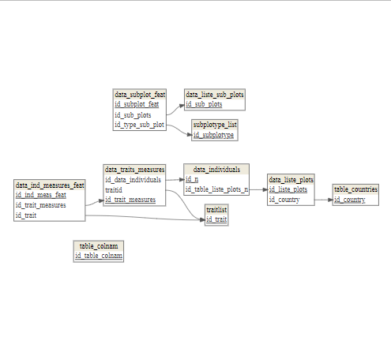

# CLAUDE.md

This file provides guidance to Claude Code (claude.ai/code) when working with code in this repository.

## Development Workflow

**IMPORTANT: Always use feature branches for code changes**

When making any code modifications, follow this workflow:

1. **Create a feature branch** before making changes:
   - Use descriptive branch names (e.g., `feature/add-new-query`, `fix/connection-bug`)

2. **Make updates** on the feature branch

3. **Before committing**, **ASK THE USER** whether they want to update NEWS.md:
   - If yes, add entry under the current development version section
   - Categorize changes appropriately:
     - **Breaking Changes**: Changes that break backward compatibility
     - **New Features**: New functionality added
     - **Bug Fixes**: Fixes for existing issues
     - **Documentation**: Documentation improvements
     - **Code Refactoring**: Code organization improvements without functional changes
     - **Infrastructure**: Development/build process changes
   - Use bullet points with clear, concise descriptions
   - Reference issue numbers or PR numbers if applicable

4. **Commit changes** with clear, descriptive commit messages

5. **Create a pull request** (optional, based on user request) back to master

6. **After merging to master**: Ensure NEWS.md reflects all changes from the merged branch (if updated)

**Never commit directly to master unless explicitly instructed by the user.**
**Never automatically update NEWS.md - always ask the user first.**

### NEWS.md Format

The NEWS.md file follows standard R package changelog format:

```markdown
# CafriplotsR NEWS

## CafriplotsR X.Y (Development/Release Date)

### Breaking Changes
* Description of breaking change

### New Features
* Description of new feature

### Bug Fixes
* Description of bug fix

### Documentation
* Documentation improvements

### Infrastructure
* Development process changes
```

## Repository Overview

This is `CafriplotsR`, an R package for exploring and updating a PostgreSQL database containing Central African forest plot and transect data. The package provides functions for querying plot data, individual tree measurements, taxonomic traits, and various ecological features.

**What this project does:**
- Query and analyze forest plot data from Central Africa
- Access individual tree measurements and ecological features
- Retrieve and aggregate species-level taxonomic traits
- Update database tables with new measurements and observations
- Resolve taxonomic synonyms and link trait data across hierarchy levels

**Access is restricted** - requires database credentials.

## Technology Stack

**Core Technologies:**
- **R** (≥4.0) - Primary programming language
- **PostgreSQL** - Two databases: `plots_transects` (main) and `rainbio` (taxa)

**Key R Package Dependencies:**
- **DBI** - Database interface abstraction
- **RPostgres** - PostgreSQL connector
- **data.table** - High-performance data manipulation

**Development Tools:**
- **roxygen2** (v7.3.2) - Automatic documentation generation from code comments
- **devtools** - Package development workflow
- **RStudio** - Recommended IDE

**Documentation & Reporting:**
- **RMarkdown** - Interactive tutorials and reports
- **knitr** - Document rendering

**Data Formats:**
- Excel (`.xlsx`) - Data imports/exports
- GeoPackage (`.gpkg`) - Spatial/geographic data
- CSV - Tabular data exchange

**Architecture Patterns:**
- Connection pooling for database efficiency
- Row-level security policies for access control
- Session-based credential caching
- Layered query architecture (connection → fetch → enrich → aggregate → query)

## Core Architecture

### Database Connections

The package manages connections to **two separate PostgreSQL databases**:

1. **Main database** (`plots_transects`): Contains plot, subplot, individual tree data, **and taxa-level trait measurements** (`taxa_traits_measures` was migrated here from `rainbio`)
2. **Taxa database** (`rainbio`): Contains taxonomic information (taxon hierarchy, synonymy)

**Connection management** (`R/connections_db.R`):
- Connections are stored in internal environment `.db_env`
- Use `call.mydb()` for main database, `call.mydb.taxa()` for taxa database
- Credentials cached in `credentials` environment during session
- Connection pooling: functions check for existing valid connections before creating new ones
- Use `cleanup_connections()` to close all connections and clear credentials

**Credential setup options**:
1. Interactive prompts (default)
2. Store in `~/.Renviron` via `setup_db_credentials()` (WARNING: plaintext storage)
3. Pass directly to connection functions

**CRITICAL SECURITY WARNING - Database Credentials:**

⚠️ **NEVER commit database credentials to version control**

When writing code examples, documentation, or vignettes that demonstrate database connections:

✅ **CORRECT - Use placeholder credentials:**
```r
# Example with placeholder credentials
con <- call.mydb(user = "your_username", password = "your_password")
con <- call.mydb(user = "eee", password = "sss")
```

❌ **NEVER do this - Real credentials in code:**
```r
# DANGER: Never use actual credentials in code
con <- call.mydb(user = "john.doe", password = "MyP@ssw0rd123")
```

**Security best practices:**
- Always use `call.mydb()` without parameters to trigger interactive prompts (preferred)
- If credentials must be in code, use obvious placeholders like "eee", "sss", "your_username"
- Never commit files containing real usernames or passwords (.Rmd, .R, .Rprofile, etc.)
- If credentials are accidentally committed:
  1. Immediately change the password in the database
  2. Remove the credentials from git history using `git filter-branch` or `git filter-repo`
  3. Force push the cleaned history to remote
- Keep `.Rprofile` in `.gitignore` (already configured)
- Review all Rmd vignettes before committing to ensure no real credentials

### Data Query Architecture

The package follows a **layered query architecture**:

1. **Connection layer**: `call.mydb()`, `call.mydb.taxa()`
2. **Fetching layer**: Low-level SQL queries (e.g., `fetch_taxa_trait_measurements()`, `fetch_subplot_features()`)
3. **Enrichment layer**: Add related data (e.g., `enrich_with_taxa_info()`, `enrich_individual_traits()`)
4. **Aggregation layer**: Pivot/aggregate features (e.g., `aggregate_plot_features()`, `pivot_numeric_traits_generic()`)
5. **Query layer**: High-level user-facing functions (e.g., `query_taxa_traits()`, `query_plot_features()`)

### Key Data Structures

**Plot hierarchy**:
- `data_liste_plots` → `data_liste_sub_plots` → `data_ind_measures` (individual trees)
- Plots contain subplots features (census points, soil samples, people involved etc.)
- Subplots contain observations with features that can describe these subplots features (for a census, people involved)

**Traits hierarchy**:
- Taxa-level: `taxa_traits_measures` (species traits, now in main `plots_transects` DB)
- Individual-level: `data_ind_measures_feat` (tree-level measurements in main DB)
- Both link to `table_traits` / `traitlist` for trait definitions

**Synonym resolution**:
- Taxa database contains `idtax_n` (taxon ID) and `idtax_good_n` (accepted taxon ID)
- Use `resolve_taxon_synonyms()` to consolidate traits from synonyms

**Database schema visualization**:
- Use `get_database_fk()` (in `R/database_structure.R`) to visualize database structure
- Generates diagram showing primary keys, foreign keys, and relationships between main tables
- Covers key tables: plots, subplots, individuals, traits, and lookup tables
- Requires `dm` package for relationship discovery and visualization




### Plot Data Storage Architecture

**CRITICAL: Understanding the three types of columns for plots**

When working with plot data import/validation, it's essential to understand how different types of data are stored:

#### 1. **Flat Columns** (Direct storage in `data_liste_plots`)
Columns stored directly in the main plots table:
- `plot_name`, `ddlat`, `ddlon`, `elevation`, `date_y`, `date_m`, `date_d`, etc.
- Also includes ID columns for lookups (see below)
- Retrieved directly when querying plots

#### 2. **Lookup Columns** (Stored as Foreign Key IDs in `data_liste_plots`)

**ONLY these two columns are lookup columns for plots:**
- `method` → Foreign key to `methodslist.id_method`
- `country` → Foreign key to `table_countries.id_country`

These are stored as integer IDs directly in `data_liste_plots` and require lookup table matching during import.

**Important:** People-related columns (principal_investigator, team_leader, etc.) are NOT lookup columns in `data_liste_plots` - they are features (see below).

#### 3. **Features** (Stored in `data_liste_sub_plots` table)

Features are stored separately in `data_liste_sub_plots` and linked to plots. Each row represents one feature instance.

**Table structure of `data_liste_sub_plots`:**
```r
id_table_liste_plots  # FK to data_liste_plots
id_type_sub_plot      # FK to subplotype_list (defines feature type)
id_colnam             # FK to table_colnam (for people features)
year, month, day      # Date information
typevalue             # Numeric feature values
typecode              # Character/text feature values
```

**Feature types are defined in `subplotype_list` table:**

Query to see all feature types:
```r
subplot_list(con)  # Returns all available subplot feature types
```

**Three categories of features based on `valuetype`:**

1. **Lookup Features** (`valuetype == "table_colnam"`):
   - `principal_investigator` (id_subplotype = 247)
   - `data_manager` (id_subplotype = 248)
   - `additional_people` (id_subplotype = 249)
   - `team_leader` (id_subplotype = 250)
   - Stored in: `data_liste_sub_plots.id_colnam`
   - **Require ID matching during import** (match person names to `table_colnam.id_table_colnam`)

2. **Character Features** (`valuetype == "character"` or similar):
   - `data_provider` and others
   - Stored in: `data_liste_sub_plots.typecode`
   - **No matching needed** - free text values

3. **Numeric Features** (`valuetype == "numeric"`):
   - Various measurements
   - Stored in: `data_liste_sub_plots.typevalue`
   - **No matching needed** - numeric values

**How to dynamically identify lookup features:**
```r
# Get all feature types
subplot_info <- subplot_list(con)

# Filter for people features that need ID matching
people_features <- subplot_info$type[subplot_info$valuetype == "table_colnam"]
# Returns: c("principal_investigator", "data_manager", "additional_people", "team_leader")
```

**Import/Validation workflow:**
1. **Plot-level lookups** (method, country): Match to IDs for `data_liste_plots`
2. **Feature-level lookups** (people columns): Match to IDs for `data_liste_sub_plots.id_colnam`
3. **Character features**: Store as-is in `data_liste_sub_plots.typecode`
4. **Numeric features**: Store as-is in `data_liste_sub_plots.typevalue`

**Key function for column routing:**
```r
config <- get_import_column_routing("plots", con)
# Returns:
# - direct_columns: columns in data_liste_plots (includes method, country as IDs)
# - subplot_features: feature types from subplotype_list
# - metadata_mappings: currently only defines country (method needs to be added)
```

**Common mistakes to avoid:**
- ❌ Don't treat people columns as lookup columns in `data_liste_plots` - they're features!
- ❌ Don't hardcode the list of people features - query `subplotype_list` dynamically
- ❌ Don't try to match `data_provider` as a lookup - it's a character feature
- ✅ Only method and country need lookup matching for the main plot table
- ✅ Use `valuetype == "table_colnam"` to identify which features need ID matching

## Development Commands

### Building and Checking
```r
# Load package for development
devtools::load_all()

# Document functions (generate .Rd files from roxygen)
devtools::document()

# Check package
devtools::check()

# Install locally
devtools::install()
```

### Database Connection Testing
```r
# Test connections
library(CafriplotsR)
db_diagnostic()  # Full diagnostic
print_connection_status()  # Quick status check

# Connect to databases
con_main <- call.mydb()
con_taxa <- call.mydb.taxa()

# Visualize database structure
get_database_fk(con_main)  # Shows primary/foreign key relationships
```

### Common Query Examples
```r
# Query plots
plots <- query_plots(plot_ids = c(1, 2, 3))

# Query taxa-level traits
traits <- query_taxa_traits(
  idtax = c(12345, 67890),
  format = "wide",
  add_taxa_info = TRUE
)

# Query individual tree features
indiv <- query_individual_features(
  plot_ids = 1,
  trait_ids = c(1, 2),  # Specific traits
  format = "wide"
)
```

## Repository Structure

### Folder Organization

**`R/`** - Source code (all R function definitions)

*Connection & Database Management:*
- `connections_db.R` - Database connection management, credentials, diagnostics, retry utilities
- `database_structure.R` - Database schema visualization with `get_database_fk()`

*Query Functions:*
- `individual_features_function.R` - Individual tree measurements and traits queries
- `subsplots_features_function.R` - Plot/subplot features and aggregation
- `taxa_traits_function.R` - Species-level trait queries from taxa database

*Taxonomic Functions:*
- `taxonomic_query_functions.R` - Taxonomic queries with synonym resolution
- `taxonomic_update_functions.R` - Taxonomic data updates and entry management

*Update & Delete Functions:*
- `updates_tables_functions.R` - Database insert/update operations
- `delete_functions.R` - Database deletion operations with cascade handling

*Linking & Matching:*
- `link_table_functions.R` - Interactive data matching to lookup tables
- `specimen_linking_functions.R` - Herbarium specimen linking to individuals

*Data Processing & Analysis:*
- `growth_census_functions.R` - Growth computation and census analysis
- `functions_divid_plot.R` - Plot division and spatial operations
- `functions_manip_db.R` - General data processing utilities
- `process_trimble_function.R` - GPS Trimble data processing

*Helper Functions:*
- `helpers_traits_common.R` - Generic trait aggregation functions
- `helpers.R` - General utility functions (prompts, etc.)
- `utils-pipe.R` - Pipe operator utilities

*Interactive Applications:*
- `shiny_app_taxo_match.R` - Shiny app for taxonomic matching

*Package Data:*
- `datasets.R` - Package dataset documentation

**`man/`** - Documentation files (`.Rd` format)
- Auto-generated from roxygen2 comments via `devtools::document()`
- One `.Rd` file per exported function
- Do not edit manually - modify roxygen comments in `R/` files instead

**Root directory:**
- `DESCRIPTION` - Package metadata (version, authors, dependencies)
- `NAMESPACE` - Exported functions list (auto-generated)
- `README.md` - Package overview and quick start guide
- `CLAUDE.md` - This file (instructions for Claude Code)
- `NEWS.md` - Version history and changelog
- `.Rproj` - RStudio project configuration
- `.gitignore` - Git ignore patterns (should include data files, outputs, cache)

**Note**: The repository may contain working data files (`.xlsx`, `.gpkg`, `.csv`, `.html`, `.pdf`, etc.) that are NOT part of the package and should NOT be committed to version control. These should be in `.gitignore`.

### Primary Function Categories

**Connection & Utilities**:
- `R/connections_db.R`: Database connection management, credential handling, diagnostics
  - `call.mydb()`, `call.mydb.taxa()` - Connection functions
  - `func_try_fetch()`, `try_open_postgres_table()` - Retry utilities
  - `db_diagnostic()`, `print_connection_status()` - Diagnostics
- `R/database_structure.R`: Database schema visualization
  - `get_database_fk()` - Visualize database structure and relationships

**Querying Functions**:
- `R/individual_features_function.R`: Individual tree measurements and traits
  - `query_individual_features()` - Main query function
- `R/subsplots_features_function.R`: Plot-level features and subplot data
  - `query_plot_features()`, `query_subplot_features()` - Feature queries
- `R/taxa_traits_function.R`: Species-level trait queries from taxa database
  - `query_taxa_traits()` - Main trait query function

**Taxonomic Functions**:
- `R/taxonomic_query_functions.R`: Taxonomic queries with synonym resolution
  - `query_taxa()`, `match_tax()` - Taxonomy lookups
- `R/taxonomic_update_functions.R`: Taxonomic data updates
  - `add_entry_taxa()`, `update_taxa_link_table()` - Add/update taxa
  - `merge_individuals_taxa()` - Merge individuals with taxonomy

**Update & Delete Functions**:
- `R/updates_tables_functions.R`: Database insert/update operations
  - `add_sp_traits_measures()`, `add_trait_taxa()` - Add measurements/traits
- `R/delete_functions.R`: Database deletion operations
  - `.delete_individuals()`, `.delete_entry_trait_measure()` - Safe deletions with cascade handling

**Linking & Specimen Management**:
- `R/link_table_functions.R`: Interactive data matching
  - `.link_table()` - Interactive matching of values to lookup tables
  - `.find_cat()` - Fuzzy matching for categorical values
- `R/specimen_linking_functions.R`: Herbarium specimen linking
  - `.add_link_specimens()` - Link individuals to herbarium specimens
  - `get_ref_specimen_ind()` - Find reference specimens

**Data Processing & Analysis**:
- `R/growth_census_functions.R`: Growth and census analysis
  - `growth_computing()` - Compute tree growth between censuses
- `R/functions_divid_plot.R`: Plot division and spatial operations
- `R/functions_manip_db.R`: General data processing utilities

**Helper Functions**:
- `R/helpers_traits_common.R`: Generic trait aggregation
  - `pivot_numeric_traits_generic()`, `pivot_categorical_traits_generic()`
- `R/helpers.R`: General utilities
  - `choose_prompt()` - Interactive user prompts

### Coding Conventions

**Helper Functions Pattern:**
- Internal helpers use `.` prefix (e.g., `.link_table()`, `.add_modif_field()`, `.rename_data()`)
- These are exported but intended for internal use or advanced users
- Public-facing functions have descriptive names without prefix

**Generic Aggregation Functions:**
The package has refactored generic aggregation helpers in `R/helpers_traits_common.R`:
- `pivot_numeric_traits_generic()`: Aggregate numeric traits with mean/sd/n
- `pivot_categorical_traits_generic()`: Aggregate categorical traits (mode or concat)
- `aggregate_plot_features()`: Aggregate multiple feature types for plots

**Error Handling Pattern for Configuration Functions:**
Configuration functions that query the database MUST implement graceful error handling to support users with limited database permissions:

```r
# Pattern for functions that query database tables
get_example_config <- function(con) {
  tryCatch({
    # Handle pool connections
    actual_con <- if (inherits(con, "Pool")) {
      pool::poolCheckout(con)
    } else {
      con
    }

    on.exit({
      if (inherits(con, "Pool") && !is.null(actual_con)) {
        pool::poolReturn(actual_con)
      }
    }, add = TRUE)

    # Perform database query
    result <- DBI::dbGetQuery(actual_con, "SELECT ...")

    # Process and return result
    return(result)

  }, error = function(e) {
    # Log to console for debugging (NOT user-facing)
    message("Note: Could not fetch data (", e$message, "). Using fallback.")

    # Return sensible fallback value
    return(default_value)
  })
}
```

**Key principles:**
- Use `message()` for debug logging, NOT `cli::cli_alert_*()` or `shiny::showNotification()`
- Always provide fallback values (empty lists, character vectors, or minimal defaults)
- Handle pool connections explicitly with checkout/return
- Never let configuration errors crash the app

**Functions implementing this pattern:**
- `get_table_columns()` - Returns fallback columns on error
- `get_metadata_mappings_plots()` - Returns basic lookups only on error
- `get_available_subplot_types()` - Returns empty vector on error
- `get_available_individual_features()` - Returns empty vector on error
- `.get_column_descriptions()` - Skips feature descriptions on error

**Standard R Package Structure:**
- Documentation lives in `man/` (generated, not manually edited)
- Source code lives in `R/`
- No `tests/` directory present (consider adding for production robustness)
- No `vignettes/` directory (tutorials are in root as `.Rmd` files)

### Shiny App Development Guidelines

When developing Shiny apps in this package, follow these mandatory patterns:

**1. Database Connection Management:**
- Use the `mod_database_login_ui/server` module for authentication within the app
- Do NOT require database connections from R console before launching
- Store connection pools in `.db_env$pool_main` and `.db_env$pool_taxa`
- Use `shinyjs::useShinyjs()` for dynamic UI control

**2. UI Structure with Conditional Authentication:**
```r
ui <- shiny::fluidPage(
  shinyjs::useShinyjs(),

  # Login panel (shown before authentication)
  shiny::conditionalPanel(
    condition = "!output.authenticated",
    mod_database_login_ui("login")
  ),

  # Main app content (shown after authentication)
  shiny::conditionalPanel(
    condition = "output.authenticated",
    # ... main app UI ...
  )
)
```

**3. Server Authentication Pattern:**
```r
server <- function(input, output, session) {
  # Use login module
  login_output <- mod_database_login_server("login")
  pool_reactive <- login_output$pool_main
  authenticated_reactive <- login_output$authenticated

  # Output for conditional panel
  output$authenticated <- shiny::reactive({ authenticated_reactive() })
  shiny::outputOptions(output, "authenticated", suspendWhenHidden = FALSE)

  # Initialize modules only after authentication
  shiny::observe({
    shiny::req(authenticated_reactive() == TRUE)
    # ... initialize other modules ...
  })
}
```

**4. Mandatory Session Cleanup:**
Always include this session end handler to clean up connections and quit R:
```r
session$onSessionEnded(function() {
  # Clean up all connections and credentials
  tryCatch({
    cleanup_connections()
  }, error = function(e) {
    cli::cli_alert_warning("Failed to cleanup connections: {e$message}")
  })
  shiny::stopApp()
})
```

**5. Why This Matters:**
- Prevents "SSL SYSCALL error: EOF detected" when users run queries after closing app
- Prevents "Checked-out object deleted before being returned" warnings
- Ensures clean state for subsequent R console usage
- Provides consistent user experience across all apps

**6. Internationalization (i18n) with shiny.i18n:**

**Translation File Management:**
- All translations are stored in `inst/translations/translation.json`
- The file has structure: `{"languages": ["en", "fr"], "translation": [{"en": "...", "fr": "..."}]}`
- **CRITICAL: Always check for duplicates before adding new translations**

**Adding New Translations - MANDATORY PATTERN:**
```r
library(jsonlite)

# Read current translations
translation_file <- "inst/translations/translation.json"
translations <- fromJSON(translation_file, simplifyDataFrame = FALSE)

# New translations to add
new_translations <- list(
  list(en = "Your English text", fr = "Votre texte français")
)

# Check for existing translations and add only new ones
existing_en <- sapply(translations$translation, function(x) x$en)
for (new_trans in new_translations) {
  if (!new_trans$en %in% existing_en) {
    translations$translation[[length(translations$translation) + 1]] <- new_trans
    cat("Added:", new_trans$en, "\n")
  } else {
    cat("Skipped (already exists):", new_trans$en, "\n")
  }
}

# Write back to file with pretty formatting
write(toJSON(translations, pretty = TRUE, auto_unbox = TRUE), translation_file)
```

**i18n Usage Patterns:**
- In **UI functions**: Use `i18n$t("text")` - i18n is passed as a direct parameter
- In **server functions**: Use `i18n()$t("text")` - i18n is passed as a reactive
- **Wrong pattern** in server: `i18n$t()` will cause "objet de type 'closure' non indiçable" error

**Example:**
```r
# UI function - correct
mod_step1_ui <- function(id, i18n) {
  shiny::h3(i18n$t("Step 1: Choose Import Type"))
}

# Server function - correct
mod_step1_server <- function(id, i18n) {
  shiny::moduleServer(id, function(input, output, session) {
    output$message <- shiny::renderUI({
      shiny::div(i18n()$t("Welcome message"))  # Note: i18n()$t() not i18n$t()
    })
  })
}
```

**Reference Implementations:**
- `R/shiny_app_query_plots.R` - Query plots interactive app
- `R/shiny_app_taxonomic_match.R` - Taxonomic name standardization app
- `R/shiny_app_import_wizard.R` - Import wizard with full i18n support

## Important Notes

### Database Write Operations

- **Taxa database is READ-ONLY** for most users (verified on connect)
- Write operations on main database require appropriate user permissions
- Use `define_user_policy()` for row-level security setup
- Updates typically require `add_data = TRUE` parameter and user confirmation

### Trait Value Types

Traits have `valuetype` field:
- `"numeric"`: Stored in `traitvalue` column
- `"categorical"`: Stored in `traitvalue_char` column
- `"ordinal"`, `"character"`: Also use `traitvalue_char`
- `"integer"`: Uses `traitvalue` (numeric)
- `"table_colnam"`: References lookup table (treated as numeric ID)

### Categorical Aggregation Modes

When pivoting categorical traits to wide format:
- `"mode"`: Most frequent value per taxon/individual
- `"concat"`: All unique values concatenated

### Legacy Function Wrappers

Some functions have legacy wrappers for backward compatibility:
- `query_traits_measures()` → wraps `query_taxa_traits()`
- These emit warnings suggesting migration to new functions

## RMarkdown Tutorials

The repository contains several `.Rmd` tutorial files (see `tuto_database.Rmd`, `tuto_db.Rmd`) which demonstrate package usage.

## Package Metadata

- **Version**: 1
- **Authors**: Gilles Dauby, Hugo Leblanc
- **License**: GPL-2
- **Minimum R version**: 4.0
- **roxygen2 version**: 7.3.2
