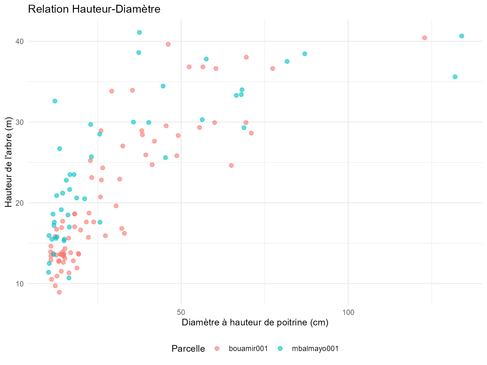

# Estimation de la Biomasse Aérienne avec le Package BIOMASS

## Aperçu

Cette vignette montre comment utiliser `CafriplotsR` avec le package
**BIOMASS** pour estimer la biomasse aérienne (AGB) des parcelles
forestières permanentes. La fonction
[`query_plots()`](https://umr-amap.github.io/cafriplotsR/reference/query_plots.md)
avec `output_style = "permanent_plot"` fournit des structures de données
optimisées pour les analyses allométriques.

**Avantages clés du flux de travail intégré :**

1.  **Enrichissement automatique des traits** - La densité du bois et
    autres traits sont pré-intégrés
2.  **Table hauteur-diamètre prête à l’emploi** - Table
    `$height_diameter` fournie par défaut
3.  **Sortie structurée** - Tables séparées pour les métadonnées,
    individus et mesures
4.  **Hiérarchies taxonomiques** - Héritage des traits de l’espèce →
    genre → famille

## Prérequis

``` r

library(CafriplotsR)
library(BIOMASS)
library(dplyr)
library(ggplot2)

# Se connecter aux deux bases avec une seule invite d'identifiants
cons <- connect_cafri()
mydb <- cons$main
mydb_taxa <- cons$taxa
```

------------------------------------------------------------------------

## Étape 1 : Extraire les Données de Parcelles

Utilisez `output_style = "permanent_plot"` pour obtenir une sortie
structurée optimisée pour l’analyse de biomasse :

``` r

# Interroger les parcelles permanentes avec les données individuelles
plot_data <- query_plots(
  plot_name = c("bouamir001", "mbalmayo001"),  # Parcelles exemples
  extract_individuals = TRUE, ## extraire les individus/tiges
  method = "1ha-IRD",
  con = mydb,
  census_strategy = "first", ## obtenir le premier recensement (s'il y en a plusieurs) - dans ce cas, parce que les hauteurs d'arbres ont été mesurées lors du premier recensement
  ## Si wd n'est pas disponible pour l'espèce, la moyenne de wd par genre est attribuée aux espèces appartenant à ce genre
  ## si wd n'est pas disponible au niveau du genre, la moyenne de la parcelle est donnée
  ## génère une colonne qui indique la source de l'information
  traits_to_genera = T
)
#> ── Building plot filter query ──────────────────────────────────────────────────
#> ℹ Attempt 1 of 10...
#> ✔ ✅ Successfully connected and fetched 2 rows.
#> 
#> ── Querying plot features ──
#> 
#> ✔ Found 115 feature(s) for 2 plot(s)
#> ℹ Enriching with subplot observation features
#> 
#> ── Aggregating features to wide format ──
#> 
#> ✔ Query completed
#> ── Processing individuals ──────────────────────────────────────────────────────
#> ℹ Selected first census date column: date_census_1
#> ℹ Fetching individuals
#> ℹ Fetching individuals...
#> ✔ Fetched 888 individual(s)
#> ℹ Loading specimen links...
#> ℹ Loading 92 specimen(s)...
#> ℹ Loading synonyms for 179 taxa...
#> ✔ Loaded 179 synonym record(s)
#> ℹ Assembling individual data...
#> ℹ Enriching with taxonomic backbone...
#> ✔ Successfully fetched 888 individual(s)
#> ✔ Processed 888 individuals
#> ── Processing traits ───────────────────────────────────────────────────────────
#> ℹ Enriching with individual-level traits
#> 
#> ── Fetching individual features ──
#> 
#> ── Fetching trait measurements ──
#> 
#> ℹ Removed 135 measurement(s) with issues
#> ℹ Enriching with census information for first census selection
#> ✔ Selected first census for 2 plot(s)
#> ℹ Filtered out 5345 measurement(s) from other censuses
#> ✔ Query completed: 6878 measurement(s)
#> 
#> ── Aggregating features by individual ──
#> 
#> ℹ Aggregating 4597 numeric measurement(s)
#> ℹ Aggregating 2281 character measurement(s)
#> ✔ Aggregated 888 individual(s)
#> ℹ Enriching with taxonomic-level traits
#> 
#> ── Querying taxa-level traits ──
#> 
#> ℹ Fetching trait measurements for 154 taxon/taxa
#> ✔ Found 5064 measurement(s) for 142 taxa
#> ℹ Resolving taxonomic synonyms
#> 
#> ── Processing traits to wide format ──
#> 
#> ℹ Aggregating numeric traits
#> ℹ Aggregating categorical traits (mode)
#> ✔ Query completed
#> ✔ Added 24 numeric taxonomic trait column(s)
#> ✔ Added 16 categorical taxonomic trait column(s)
#> ℹ Aggregating traits to genus level
#> ℹ Source information added to columns starting with 'source_'
#> ℹ Attempt 1 of 10...
#> ✔ ✅ Successfully connected and fetched 10253 rows.
#> ℹ Attempt 1 of 10...
#> ✔ ✅ Successfully connected and fetched 6091 rows.
#> 
#> ── Querying taxa-level traits ──
#> 
#> ℹ Fetching trait measurements for 13111 taxon/taxa
#> ✔ Found 19950 measurement(s) for 2492 taxa
#> ℹ Resolving taxonomic synonyms
#> ℹ Including synonyms: 2492 taxa expanded to 6053 taxa
#> ℹ Adding taxonomic information
#> ✔ Query completed
#> ℹ Setting wood density SD to averaged species and genus level according to BIOMASS dataset
#> 
#> ── Fetching trait measurements ──
#> 
#> ℹ Removed 135 measurement(s) with issues
#> ℹ Enriching with census information
#> ✔ Query completed: 4112 measurement(s)
#> 
#> ── Querying taxa-level traits ──
#> 
#> ℹ Fetching trait measurements for 154 taxon/taxa
#> ✔ Found 5064 measurement(s) for 142 taxa
#> ℹ Resolving taxonomic synonyms
#> ✔ Query completed
#> ! ids removed - remove_ids = TRUE
#> ℹ Auto-detected output style: 'permanent_plot' based on method field
#> ✔ Output restructured using 'permanent_plot' style. Use names() to see available tables.
```

``` r


# Vérifier la structure
names(plot_data)
#> [1] "metadata"        "individuals"     "height_diameter" "data_sources"
# $metadata - Informations au niveau de la parcelle
# $individuals - Données d'arbres individuels avec traits
# $height_diameter - Paires hauteur-diamètre (prêtes pour la modélisation)
```

Le style de sortie `permanent_plot` fournit :

- **`$metadata`** : Coordonnées de parcelle, superficie, dates de
  recensement, investigateurs
- **`$individuals`** : Inventaire complet des arbres avec traits
  taxonomiques
- **`$height_diameter`** : Paires hauteur-diamètre pré-filtrées pour la
  modélisation allométrique

------------------------------------------------------------------------

## Étape 2 : Explorer les Données

### Données d’Arbres Individuels

La table des individus inclut des **traits automatiquement enrichis** :

``` r

# Vérifier quelles données nous avons
str(plot_data$individuals)
#> tibble [888 × 36] (S3: tbl_df/tbl/data.frame)
#>  $ id_n                              : int [1:888] 248314 248318 248322 248326 248330 248334 248338 248342 248346 248350 ...
#>  $ plot_name                         : chr [1:888] "bouamir001" "bouamir001" "bouamir001" "bouamir001" ...
#>  $ tag                               : num [1:888] 1 2 3 4 5 6 7 8 9 10 ...
#>  $ family                            : chr [1:888] "Annonaceae" "Lecythidaceae" "Olacaceae" "Annonaceae" ...
#>  $ genus                             : chr [1:888] "Xylopia" "Petersianthus" "Heisteria" "Greenwayodendron" ...
#>  $ species                           : chr [1:888] "Xylopia quintasii" "Petersianthus macrocarpus" "Heisteria parvifolia" "Greenwayodendron suaveolens" ...
#>  $ dbh                               : num [1:888] 17.7 62.4 57.7 25.9 22.8 ...
#>  $ idtax_individual_f                : int [1:888] 6737 626 245 219 1535 344939 828 1757 784 1153 ...
#>  $ quadrat                           : chr [1:888] "0_0" "0_0" "0_0" "0_0" ...
#>  $ height                            : num [1:888] 12.8 NA NA NA NA ...
#>  $ census_date                       : Date[1:888], format: "2018-12-02" "2018-12-02" ...
#>  $ number_of_stem                    : int [1:888] NA NA NA NA NA NA NA NA NA NA ...
#>  $ taxa_mean_wood_density            : num [1:888] 0.75 0.64 0.74 0.64 0.51 0.56 0.64 0.53 0.8 0.61 ...
#>  $ taxa_n_wood_density               : num [1:888] 6 96 10 70 12 1 14 36 31 44 ...
#>  $ taxa_sd_wood_density              : num [1:888] 0.0708 0.0708 0.0708 0.0708 0.0708 ...
#>  $ source_taxa_mean_wood_density     : chr [1:888] "species" "species" "species" "species" ...
#>  $ source_taxa_n_wood_density        : chr [1:888] "species" "species" "species" "species" ...
#>  $ source_taxa_sd_wood_density       : chr [1:888] "species" "species" "species" "species" ...
#>  $ taxa_sd_wood_density_plot_level   : num [1:888] 0.0762 0.0762 0.0762 0.0762 0.0762 ...
#>  $ pom                               : num [1:888] 1.3 1.3 1.3 1.3 1.3 1.3 1.3 1.8 3.3 1.3 ...
#>  $ taxa_mean_stem_diameter_p95       : num [1:888] 35 76.3 50 40 23.5 ...
#>  $ taxa_n_stem_diameter_p95          : num [1:888] 1 1 1 1 1 1 1 1 1 1 ...
#>  $ taxa_sd_stem_diameter_p95         : num [1:888] 13.9 NA 10.32 13.02 6.36 ...
#>  $ source_taxa_mean_stem_diameter_p95: chr [1:888] "species" "species" "species" "species" ...
#>  $ source_taxa_n_stem_diameter_p95   : chr [1:888] "species" "species" "species" "species" ...
#>  $ source_taxa_sd_stem_diameter_p95  : chr [1:888] "genus" NA "genus" "genus" ...
#>  $ observations                      : chr [1:888] NA "rejets" NA NA ...
#>  $ position_x                        : num [1:888] 3 NA NA NA NA 17.2 NA 13.4 19 NA ...
#>  $ position_x_iphone                 : num [1:888] 2.323 0.801 4.587 10.825 15.836 ...
#>  $ position_y                        : num [1:888] 10 NA NA NA NA 15 NA 6.5 5 NA ...
#>  $ position_y_iphone                 : num [1:888] 10.3 15 19.7 19.9 17.5 ...
#>  $ taxa_phenology                    : chr [1:888] "evergreen" "deciduous" "evergreen" "evergreen" ...
#>  $ source_taxa_phenology             : chr [1:888] "species" "species" "genus" "species" ...
#>  $ taxa_succession_guild             : chr [1:888] "non-pioneer light demanding" "non-pioneer light demanding" "shade-tolerant" "shade-tolerant" ...
#>  $ source_taxa_succession_guild      : chr [1:888] "species" "species" "genus" "species" ...
#>  $ stem_status                       : chr [1:888] "alive" "alive" "alive" "alive" ...
```

``` r

# Colonnes clés pour la biomasse :
# - dbh (stem_diameter) : Diamètre à hauteur de poitrine (cm)
# - species (tax_sp_level) : Nom de l'espèce
# - wood_density_mean (taxa_mean_wood_density) : Densité moyenne du bois (g/cm³)
# - wood_density_sd (taxa_sd_wood_density) : Écart-type pour la propagation d'erreur
# - source_taxa_mean_wood_density (taxa_sd_wood_density) : source d'information pour la densité du bois

# Résumé de la disponibilité de la densité du bois
plot_data$individuals %>%
  summarise(
    n_total = n(),
    n_with_wd = sum(!is.na(taxa_mean_wood_density)),
    pct_with_wd = round(100 * n_with_wd / n_total, 1),
    mean_wd = mean(taxa_mean_wood_density, na.rm = TRUE)
  )
#> # A tibble: 1 × 4
#>   n_total n_with_wd pct_with_wd mean_wd
#>     <int>     <int>       <dbl>   <dbl>
#> 1     888       888         100   0.639
```

**Note** : Les traits de densité du bois sont automatiquement : -
Récupérés de la base de données taxonomique - Hérités de l’espèce →
genre → famille quand les données au niveau de l’espèce ne sont pas
disponibles - Moyennés au niveau de la parcelle quand aucune
correspondance taxonomique n’est trouvée (si `traits_to_genera = TRUE`)

### Données Hauteur-Diamètre

La table `$height_diameter` est **pré-filtrée et prête** pour la
modélisation :

``` r

# Paires hauteur-diamètre (automatiquement filtrées)
head(plot_data$height_diameter)
#> # A tibble: 6 × 8
#>     id_n plot_name    tag     D     H   POM census_name census_date
#>    <int> <chr>      <dbl> <dbl> <dbl> <dbl> <chr>       <date>     
#> 1 248314 bouamir001     1  17.7  12.8   1.3 census_1    2018-12-02 
#> 2 248334 bouamir001     6  22.2  15.7   1.3 census_1    2018-12-02 
#> 3 248342 bouamir001     8  38.4  28.4   1.8 census_1    2018-12-02 
#> 4 248346 bouamir001     9 123.   40.4   3.3 census_1    2018-12-02 
#> 5 248370 bouamir001    15  48.7  25.8   1.3 census_1    2018-12-02 
#> 6 248738 bouamir001   107  14.7  13.5   1.3 census_1    2018-12-02

# Cette table inclut :
# - id_n : ID de l'individu
# - plot_name : Identifiant de la parcelle
# - tag : Numéro de l'arbre
# - D : Diamètre (dhp en cm)
# - H : Hauteur (hauteur de l'arbre en m)
# - POM : Point de mesure (si disponible)

# Résumé
plot_data$height_diameter %>%
  group_by(plot_name) %>%
  summarise(
    n_pairs = n(),
    mean_dbh = round(mean(D), 1),
    mean_height = round(mean(H), 1),
    dbh_range = paste(round(min(D), 1), "-", round(max(D), 1)),
    height_range = paste(round(min(H), 1), "-", round(max(H), 1))
  )
#> # A tibble: 2 × 6
#>   plot_name   n_pairs mean_dbh mean_height dbh_range    height_range
#>   <chr>         <int>    <dbl>       <dbl> <chr>        <chr>       
#> 1 bouamir001       76     28.9        20.4 10.9 - 122.9 8.9 - 40.4  
#> 2 mbalmayo001      46     33.2        24.7 10.3 - 134   10.7 - 41.1
```

------------------------------------------------------------------------

## Étape 3 : Construire les Modèles Hauteur-Diamètre

Utilisez la table `$height_diameter` pré-filtrée directement avec
BIOMASS :

### Option A : Modèle Unique (Toutes Parcelles)

``` r

# Ajuster un modèle hauteur-diamètre global
hd_model_global <- BIOMASS::modelHD(
  D = plot_data$height_diameter$D,
  H = plot_data$height_diameter$H,
  method = "weibull",
  useWeight = TRUE
)

# Vérifier l'ajustement du modèle
summary(hd_model_global)
#>           Length Class  Mode     
#> input       2    -none- list     
#> model       6    nls    list     
#> residuals 122    -none- numeric  
#> method      1    -none- character
#> predicted 122    -none- numeric  
#> RSE         1    -none- numeric  
#> weighted    1    -none- logical

# Erreur standard résiduelle pour la propagation d'incertitude
RSE_global <- hd_model_global$RSE
print(paste("RSE :", round(RSE_global, 3)))
#> [1] "RSE : 5.029"
```

### Option B : Modèles Spécifiques par Parcelle

Pour les parcelles avec suffisamment de mesures de hauteur (\>15 paires
recommandées) :

``` r

# Construire des modèles séparés par parcelle
hd_models_by_plot <- plot_data$height_diameter %>%
  group_by(plot_name) %>%
  filter(n() >= 15) %>%  # Exiger au moins 15 paires H-D
  group_split() %>%
  lapply(function(plot_df) {
    tryCatch({
      model <- BIOMASS::modelHD(
        D = plot_df$D,
        H = plot_df$H,
        method = "weibull",
        useWeight = TRUE
      )
      list(
        plot_name = unique(plot_df$plot_name),
        model = model,
        RSE = model$RSE,
        n = nrow(plot_df)
      )
    }, error = function(e) {
      NULL  # Retourner NULL si le modèle échoue
    })
  }) %>%
  Filter(Negate(is.null), .)  # Supprimer les modèles échoués

# Résumé
cat(sprintf("Construit %d modèles spécifiques par parcelle\n", length(hd_models_by_plot)))
#> Construit 2 modèles spécifiques par parcelle
```

### Visualiser les Relations H-D

``` r

# Tracer les données hauteur-diamètre avec la courbe ajustée
ggplot(plot_data$height_diameter, aes(x = D, y = H)) +
  geom_point(aes(color = plot_name), alpha = 0.6, size = 2) +
  geom_smooth(method = "nls",
              formula = y ~ a * (1 - exp(-b * x^c)),
              method.args = list(start = list(a = 40, b = 0.05, c = 1)),
              se = TRUE, color = "black", linewidth = 1.5) +
  labs(
    title = "Relation Hauteur-Diamètre",
    x = "Diamètre à hauteur de poitrine (cm)",
    y = "Hauteur de l'arbre (m)",
    color = "Parcelle"
  ) +
  theme_minimal() +
  theme(legend.position = "bottom")
#> Warning: Failed to fit group -1.
#> Caused by error in `pred$fit`:
#> ! $ operator is invalid for atomic vectors
```



------------------------------------------------------------------------

## Étape 4 : Prédire les Hauteurs Manquantes

La plupart des arbres n’ont pas de mesures de hauteur. Utilisez le
modèle H-D pour les prédire :

``` r

# Préparer les données pour l'estimation AGB
agb_data <- plot_data$individuals %>%
  filter(!is.na(dbh)) %>%  # Doit avoir un diamètre
  mutate(
    # Prédire la hauteur en utilisant le modèle global (ou spécifique à la parcelle si disponible)
    H_predicted = BIOMASS::retrieveH(
      D = dbh,
      model = hd_model_global
    )$H,
    # Utiliser la hauteur mesurée si disponible, sinon prédite
    H_final = ifelse(!is.na(height), height, H_predicted),
    # Assigner RSE pour l'incertitude
    H_RSE = RSE_global
  )

# Vérifier le succès de la prédiction
agb_data %>%
  summarise(
    n_total = n(),
    n_measured = sum(!is.na(height)),
    n_predicted = sum(is.na(height)),
    pct_predicted = round(100 * n_predicted / n_total, 1)
  )
#> # A tibble: 1 × 4
#>   n_total n_measured n_predicted pct_predicted
#>     <int>      <int>       <int>         <dbl>
#> 1     834        122         712          85.4
```

**Utiliser des modèles spécifiques par parcelle** (si disponibles) :

``` r

# Créer une table de correspondance pour le RSE spécifique par parcelle
plot_rse <- data.frame(
  plot_name = sapply(hd_models_by_plot, function(x) x$plot_name),
  RSE_plot = sapply(hd_models_by_plot, function(x) x$RSE)
)

# Prédire avec des modèles spécifiques par parcelle où disponibles
agb_data <- agb_data %>%
  filter(!is.na(dbh)) %>%
  left_join(plot_rse, by = "plot_name") %>%
  mutate(
    # Utiliser le RSE spécifique par parcelle si disponible, sinon global
    H_RSE = ifelse(!is.na(RSE_plot), RSE_plot, RSE_global),
    # Prédire les hauteurs (nécessiterait de boucler sur les modèles spécifiques par parcelle)
    H_final = ifelse(!is.na(height), height, H_predicted)
  )
```

------------------------------------------------------------------------

## Étape 5 : Estimer la Biomasse Aérienne

Nous avons maintenant toutes les entrées requises pour BIOMASS :

- **D** : Diamètre (dhp)
- **WD** : Densité du bois (automatiquement depuis la base de données !)
- **H** : Hauteur (mesurée ou prédite)
- **Erreurs** : Écart-type pour la densité du bois, RSE pour la hauteur

### Vérifier la Complétude des Données

``` r

# Résumé des variables requises
summary(agb_data[, c("dbh", "taxa_mean_wood_density", "H_final", "H_RSE")])
#>       dbh        taxa_mean_wood_density    H_final          H_RSE      
#>  Min.   : 10.0   Min.   :0.290          Min.   : 8.93   Min.   :4.280  
#>  1st Qu.: 12.3   1st Qu.:0.590          1st Qu.:16.39   1st Qu.:4.280  
#>  Median : 16.2   Median :0.650          Median :19.07   Median :5.299  
#>  Mean   : 23.3   Mean   :0.639          Mean   :20.97   Mean   :4.824  
#>  3rd Qu.: 24.8   3rd Qu.:0.710          3rd Qu.:23.86   3rd Qu.:5.299  
#>  Max.   :175.0   Max.   :0.870          Max.   :41.10   Max.   :5.299

# Vérifier les données manquantes
agb_data %>%
  summarise(
    missing_dbh = sum(is.na(dbh)),
    missing_wd = sum(is.na(taxa_mean_wood_density)),
    missing_height = sum(is.na(H_final)),
    complete_cases = sum(!is.na(dbh) & !is.na(taxa_mean_wood_density) & !is.na(H_final))
  )
#> # A tibble: 1 × 4
#>   missing_dbh missing_wd missing_height complete_cases
#>         <int>      <int>          <int>          <int>
#> 1           0          0              0            834
```

### Estimation Simple d’AGB (Sans Propagation d’Erreur)

Estimation rapide sans incertitude :

``` r

# Calcul simple d'AGB en utilisant l'équation de Chave et al. 2014
agb_data <- agb_data %>%
  filter(!is.na(dbh) & !is.na(taxa_mean_wood_density) & !is.na(H_final)) %>%
  mutate(
    AGB_kg = BIOMASS::computeAGB(
      D = dbh,
      WD = taxa_mean_wood_density,
      H = H_final
    )
  )

# AGB au niveau de la parcelle
agb_by_plot <- agb_data %>%
  group_by(plot_name) %>%
  summarise(
    n_trees = n(),
    total_AGB_Mg = sum(AGB_kg)
  )

print(agb_by_plot)
#> # A tibble: 2 × 3
#>   plot_name   n_trees total_AGB_Mg
#>   <chr>         <int>        <dbl>
#> 1 bouamir001      389         334.
#> 2 mbalmayo001     445         445.
```

------------------------------------------------------------------------

## Résumé

Cette vignette a démontré le flux de travail complet pour l’estimation
d’AGB en utilisant `CafriplotsR` et `BIOMASS` :

1.  ✅ **Extraire des données structurées** avec
    `output_style = "permanent_plot"`
2.  ✅ **Utiliser les données H-D pré-filtrées** de la table
    `$height_diameter`
3.  ✅ **Construire des modèles allométriques** avec BIOMASS::modelHD()
4.  ✅ **Exploiter les traits intégrés** - densité du bois
    automatiquement incluse

**Avantages clés :**

- **Pas de correspondance manuelle des traits** - densité du bois
  pré-intégrée depuis la base de données taxonomique
- **Table H-D prête à l’emploi** - filtrée et formatée pour BIOMASS

------------------------------------------------------------------------

## Ressources Supplémentaires

- **Package BIOMASS** : Réjou-Méchain et al. (2017)
  <https://CRAN.R-project.org/package=BIOMASS>
- **Équations allométriques** : Chave et al. (2014)
  <https://doi.org/10.1111/gcb.12629>
- **Requêtes CafriplotsR** : Voir
  [`vignette("using-query-plots-fr")`](https://umr-amap.github.io/cafriplotsR/articles/using-query-plots-fr.md)
- **Correspondance taxonomique** : Voir
  [`vignette("taxonomic-app-fr")`](https://umr-amap.github.io/cafriplotsR/articles/taxonomic-app-fr.md)

------------------------------------------------------------------------

## Références

Chave, J., et al. (2014). Improved allometric models to estimate the
aboveground biomass of tropical trees. *Global Change Biology*, 20(10),
3177-3190.

Réjou-Méchain, M., et al. (2017). biomass: an R package for estimating
above-ground biomass and its uncertainty in tropical forests. *Methods
in Ecology and Evolution*, 8(9), 1163-1167.
