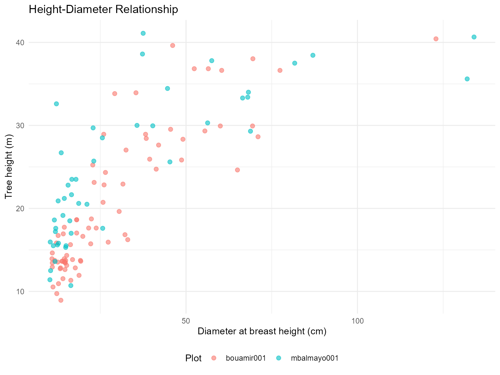

# Above-Ground Biomass Estimation with BIOMASS Package

## Overview

This vignette demonstrates how to use `CafriplotsR` with the **BIOMASS**
package to estimate above-ground biomass (AGB) for permanent forest
plots. The
[`query_plots()`](https://umr-amap.github.io/cafriplotsR/reference/query_plots.md)
function with `output_style = "permanent_plot"` provides data structures
optimized for allometric analyses.

**Key advantages of the integrated workflow:**

1.  **Automatic trait enrichment** - Wood density and other traits are
    pre-integrated
2.  **Ready-made height-diameter table** - `$height_diameter` table
    provided by default
3.  **Structured output** - Separate tables for metadata, individuals,
    and measurements
4.  **Taxonomic hierarchies** - Trait inheritance from species → genus →
    family

## Prerequisites

``` r

library(CafriplotsR)
library(BIOMASS)
library(dplyr)
library(ggplot2)

# Connect to both databases with a single credential prompt
cons <- connect_cafri()
mydb <- cons$main
mydb_taxa <- cons$taxa
```

------------------------------------------------------------------------

## Step 1: Extract Plot Data

Use `output_style = "permanent_plot"` to get structured output optimized
for biomass analysis:

``` r

# Query permanent plots with individual data
plot_data <- query_plots(
  plot_name = c("bouamir001", "mbalmayo001"),  # Example plots
  extract_individuals = TRUE, ## extract individuals/stems
  method = "1ha-IRD",
  con = mydb, 
  census_strategy = "first", ## get first census (if more than one) - in this case, because tree heights were measure during the first census
  ## If wd is not available for species, the mean of wd per genus is attributed to species belonging to this genus
  ## if wd if not available at genus level, plot mean is given
  ## generate a column that indicates the source of information
  traits_to_genera = TRUE 
)
#> ! Dropped 4 traits with no measurement at the selected (first) census: "flag2_rainfor", "light_observations", "mortality_risk_flag", and "stem_diameter_observations"
#> ! Keep them with `show_multiple_census = TRUE` or `census_strategy = "mean"`
#> ✔ 2 plots, 888 individuals, permanent_plot style
#> ℹ Excluded:
#> • 270 measurements flagged with an issue: `issues = "remove"`, or `issues =
#>   "include"` to keep them
#> ℹ Taxonomic traits are genus-level aggregates, not values of the taxon itself:
#>   `traits_to_genera = TRUE`, provenance in the source_* columns
#> ℹ Tables: metadata, individuals, height_diameter, and data_sources
```

``` r


# Check structure
names(plot_data)
#> [1] "metadata"        "individuals"     "height_diameter" "data_sources"
# $metadata - Plot-level information
# $individuals - Individual tree data with traits
# $height_diameter - Height-diameter pairs (ready for modeling)
```

The `permanent_plot` output style provides:

- **`$metadata`**: Plot coordinates, area, census dates, investigators
- **`$individuals`**: Complete tree inventory with taxonomic traits
- **`$height_diameter`**: Pre-filtered height-diameter pairs for
  allometric modeling

------------------------------------------------------------------------

## Step 2: Explore the Data

### Individual Tree Data

The individuals table includes **automatically enriched traits**:

``` r

# Check what data we have
str(plot_data$individuals)
#> tibble [888 × 36] (S3: tbl_df/tbl/data.frame)
#>  $ id_n                              : int [1:888] 248314 248318 248322 248326 248330 248334 248338 248342 248346 248350 ...
#>  $ plot_name                         : chr [1:888] "bouamir001" "bouamir001" "bouamir001" "bouamir001" ...
#>  $ tag                               : num [1:888] 1 2 3 4 5 6 7 8 9 10 ...
#>  $ family                            : chr [1:888] "Annonaceae" "Lecythidaceae" "Olacaceae" "Annonaceae" ...
#>  $ genus                             : chr [1:888] "Xylopia" "Petersianthus" "Heisteria" "Greenwayodendron" ...
#>  $ species                           : chr [1:888] "Xylopia quintasii" "Petersianthus macrocarpus" "Heisteria parvifolia" "Greenwayodendron suaveolens" ...
#>  $ dbh                               : num [1:888] 17.7 62.4 57.7 25.9 22.8 ...
#>  $ idtax_individual_f                : int [1:888] 6737 626 245 219 1535 344939 828 1757 784 1153 ...
#>  $ quadrat                           : chr [1:888] "0_0" "0_0" "0_0" "0_0" ...
#>  $ height                            : num [1:888] 12.8 NA NA NA NA ...
#>  $ census_date                       : Date[1:888], format: "2018-12-02" "2018-12-02" ...
#>  $ number_of_stem                    : int [1:888] NA NA NA NA NA NA NA NA NA NA ...
#>  $ taxa_mean_wood_density            : num [1:888] 0.75 0.64 0.74 0.64 0.51 0.56 0.64 0.53 0.8 0.61 ...
#>  $ taxa_n_wood_density               : num [1:888] 6 96 10 70 12 1 14 36 31 44 ...
#>  $ taxa_sd_wood_density              : num [1:888] 0.0708 0.0708 0.0708 0.0708 0.0708 ...
#>  $ source_taxa_mean_wood_density     : chr [1:888] "species" "species" "species" "species" ...
#>  $ source_taxa_n_wood_density        : chr [1:888] "species" "species" "species" "species" ...
#>  $ source_taxa_sd_wood_density       : chr [1:888] "species" "species" "species" "species" ...
#>  $ taxa_sd_wood_density_plot_level   : num [1:888] 0.0762 0.0762 0.0762 0.0762 0.0762 ...
#>  $ pom                               : num [1:888] 1.3 1.3 1.3 1.3 1.3 1.3 1.3 1.8 3.3 1.3 ...
#>  $ taxa_mean_stem_diameter_p95       : num [1:888] 35 76.3 50 40 23.5 ...
#>  $ taxa_n_stem_diameter_p95          : num [1:888] 1 1 1 1 1 1 1 1 1 1 ...
#>  $ taxa_sd_stem_diameter_p95         : num [1:888] 13.9 NA 10.32 13.02 6.36 ...
#>  $ source_taxa_mean_stem_diameter_p95: chr [1:888] "species" "species" "species" "species" ...
#>  $ source_taxa_n_stem_diameter_p95   : chr [1:888] "species" "species" "species" "species" ...
#>  $ source_taxa_sd_stem_diameter_p95  : chr [1:888] "genus" NA "genus" "genus" ...
#>  $ observations                      : chr [1:888] NA "rejets" NA NA ...
#>  $ position_x                        : num [1:888] 3 NA NA NA NA 17.2 NA 13.4 19 NA ...
#>  $ position_x_iphone                 : num [1:888] 2.323 0.801 4.587 10.825 15.836 ...
#>  $ position_y                        : num [1:888] 10 NA NA NA NA 15 NA 6.5 5 NA ...
#>  $ position_y_iphone                 : num [1:888] 10.3 15 19.7 19.9 17.5 ...
#>  $ taxa_phenology                    : chr [1:888] "evergreen" "deciduous" "evergreen" "evergreen" ...
#>  $ source_taxa_phenology             : chr [1:888] "species" "species" "genus" "species" ...
#>  $ taxa_succession_guild             : chr [1:888] "non-pioneer light demanding" "non-pioneer light demanding" "shade-tolerant" "shade-tolerant" ...
#>  $ source_taxa_succession_guild      : chr [1:888] "species" "species" "genus" "species" ...
#>  $ stem_status                       : chr [1:888] "alive" "alive" "alive" "alive" ...
```

``` r

# Key columns for biomass:
# - dbh (stem_diameter): Diameter at breast height (cm)
# - species (tax_sp_level): Species name
# - wood_density_mean (taxa_mean_wood_density): Mean wood density (g/cm³)
# - wood_density_sd (taxa_sd_wood_density): SD for error propagation
# - source_taxa_mean_wood_density (taxa_sd_wood_density): source of information for wood density

# Summary of wood density availability
plot_data$individuals %>%
  summarise(
    n_total = n(),
    n_with_wd = sum(!is.na(taxa_mean_wood_density)),
    pct_with_wd = round(100 * n_with_wd / n_total, 1),
    mean_wd = mean(taxa_mean_wood_density, na.rm = TRUE)
  )
#> # A tibble: 1 × 4
#>   n_total n_with_wd pct_with_wd mean_wd
#>     <int>     <int>       <dbl>   <dbl>
#> 1     888       888         100   0.639
```

**Note**: Wood density traits are automatically: - Retrieved from the
taxa database - Inherited from species → genus → family when
species-level data unavailable - Averaged at plot level when no
taxonomic match found (if `traits_to_genera = TRUE`)

### Height-Diameter Data

The `$height_diameter` table is **pre-filtered and ready** for modeling:

``` r

# Height-diameter pairs (automatically filtered)
head(plot_data$height_diameter)
#> # A tibble: 6 × 8
#>     id_n plot_name    tag     D     H   POM census_name census_date
#>    <int> <chr>      <dbl> <dbl> <dbl> <dbl> <chr>       <date>     
#> 1 248314 bouamir001     1  17.7  12.8  1.3  census_1    2018-12-02 
#> 2 248738 bouamir001   107  14.7  13.5  1.3  census_1    2018-12-02 
#> 3 248742 bouamir001   108  56.5  36.8  1.3  census_1    2018-12-02 
#> 4 248754 bouamir001   111  18.1  18.6  1.3  census_1    2018-12-02 
#> 5 248890 bouamir001   145  71    28.6  3.5  census_1    2018-12-02 
#> 6 248938 bouamir001   157  49.1  28.3  2.62 census_1    2018-12-02

# This table includes:
# - id_n: Individual ID
# - plot_name: Plot identifier
# - tag: Tree tag
# - D: Diameter (dbh in cm)
# - H: Height (tree height in m)
# - POM: Point of measurement (if available)

# Summary
plot_data$height_diameter %>%
  group_by(plot_name) %>%
  summarise(
    n_pairs = n(),
    mean_dbh = round(mean(D), 1),
    mean_height = round(mean(H), 1),
    dbh_range = paste(round(min(D), 1), "-", round(max(D), 1)),
    height_range = paste(round(min(H), 1), "-", round(max(H), 1))
  )
#> # A tibble: 2 × 6
#>   plot_name   n_pairs mean_dbh mean_height dbh_range    height_range
#>   <chr>         <int>    <dbl>       <dbl> <chr>        <chr>       
#> 1 bouamir001       76     28.9        20.4 10.9 - 122.9 8.9 - 40.4  
#> 2 mbalmayo001      46     33.2        24.7 10.3 - 134   10.7 - 41.1
```

------------------------------------------------------------------------

## Step 3: Build Height-Diameter Models

Use the pre-filtered `$height_diameter` table directly with BIOMASS:

### Option A: Single Model (All Plots)

``` r

# Fit global height-diameter model
hd_model_global <- BIOMASS::modelHD(
  D = plot_data$height_diameter$D,
  H = plot_data$height_diameter$H,
  method = "weibull",
  useWeight = TRUE
)

# Check model fit
summary(hd_model_global)
#>           Length Class  Mode     
#> input       2    -none- list     
#> model       6    nls    list     
#> residuals 122    -none- numeric  
#> method      1    -none- character
#> predicted 122    -none- numeric  
#> RSE         1    -none- numeric  
#> weighted    1    -none- logical

# Residual Standard Error for uncertainty propagation
RSE_global <- hd_model_global$RSE
print(paste("RSE:", round(RSE_global, 3)))
#> [1] "RSE: 5.029"
```

### Option B: Plot-Specific Models

For plots with sufficient height measurements (\>15 pairs recommended):

``` r

# Build separate models per plot
hd_models_by_plot <- plot_data$height_diameter %>%
  group_by(plot_name) %>%
  filter(n() >= 15) %>%  # Require at least 15 H-D pairs
  group_split() %>%
  lapply(function(plot_df) {
    tryCatch({
      model <- BIOMASS::modelHD(
        D = plot_df$D,
        H = plot_df$H,
        method = "weibull",
        useWeight = TRUE
      )
      list(
        plot_name = unique(plot_df$plot_name),
        model = model,
        RSE = model$RSE,
        n = nrow(plot_df)
      )
    }, error = function(e) {
      NULL  # Return NULL if model fails
    })
  }) %>%
  Filter(Negate(is.null), .)  # Remove failed models

# Summary
cat(sprintf("Built %d plot-specific models\n", length(hd_models_by_plot)))
#> Built 2 plot-specific models
```

### Visualize H-D Relationships

``` r

# Plot height-diameter data with fitted curve
ggplot(plot_data$height_diameter, aes(x = D, y = H)) +
  geom_point(aes(color = plot_name), alpha = 0.6, size = 2) +
  geom_smooth(method = "nls",
              formula = y ~ a * (1 - exp(-b * x^c)),
              method.args = list(start = list(a = 40, b = 0.05, c = 1)),
              se = TRUE, color = "black", linewidth = 1.5) +
  labs(
    title = "Height-Diameter Relationship",
    x = "Diameter at breast height (cm)",
    y = "Tree height (m)",
    color = "Plot"
  ) +
  theme_minimal() +
  theme(legend.position = "bottom")
#> Warning: Failed to fit group -1.
#> Caused by error in `pred$fit`:
#> ! $ operator is invalid for atomic vectors
```



------------------------------------------------------------------------

## Step 4: Predict Missing Heights

Most trees don’t have height measurements. Use the H-D model to predict
them:

``` r

# Prepare data for AGB estimation
agb_data <- plot_data$individuals %>%
  filter(!is.na(dbh)) %>%  # Must have diameter
  mutate(
    # Predict height using global model (or plot-specific if available)
    H_predicted = BIOMASS::retrieveH(
      D = dbh,
      model = hd_model_global
    )$H,
    # Use measured height if available, otherwise predicted
    H_final = ifelse(!is.na(height), height, H_predicted),
    # Assign RSE for uncertainty
    H_RSE = RSE_global
  )

# Check prediction success
agb_data %>%
  summarise(
    n_total = n(),
    n_measured = sum(!is.na(height)),
    n_predicted = sum(is.na(height)),
    pct_predicted = round(100 * n_predicted / n_total, 1)
  )
#> # A tibble: 1 × 4
#>   n_total n_measured n_predicted pct_predicted
#>     <int>      <int>       <int>         <dbl>
#> 1     834        122         712          85.4
```

**Using plot-specific models** (if available):

``` r

# Create lookup for plot-specific RSE
plot_rse <- data.frame(
  plot_name = sapply(hd_models_by_plot, function(x) x$plot_name),
  RSE_plot = sapply(hd_models_by_plot, function(x) x$RSE)
)

# Predict with plot-specific models where available
agb_data <- agb_data %>%
  filter(!is.na(dbh)) %>%
  left_join(plot_rse, by = "plot_name") %>%
  mutate(
    # Use plot-specific RSE if available, otherwise global
    H_RSE = ifelse(!is.na(RSE_plot), RSE_plot, RSE_global),
    # Predict heights (would need to loop through plot-specific models)
    H_final = ifelse(!is.na(height), height, H_predicted)
  )
```

------------------------------------------------------------------------

## Step 5: Estimate Above-Ground Biomass

Now we have all required inputs for BIOMASS:

- **D**: Diameter (dbh)
- **WD**: Wood density (automatically from database!)
- **H**: Height (measured or predicted)
- **Errors**: SD for wood density, RSE for height

### Check Data Completeness

``` r

# Summary of required variables
summary(agb_data[, c("dbh", "taxa_mean_wood_density", "H_final", "H_RSE")])
#>       dbh        taxa_mean_wood_density    H_final          H_RSE      
#>  Min.   : 10.0   Min.   :0.290          Min.   : 8.93   Min.   :4.280  
#>  1st Qu.: 12.3   1st Qu.:0.590          1st Qu.:16.39   1st Qu.:4.280  
#>  Median : 16.2   Median :0.650          Median :19.07   Median :5.299  
#>  Mean   : 23.3   Mean   :0.639          Mean   :20.97   Mean   :4.824  
#>  3rd Qu.: 24.8   3rd Qu.:0.710          3rd Qu.:23.86   3rd Qu.:5.299  
#>  Max.   :175.0   Max.   :0.870          Max.   :41.10   Max.   :5.299

# Check for missing data
agb_data %>%
  summarise(
    missing_dbh = sum(is.na(dbh)),
    missing_wd = sum(is.na(taxa_mean_wood_density)),
    missing_height = sum(is.na(H_final)),
    complete_cases = sum(!is.na(dbh) & !is.na(taxa_mean_wood_density) & !is.na(H_final))
  )
#> # A tibble: 1 × 4
#>   missing_dbh missing_wd missing_height complete_cases
#>         <int>      <int>          <int>          <int>
#> 1           0          0              0            834
```

### Single AGB Estimate (No Error Propagation)

Quick estimate without uncertainty:

``` r

# Simple AGB calculation using Chave et al. 2014 equation
agb_data <- agb_data %>%
  filter(!is.na(dbh) & !is.na(taxa_mean_wood_density) & !is.na(H_final)) %>%
  mutate(
    AGB_kg = BIOMASS::computeAGB(
      D = dbh,
      WD = taxa_mean_wood_density,
      H = H_final
    )
  )

# Plot-level AGB
agb_by_plot <- agb_data %>%
  group_by(plot_name) %>%
  summarise(
    n_trees = n(),
    total_AGB_Mg = sum(AGB_kg)
  )

print(agb_by_plot)
#> # A tibble: 2 × 3
#>   plot_name   n_trees total_AGB_Mg
#>   <chr>         <int>        <dbl>
#> 1 bouamir001      389         334.
#> 2 mbalmayo001     445         445.
```

------------------------------------------------------------------------

## Summary

This vignette demonstrated the complete workflow for AGB estimation
using `CafriplotsR` and `BIOMASS`:

1.  ✅ **Extract structured data** with
    `output_style = "permanent_plot"`
2.  ✅ **Use pre-filtered H-D data** from `$height_diameter` table
3.  ✅ **Build allometric models** with BIOMASS::modelHD()
4.  ✅ **Leverage integrated traits** - wood density automatically
    included

**Key advantages:**

- **No manual trait matching** - wood density pre-integrated from taxa
  database
- **Ready-made H-D table** - filtered and formatted for BIOMASS

------------------------------------------------------------------------

## Additional Resources

- **BIOMASS package**: Réjou-Méchain et al. (2017)
  <https://CRAN.R-project.org/package=BIOMASS>
- **Allometric equations**: Chave et al. (2014)
  <https://doi.org/10.1111/gcb.12629>
- **CafriplotsR queries**: See
  [`vignette("using-query-plots")`](https://umr-amap.github.io/cafriplotsR/articles/using-query-plots.md)
- **Taxonomic matching**: See
  [`vignette("taxonomic-app")`](https://umr-amap.github.io/cafriplotsR/articles/taxonomic-app.md)

------------------------------------------------------------------------

## References

Chave, J., et al. (2014). Improved allometric models to estimate the
aboveground biomass of tropical trees. *Global Change Biology*, 20(10),
3177-3190.

Réjou-Méchain, M., et al. (2017). biomass: an R package for estimating
above-ground biomass and its uncertainty in tropical forests. *Methods
in Ecology and Evolution*, 8(9), 1163-1167.
