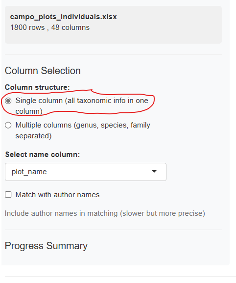
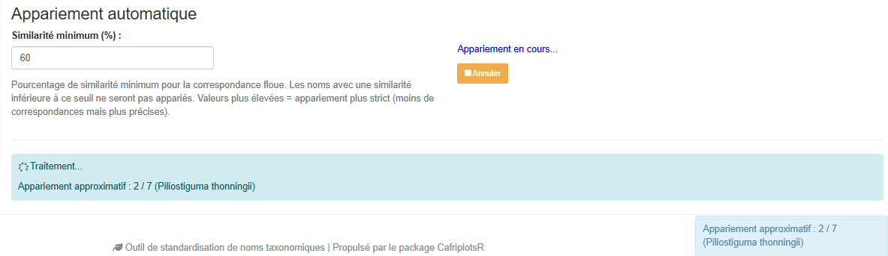
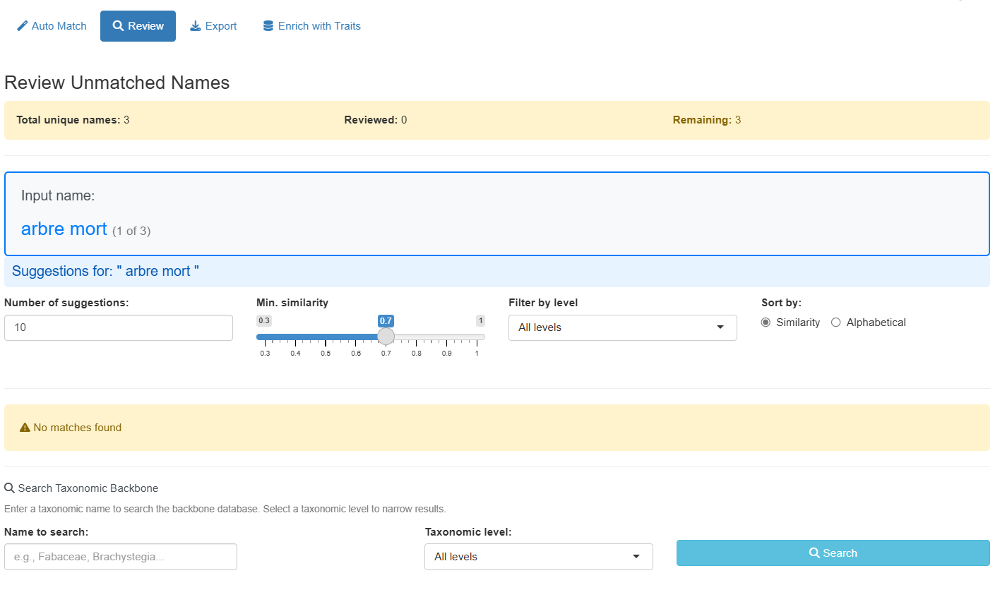
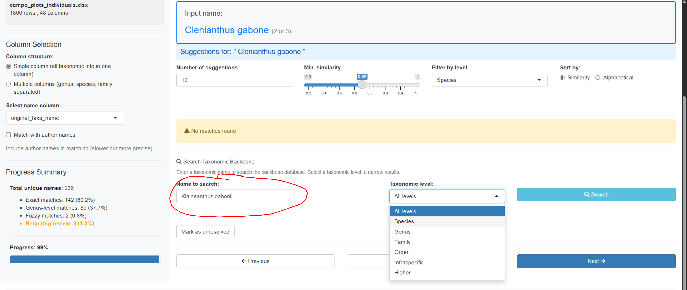
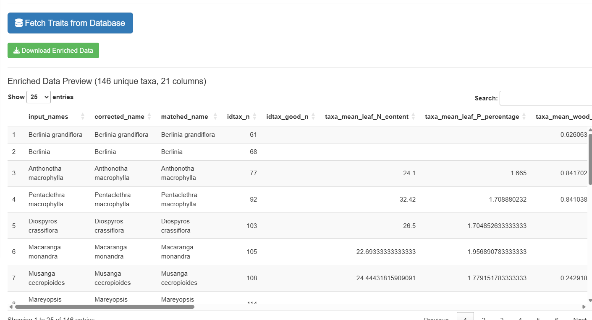
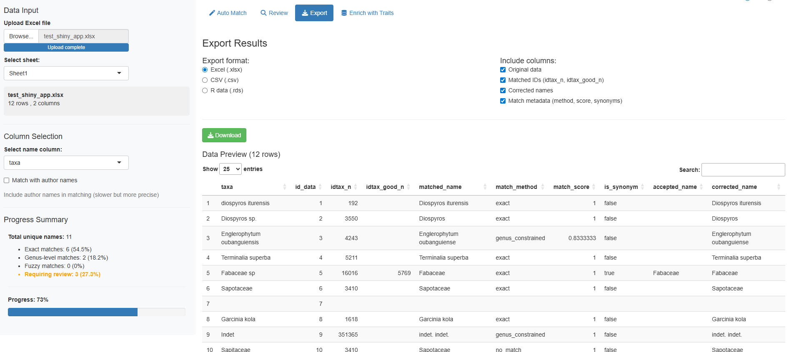

# Utiliser l'Application de Standardisation des Noms Taxonomiques

## Introduction

La fonction
[`launch_taxonomic_match_app()`](https://umr-amap.github.io/cafriplotsR/reference/launch_taxonomic_match_app.md)
fournit une application Shiny interactive pour standardiser les noms
taxonomiques contre la base de données taxonomique de référence des
plantes d’Afrique centrale. Cette interface visuelle est idéale pour :

- Explorer et nettoyer les données taxonomiques de manière interactive
- Comprendre la qualité des correspondances grâce au retour visuel
- Examiner manuellement les correspondances incertaines
- Enrichir les données avec des traits au niveau de l’espèce depuis la
  base de données
- Vérifier la provenance des noms taxonomiques via l’intégration WCVP

## Prérequis

### Avec identifiants de base de données (accès complet)

Pour accéder à toutes les fonctionnalités, y compris l’enrichissement
par les traits, des identifiants de base de données sont nécessaires
(voir
[`setup_db_credentials()`](https://umr-amap.github.io/cafriplotsR/reference/setup_db_credentials.md)).
Au lancement, l’application présente un écran de connexion où vous
saisissez vos identifiants.

### Sans identifiants

Depuis mars 2026, l’application peut être utilisée **sans aucun
identifiant de base de données**, par deux voies distinctes.

**Compte public en lecture seule.** Cliquez sur **“Se connecter en tant
qu’utilisateur public”** sur l’écran de connexion. La correspondance
*et* l’enrichissement par les traits fonctionnent ; l’ajout ou la
modification de données n’est pas possible. C’est la voie sans
identifiants disponible partout, y compris dans l’application hébergée,
et celle à privilégier si vous n’avez tout simplement pas de compte.

**Référence taxonomique en cache (hors ligne).** Cliquez sur **“Utiliser
hors ligne (référentiel en cache)”** pour travailler à partir d’une
copie locale de la référence :

- La correspondance automatique et les suggestions approximatives
  fonctionnent via une référence locale en cache
- La révision manuelle est entièrement fonctionnelle
- L’onglet Enrichissement par les traits est masqué (nécessite une
  connexion active)
- Un badge **“Lecture seule”** est affiché tout au long de la session

Le mode hors ligne prend tout son sens lorsque la base de données est
inaccessible depuis l’endroit où vous travaillez. Il n’apparaît que si
vous lancez l’application vous-même depuis R *et* qu’un cache a déjà été
téléchargé. L’application hébergée ne le propose pas : le cache y
résiderait sur le serveur et non sur votre machine — il ne résoudrait
donc rien, et l’accès public couvre déjà le travail sans compte.

## Démarrage Rapide

Lancez l’application avec une seule commande :

``` r

library(CafriplotsR)
launch_taxonomic_match_app()
```

Alternativement, pré-chargez vos données ou définissez des options :

``` r

# Avec un data.frame R
my_data <- read.csv("inventaire_arbres.csv")
launch_taxonomic_match_app(data = my_data, name_column = "nom_espece")

# Lancer en anglais (le français est la langue par défaut)
launch_taxonomic_match_app(language = "en")

# Ajuster la sensibilité de la correspondance approximative (par défaut 0.7)
launch_taxonomic_match_app(min_similarity = 0.5)  # Correspondance plus permissive
```

## Guide Étape par Étape

### Phase 1 : Vue Initiale

Au premier lancement, vous verrez l’écran de connexion. Après vous être
authentifié (ou avoir choisi le mode hors ligne), l’interface principale
apparaît avec une barre latérale pour la configuration et des onglets
pour les différentes phases du flux de travail :


Vue initiale de l’application

L’application utilise un **flux de travail par onglets** qui vous guide
à travers chaque phase séquentiellement :

1.  **Auto Match** — Correspondance automatique
2.  **Review** — Révision manuelle des noms non appariés
3.  **Export** — Téléchargement des résultats
4.  **Traits Enrichment** — Ajout de traits d’espèces (masqué en mode
    hors ligne)

### Phase 2 : Charger Vos Données

La première étape est de fournir vos données. L’application offre deux
méthodes d’import :

#### Import par Fichier (Par Défaut)

- **Charger un fichier Excel** en utilisant le navigateur de fichiers
  (supporte .xlsx, .xls) ; pour les fichiers multi-feuilles, vous pouvez
  sélectionner la feuille à utiliser
- **Charger un fichier CSV**
- **Utiliser des données R pré-chargées** (si vous avez passé le
  paramètre `data`)


Interface de chargement des données

L’application affiche un aperçu de vos données chargées pour
vérification. Les fichiers Excel sont lus avec `guess_max = 30000` pour
améliorer la détection des types de colonnes sur les grands fichiers.

#### Saisie Texte (Copier-Coller)

Pour standardiser rapidement quelques noms, ou lorsque vous avez une
liste copiée depuis une autre source, utilisez la méthode **Saisie
texte** :


Interface de saisie texte

1.  Sélectionnez **“Texte (coller/saisir)”** dans les boutons radio de
    méthode d’import
2.  Collez ou tapez vos noms taxonomiques dans la zone de texte
3.  Cliquez sur **“Charger les noms”** pour traiter la saisie

**Séparateurs acceptés :** - Un nom par ligne (recommandé) - Séparés par
virgule : `Lophira alata, Terminalia superba, Aucoumea klaineana` -
Séparés par point-virgule :
`Lophira alata; Terminalia superba; Aucoumea klaineana` - Séparés par
tabulation (utile lors du copier-coller depuis Excel)

L’application supprime automatiquement les lignes vides, les espaces
superflus, et les doublons tout en préservant l’ordre. Une colonne
unique nommée `taxon_name` est créée pour l’appariement.

### Phase 3 : Sélectionner la/les Colonne(s) de Noms

Une fois les données chargées, vous avez deux options pour sélectionner
les noms taxonomiques :

#### Mode Colonne Unique (Par Défaut)

Sélectionnez une colonne contenant le nom taxonomique complet :



Sélection de colonne - mode unique

Le menu déroulant affiche toutes les colonnes disponibles de votre jeu
de données. Choisissez celle contenant les noms d’espèces (généralement
formatés comme “Genre espèce” ou “Genre espèce Auteur”).

#### Mode Colonnes Multiples

Si vos données ont des colonnes séparées pour le genre, l’espèce et la
famille, activez **“Utiliser plusieurs colonnes”** :


Sélection de colonnes - mode multiple

L’application combine ces colonnes de manière hiérarchique : - Genre +
espèce disponibles → “Genre espèce” - Genre uniquement → “Genre” -
Famille uniquement → “Famille”

Vous pouvez aussi optionnellement inclure une colonne d’auteur.

### Phase 4 : Correspondance Automatique

Cliquez sur le bouton **“Démarrer la Correspondance”** pour commencer le
processus de correspondance automatique.

**Choix de la copie du référentiel.** Avant de démarrer, l’application
peut demander s’il faut utiliser le référentiel taxonomique déjà en
cache ou en télécharger une copie fraîche. La copie en cache est
nettement plus rapide et convient à l’usage courant ; téléchargez une
copie fraîche après l’ajout ou la révision de taxons dans la base, ou si
vous ignorez l’âge de votre cache. La boîte de dialogue indique cet âge
pour vous permettre de trancher.

L’application parcourt ensuite la stratégie ci-dessous, en s’arrêtant au
premier niveau qui apparie chaque nom. Les noms sont traités
indépendamment : une même liste peut donc renvoyer des résultats issus
de tous les niveaux :

1.  **Correspondance exacte sur l’espèce** : Recherche directe du nom
    complet (genre + espèce)
2.  **Correspondance exacte sur le genre** : Correspondance au niveau du
    genre
3.  **Correspondance exacte sur la famille** : Correspondance au niveau
    de la famille
4.  **Correspondance exacte sur un rang supérieur** : Correspondance au
    niveau de l’ordre ou de la classe (ex. noms se terminant en -opsida,
    -psida)
5.  **Correspondance approximative contrainte au genre** : Lorsque le
    genre est reconnu mais pas l’épithète, la correspondance
    approximative est restreinte aux espèces *de ce genre*. C’est ce
    niveau qui rattrape la plupart des fautes d’orthographe, et il est
    bien plus sûr qu’une recherche sur l’ensemble du référentiel puisque
    l’ensemble des candidats est déjà botaniquement plausible
6.  **Correspondance approximative complète** : Correspondance de
    chaînes approximative (trigramme-Jaccard via `stringdist`) sur tout
    le référentiel — le dernier recours, employé lorsque même le genre
    n’est pas reconnu

Les niveaux 1 à 4 enregistrent tous `match_method = "exact"` ; le rang
qui a effectivement apparié est consigné dans `tax_level`. Le niveau 5
enregistre `genus_constrained` et le niveau 6 `fuzzy`, d’où l’intérêt de
les distinguer lors de la révision des résultats.



Correspondance en cours

La barre de progression affiche le statut en temps réel et comptabilise
correctement les noms révisés manuellement dans le pourcentage
d’avancement. La barre latérale affiche des statistiques en direct :

- Nombre de correspondances exactes
- Nombre de correspondances au niveau du genre
- Nombre de correspondances approximatives
- Nombre de noms non appariés

**Point de reprise / checkpoint** : La progression de la correspondance
est automatiquement sauvegardée dans un fichier temporaire. Si vous
fermez accidentellement l’onglet du navigateur, rouvrir l’application
proposera de reprendre là où vous vous étiez arrêté.

### Phase 5 : Examiner les Résultats de Correspondance

Après la fin de la correspondance, l’onglet Auto Match affiche un
tableau résumé avec tous les noms et leur statut de correspondance :


Résumé des résultats de correspondance

Le tableau des résultats inclut :

- **Nom original** : Votre nom en entrée
- **matched_name** : Nom trouvé dans la référence
- **match_method** : Comment il a été apparié — `exact`,
  `genus_constrained`, `fuzzy`, `manual`, `unresolved` ou `no_match`.
  Voir [Valeurs de `match_method`](#valeurs-de-match_method) pour la
  signification de chacune, et pourquoi il n’existe ni `exact_species`
  ni `exact_genus`
- **match_score** : Score de similarité (0–1, plus élevé est meilleur)
- **idtax_n** : ID du taxon dans la base de données
- **is_synonym** : Si le nom apparié est un synonyme
- **accepted_name** : Nom accepté actuel (si synonyme)

**Indicateurs de qualité de correspondance.** L’application colore
chaque score pour que le tableau se parcoure d’un coup d’œil au lieu de
se lire : **vert à partir de 90 %** et **bleu à partir de 70 %**, les
scores inférieurs restant sans couleur. En règle générale :

- **Correspondance exacte (1.0)** : Correspondance parfaite, pas de
  révision nécessaire
- **Haute similarité (≥ 0.9, vert)** : Très probablement correct,
  révision rapide recommandée
- **Similarité moyenne (0.7–0.9, bleu)** : Correspondance possible,
  révision suggérée
- **Basse similarité (\< 0.7)** : Incertain, révision manuelle requise
- **Pas de correspondance** : Nécessite une sélection manuelle

Un nom apparié par `genus_constrained` mérite plus de confiance qu’un
`fuzzy` de score équivalent : les candidats auxquels il a été comparé
étaient restreints aux espèces d’un genre que l’application avait déjà
reconnu.

### Phase 6 : Révision Manuelle

Pour les noms non appariés ou incertains, passez à l’onglet **“Review”**
pour réviser manuellement et sélectionner les correspondances :



Interface de révision manuelle

L’interface de révision fournit deux façons de trouver des
correspondances :

#### Panneau de Suggestions Approximatives

Affiche des suggestions automatiques classées par similarité avec des
options de filtrage avancées :


Suggestions approximatives avec filtres

**Options de filtrage :**

- **Nombre de suggestions** : Curseur pour afficher 5–30 suggestions
- **Similarité minimale** : Ajuster le seuil (0.3–1.0)
- **Filtre de niveau taxonomique** : Filtrer par Tous, Espèce, Genre,
  Famille, Ordre, Classe ou Infraspécifique
- **Trier par** : Score de similarité ou ordre alphabétique

Chaque carte de suggestion affiche :

- Nom avec badge de similarité coloré (vert = élevé, bleu = moyen, jaune
  = bas)
- Niveau taxonomique et famille
- Information de synonymie si applicable
- Bouton **Sélectionner** pour acceptation en un clic

#### Panneau de Recherche Manuelle

Pour les noms sans bonnes suggestions, utilisez la recherche manuelle :



Interface de recherche manuelle

- Tapez n’importe quel terme de recherche pour interroger la référence
  taxonomique
- Filtrez les résultats par niveau taxonomique
- Consultez les informations détaillées pour chaque correspondance
- Sélectionnez la bonne correspondance ou marquez comme “non résolu”

**Navigation :**

- Utilisez les boutons **Précédent/Passer/Suivant** pour parcourir les
  noms non appariés
- Le compteur de progression affiche les noms révisés vs. restants
- L’application mémorise vos sélections et met à jour automatiquement
  les résultats

### Phase 7 : Enrichir les Données avec des Traits

Passez à l’onglet **“Traits Enrichment”** pour ajouter des traits au
niveau de l’espèce à vos données appariées (nécessite une connexion à la
base de données ; cet onglet est masqué en mode hors ligne) :


Interface d’enrichissement des traits

Un taxon porte généralement plusieurs mesures d’un même trait, issues
d’individus, de sources ou d’études différentes : chaque trait doit donc
être résumé à une seule valeur par taxon avant de devenir une colonne.
La manière de le faire dépend du type de trait :

- **Traits numériques** (densité du bois, masse des graines, …) :
  restitués sous forme de trois colonnes — la **moyenne**,
  l’**écart-type** et **n**, le nombre de mesures qui la sous-tendent.
  Lisez toujours `n` avant d’utiliser une moyenne : une densité du bois
  moyennée sur une seule mesure et une autre moyennée sur quarante
  donnent le même nombre avec un poids très différent derrière, et un
  écart-type n’a de sens qu’à partir de quelques mesures
- **Traits catégoriels** (forme de croissance, phénologie, …) : résumés
  selon le mode d’agrégation que vous choisissez

**Options :**

- **Mode d’agrégation catégorielle** :
  - “mode” — Utiliser la valeur la plus fréquente par taxon. Donne une
    valeur unique et nette par taxon, mais masque silencieusement les
    désaccords entre sources
  - “concat” — Concaténer toutes les valeurs uniques. Conserve chaque
    valeur enregistrée : la variation réelle comme les contradictions
    restent visibles. À privilégier lorsque vous comptez examiner les
    traits plutôt que calculer directement dessus
- **Sélectionner les colonnes à inclure** :
  - Noms d’entrée originaux
  - Noms corrigés
  - IDs taxonomiques
  - Métadonnées de correspondance

Les traits disponibles incluent la forme de croissance, la densité du
bois, les traits foliaires et les caractéristiques écologiques. Les
traits effectivement renvoyés dépendent de ce que la base contient pour
*vos* taxons : une liste d’essences de bois d’œuvre bien étudiées sera
donc bien mieux couverte qu’une liste d’herbacées.

Les données enrichies combinent vos taxons appariés avec les traits
sélectionnés. Deux vues sont disponibles sous forme de sous-onglets : un
**format large** (une ligne par taxon, traits en colonnes) et un
**format long** (une ligne par combinaison taxon × trait) :



Résultats des données enrichies

**Note** : L’export enrichi crée une ligne par taxon unique, pas par
ligne d’entrée. Les noms d’entrée sont concaténés avec des séparateurs
pipe.

#### Panneau Sources des Données

Un sous-onglet **Sources des données** liste toutes les citations de
traits utilisées, avec le nombre de mesures par source. Cela vous aide à
suivre la provenance des données pour votre analyse et à citer les
sources correctement.

### Phase 8 : Exporter les Résultats

Passez à l’onglet **“Export”** pour télécharger votre jeu de données
standardisé :



Options d’export

**Formats disponibles :**

- **Excel (.xlsx)** : Idéal pour partager avec des collaborateurs
- **CSV (.csv)** : Format tabulaire universel
- **RDS (.rds)** : Format natif R préservant les types de données

**Colonnes sélectionnables.** Vos colonnes d’origine sont toujours
incluses ; les trois groupes ci-dessous peuvent chacun être désactivés :

- **IDs appariés** — `idtax_n`, `idtax_good_n`
- **Noms corrigés** — `corrected_name`, `matched_name`
- **Métadonnées de correspondance** — `match_method`, `match_score`,
  `is_synonym`, `accepted_name`

Les colonnes WCVP ne constituent pas l’un de ces groupes : elles sont
ajoutées dès lors que l’option WCVP était activée avant la
correspondance, et accompagnent l’export dans tous les cas.
L’identifiant de ligne interne `id_data` est toujours retiré.

**Descriptions des colonnes dans l’application.** À côté de l’aperçu,
l’onglet Export liste chaque colonne standardisée présente dans vos
résultats avec une description d’une ligne de son contenu — le même
contenu que [Comprendre les Colonnes de
Sortie](#comprendre-les-colonnes-de-sortie) ci-dessous. Seules les
colonnes réellement présentes sont décrites : la liste reflète donc les
options que vous avez choisies, et non tout ce que l’application sait
produire. Vos propres colonnes d’entrée sont conservées mais pas
décrites une à une, l’application n’en sachant rien.

Un tableau de prévisualisation montre les données avant l’export avec
des contrôles de pagination.

## Comprendre les Colonnes de Sortie

Vos colonnes d’origine sont toujours conservées. L’application ajoute
les colonnes ci-dessous — les mêmes descriptions sont affichées dans
l’application elle-même, à côté du tableau d’aperçu de l’onglet Export :
vous n’avez donc pas à revenir ici pour les lire.

| Colonne | Description |
|----|----|
| `idtax_n` | Identifiant du taxon apparié dans le référentiel taxonomique |
| `idtax_good_n` | Identifiant du taxon accepté. Diffère de `idtax_n` lorsque le nom apparié est un synonyme |
| `matched_name` | Nom trouvé dans le référentiel correspondant à votre nom d’entrée — il peut lui-même être un synonyme |
| `corrected_name` | Nom standardisé final : le nom accepté lorsque la correspondance est un synonyme, ou le nom WCVP si cette option est activée |
| `accepted_name` | Nom accepté lorsque le nom apparié est un synonyme ; vide sinon |
| `is_synonym` | `TRUE` lorsque le nom apparié est un synonyme d’un nom accepté |
| `match_method` | Comment le nom a été apparié — voir le tableau ci-dessous |
| `match_score` | Similarité entre votre nom d’entrée et le nom apparié, de 0 à 1 (1 = exact, ou correspondance que vous avez confirmée vous-même) |

Lorsque l’option WCVP est activée (voir [Intégration
WCVP](#int%C3%A9gration-wcvp)), quatre colonnes supplémentaires sont
ajoutées et `corrected_name` est **remplacé** par le nom WCVP partout où
il en existe un :

| Colonne | Description |
|----|----|
| `wcvp_taxon_name` | Nom accepté selon le World Checklist of Vascular Plants |
| `wcvp_family` | Famille selon WCVP |
| `wcvp_taxon_authors` | Autorité taxonomique selon WCVP |
| `wcvp_taxon_status` | Statut du nom dans WCVP (ex. `Accepted`) |
| `name_source` | Référence ayant fourni `corrected_name` : référentiel `internal` ou `WCVP` |

### Valeurs de `match_method`

| Valeur | Signification |
|----|----|
| `exact` | Le nom a été trouvé tel quel dans le référentiel. Les quatre niveaux exacts renvoient tous `exact` — voir la note ci-dessous |
| `genus_constrained` | Le genre a été reconnu : la correspondance approximative a donc été restreinte aux espèces de ce genre. C’est généralement le résultat approximatif le plus fiable |
| `fuzzy` | Correspondance approximative sur l’ensemble du référentiel, utilisée lorsque le genre n’a pas été reconnu |
| `manual` | Vous avez choisi cette correspondance vous-même dans l’onglet Review |
| `unresolved` | Vous avez marqué ce nom comme impossible à résoudre dans l’onglet Review |
| `no_match` | La correspondance automatique n’a rien trouvé et le nom n’a pas encore été révisé |

**Le niveau exact n’est pas consigné dans `match_method`.** Les quatre
niveaux exacts — espèce, genre, famille et rang supérieur — écrivent
tous `exact`. Celui qui s’est appliqué est consigné séparément dans
`tax_level` (`genus`, `family`, `order`, `higher`) : consultez donc
cette colonne plutôt que d’attendre `exact_species` ou `exact_genus`,
que l’application ne produit jamais.

L’application ajoute également un identifiant de ligne interne `id_data`
lorsque votre fichier n’en contient pas déjà un. Il sert à garder les
lignes alignées durant la correspondance et la révision, et il est
retiré de tous les exports : vous ne le verrez donc pas dans le fichier
téléchargé.

## Options Avancées

### Sélection de la Langue

L’application supporte **l’opération bilingue** avec des interfaces en
français et en anglais. **Le français est la langue par défaut**.

Un sélecteur de langue est situé en haut à droite de l’application : -
Cliquez sur **“FR”** pour l’interface en français - Cliquez sur **“EN”**
pour l’interface en anglais

Le changement est instantané et affecte tous les éléments de
l’interface. Pour définir la langue initiale par programme :

``` r

# Lancer l'application en anglais
launch_taxonomic_match_app(language = "en")

# Lancer l'application en français (par défaut)
launch_taxonomic_match_app(language = "fr")
```

### Intégration WCVP

L’application peut optionnellement rapprocher les résultats du **World
Checklist of Vascular Plants (WCVP)**, référence internationale
maintenue par les Royal Botanic Gardens de Kew. Lorsque la base de
données taxa contient des données WCVP, une case à cocher **“Utiliser
les noms WCVP en sortie”** apparaît dans la barre latérale. Elle ne
modifie pas la correspondance elle-même — les noms sont toujours
appariés d’abord au référentiel interne — mais elle change ce que
rapporte la sortie.

L’activer ajoute quatre colonnes :

- `wcvp_taxon_name` — Nom accepté selon WCVP
- `wcvp_family` — Famille selon WCVP
- `wcvp_taxon_authors` — Autorité taxonomique selon WCVP
- `wcvp_taxon_status` — Statut du nom dans WCVP (ex. `Accepted`)

**Elle réécrit également `corrected_name`.** Partout où WCVP contient le
taxon, `corrected_name` devient le nom WCVP plutôt que celui du
référentiel interne ; les taxons absents de WCVP conservent leur nom
interne. La colonne `name_source` enregistre laquelle des deux
références a fourni chaque valeur (`internal` ou `WCVP`), ce qui rend la
substitution vérifiable — consultez-la avant de considérer que
`corrected_name` provient d’une référence unique.

Activez cette option lorsque vos résultats doivent s’aligner sur une
liste de référence internationale, et laissez-la désactivée lorsque vous
avez besoin de noms cohérents avec le reste de la base. La case doit
être cochée **avant** la correspondance, l’enrichissement s’effectuant
au cours de cette étape.

### Ajuster la Correspondance Approximative

Contrôlez la sensibilité de la correspondance avec le paramètre
`min_similarity` :

``` r

# Très strict - uniquement des correspondances de haute qualité
launch_taxonomic_match_app(min_similarity = 0.8)

# Paramètre par défaut
launch_taxonomic_match_app(min_similarity = 0.7)

# Plus permissif - permet des correspondances de moindre qualité
launch_taxonomic_match_app(min_similarity = 0.5)
```

Des valeurs plus basses ratissent plus large mais peuvent inclure des
faux positifs. Des valeurs plus élevées sont plus conservatrices mais
peuvent manquer des correspondances valides. La valeur par défaut a été
relevée de 0.3 à **0.7** pour réduire les suggestions non pertinentes.

### Augmenter les Suggestions

Afficher plus de suggestions de correspondance approximative par nom :

``` r

# Afficher les 20 meilleures suggestions au lieu des 10 par défaut
launch_taxonomic_match_app(max_suggestions = 20)
```

Vous pouvez aussi ajuster ceci de manière interactive dans l’onglet
Review en utilisant le curseur.

### Mode Hors Ligne

Si vous n’avez pas de connexion à la base de données, cliquez sur
**“Utiliser hors ligne (référentiel en cache)”** sur l’écran de
connexion. L’application :

- Télécharge et met en cache la référence localement à la première
  utilisation
- Effectue la correspondance de chaînes entièrement dans R via
  `stringdist` (trigramme-Jaccard)
- Prend en charge la correspondance automatique, les suggestions
  approximatives et la recherche manuelle
- Masque l’onglet Enrichissement par les traits (nécessite une connexion
  active)
- Affiche un badge **“Lecture seule”** tout au long de la session

## Paramètres de la Fonction

``` r

launch_taxonomic_match_app(
  data            = NULL,          # Optionnel : pré-charger un data.frame
  name_column     = NULL,          # Optionnel : pré-sélectionner une colonne
  language        = c("fr", "en"), # Langue de l'interface (par défaut : "fr")
  min_similarity  = 0.7,           # Seuil de correspondance approximative (0-1)
  max_suggestions = 10,            # Max suggestions par nom non apparié
  mode            = "interactive", # Mode de révision ("interactive" ou "batch")
  launch.browser  = TRUE           # Ouvrir l'application dans le navigateur
)
```

## Dépannage

### Problèmes de Connexion

**Problème** : “Échec de connexion à la base de données”

**Solutions** :

``` r

# Vérifier la connexion
db_diagnostic()

# Réinitialiser les identifiants si nécessaire
remove_db_credentials()
setup_db_credentials()
```

Alternativement, utilisez le **mode hors ligne** (cliquez sur “Utiliser
hors ligne (référentiel en cache)” sur l’écran de connexion) pour
travailler sans connexion active à la base de données.

### Pas de Correspondances Approximatives Trouvées

**Problème** : Aucune suggestion n’apparaît pour les noms non appariés

**Causes possibles** : - Seuil `min_similarity` trop élevé - Les noms
taxonomiques contiennent des fautes de frappe ou un formatage non
standard - Les noms ne sont pas présents dans la référence taxonomique
(ex. taxons non africains)

**Solutions** : - Diminuer `min_similarity` :
`launch_taxonomic_match_app(min_similarity = 0.5)` - Utiliser le filtre
de niveau taxonomique pour chercher au niveau du genre ou de la
famille - Nettoyer les noms en entrée (supprimer les espaces
supplémentaires, corriger les fautes évidentes) - Vérifier que les noms
sont des taxons africains

### Performance de Correspondance Lente

**Problème** : La correspondance prend très longtemps pour les grands
jeux de données

**Solutions** : - Activer le **mode hors ligne** : la correspondance
s’exécute localement via `stringdist`, sans allers-retours vers la base
de données - Utiliser le traitement par lots à la place :
[`match_taxonomic_names()`](https://umr-amap.github.io/cafriplotsR/reference/match_taxonomic_names.md)
pour un flux de travail programmatique - Traiter les données en morceaux
(diviser les grands jeux de données)

## Quand Utiliser l’Application vs. l’Approche Programmatique

### Utilisez l’Application Shiny quand :

- Exploration interactive des données
- Vous préférez les interfaces visuelles
- Le jeu de données est de petite à moyenne taille (\<5 000 lignes)
- Besoin de réviser manuellement les correspondances incertaines
- Apprentissage du processus de correspondance

### Utilisez `match_taxonomic_names()` quand :

- Traitement de grands jeux de données (\>5 000 lignes)
- Automatisation des flux de travail dans des scripts
- Intégration avec des pipelines de données
- La reproductibilité est critique (*NE JAMAIS SUPPRIMER LA COLONNE
  CONTENANT LE NOM ORIGINAL*)
- Traitement par lots de plusieurs fichiers

Exemple d’approche programmatique :

``` r

# Charger les données
my_data <- read.csv("inventaire_arbres.csv")

# Apparier les noms
matched <- match_taxonomic_names(
  names = my_data$nom_espece,
  min_similarity = 0.7
)

# Fusionner avec les données originales
result <- cbind(my_data, matched)

# Exporter
write.csv(result, "inventaire_standardise.csv", row.names = FALSE)
```

## Voir Aussi

- [`match_taxonomic_names()`](https://umr-amap.github.io/cafriplotsR/reference/match_taxonomic_names.md)
  : Fonction de correspondance sous-jacente pour usage programmatique
- [`query_taxa()`](https://umr-amap.github.io/cafriplotsR/reference/query_taxa.md)
  : Interroger directement la référence taxonomique
- [`match_tax()`](https://umr-amap.github.io/cafriplotsR/reference/match_tax.md)
  : Fonction simple de recherche taxonomique
- [`launch_taxo_backbone_app()`](https://umr-amap.github.io/cafriplotsR/reference/launch_taxo_backbone_app.md)
  : Outil interactif pour explorer la référence taxonomique
- [`vignette("using-query-plots-fr")`](https://umr-amap.github.io/cafriplotsR/articles/using-query-plots-fr.md)
  : Guide pour interroger les données de parcelles

## Conseils pour de Meilleurs Résultats

1.  **Nettoyez d’abord vos données** : Supprimez les fautes de frappe
    évidentes, les espaces supplémentaires et les caractères spéciaux
2.  **Comprenez vos données** : Sachez quels groupes taxonomiques sont
    dans votre jeu de données
3.  **Utilisez le mode multi-colonnes** : Si vous avez des colonnes
    séparées genre/espèce/famille, combinez-les pour une meilleure
    correspondance
4.  **Filtrez par niveau taxonomique** : Utilisez le filtre de niveau
    dans l’onglet Review pour trouver des correspondances au genre ou à
    la famille
5.  **Examinez les scores de correspondance** : N’acceptez pas
    aveuglément les correspondances à faible similarité (\<0.6)
6.  **Utilisez le point de reprise** : L’application sauvegarde
    automatiquement votre progression — si vous fermez l’onglet, vous
    pouvez reprendre là où vous vous étiez arrêté
7.  **Documentez les paramètres** : Notez quelle valeur de
    `min_similarity` vous avez utilisée pour la reproductibilité
8.  **Citez les sources des données** : Consultez le panneau Sources des
    données dans l’onglet Traits pour les citations à inclure dans vos
    méthodes

## Exemple de Flux de Travail

Voici un flux de travail complet du début à la fin :

``` r

# 1. Charger vos données
trees <- read.csv("inventaire_forestier.csv")
# Colonnes : plot_id, tree_number, species_name, dbh, height

# 2. Lancer l'application avec les données
launch_taxonomic_match_app(
  data = trees,
  name_column = "species_name",
  language = "fr",
  min_similarity = 0.7
)

# 3. Dans l'application :
#    - S'authentifier (ou choisir le mode hors ligne)
#    - Revoir les correspondances automatiques dans l'onglet Auto Match
#    - Utiliser l'onglet Review pour résoudre les noms non appariés
#    - Activer optionnellement la sortie WCVP via la case à cocher dans la barre latérale
#    - Enrichir optionnellement avec des traits dans l'onglet Traits Enrichment
#      (consulter le panneau Sources des données pour les citations)
#    - Exporter comme "inventaire_forestier_standardise.xlsx"

# 4. Continuer l'analyse avec les données standardisées
standardized <- readxl::read_excel("inventaire_forestier_standardise.xlsx")

# Vous avez maintenant des IDs taxonomiques propres pour des analyses ultérieures !
```

Ce flux de travail assure que vos données taxonomiques sont
standardisées et prêtes pour des analyses en aval comme les métriques de
diversité, les analyses basées sur les traits ou l’intégration dans la
base de données.
