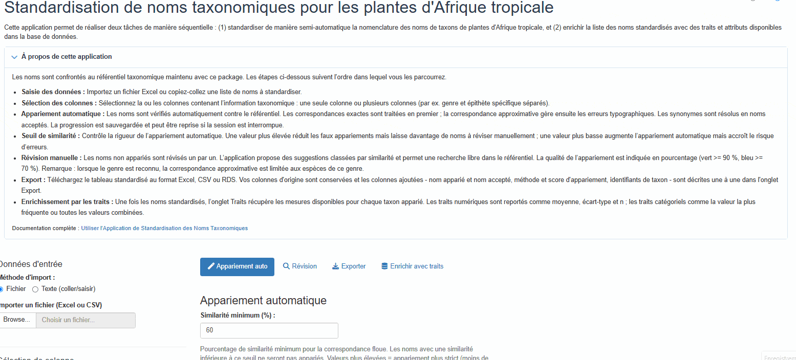
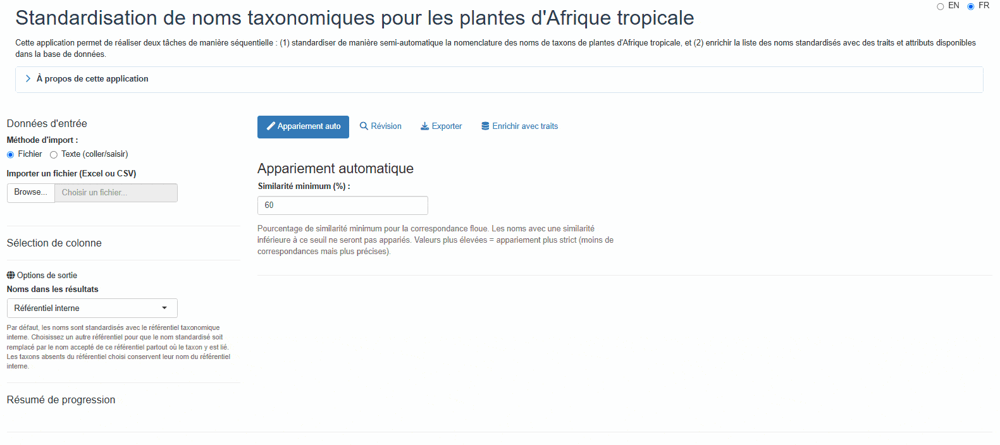
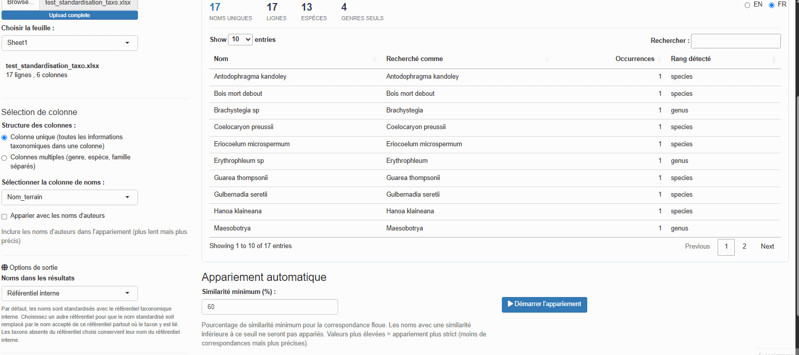
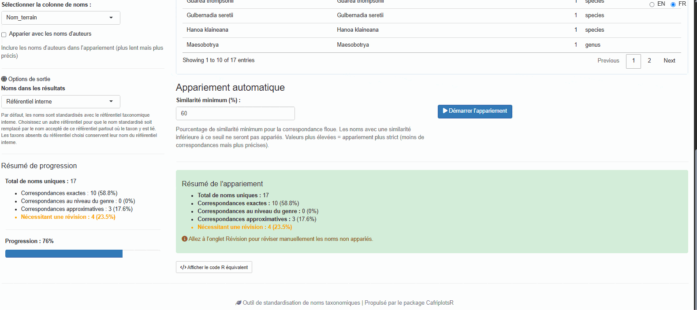
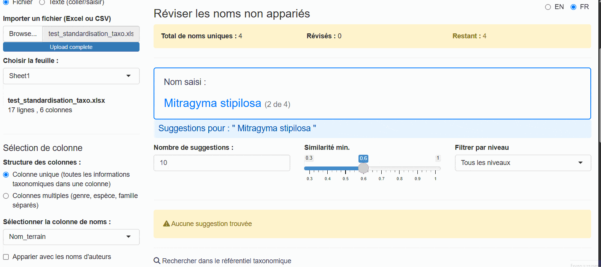
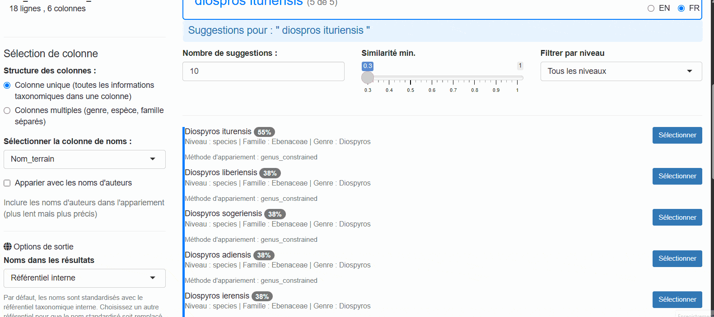
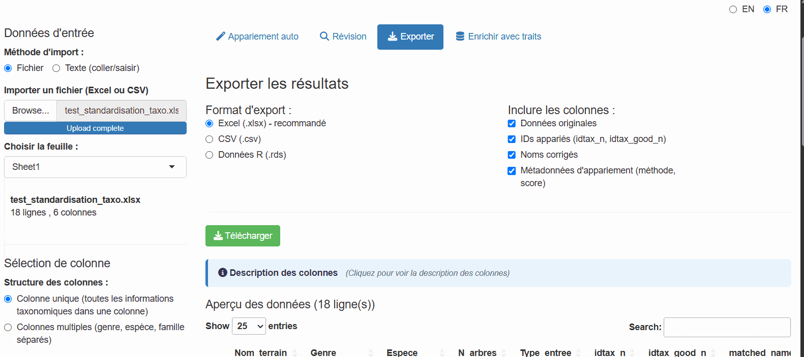
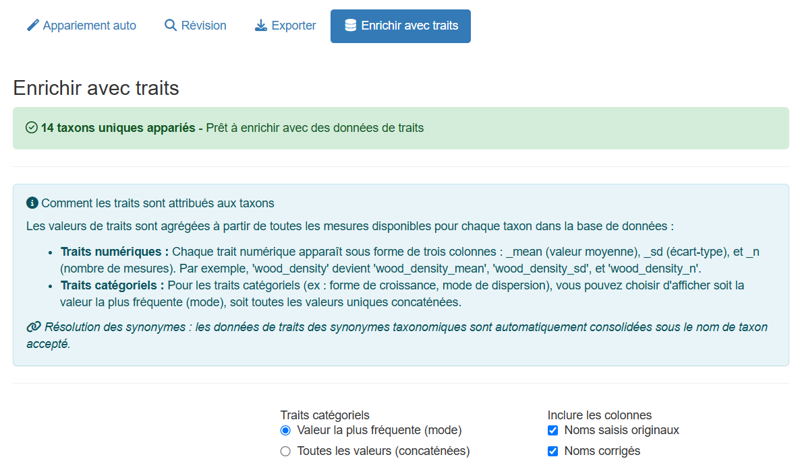
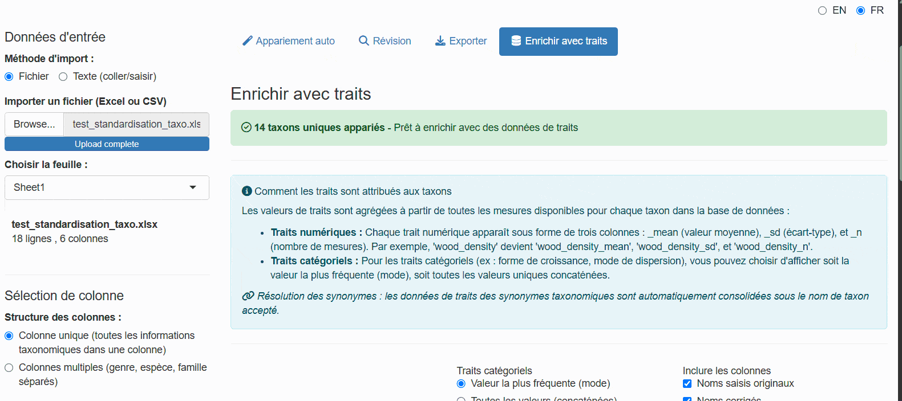

# Using the Taxonomic Name Standardization App

## Introduction

The
[`launch_taxonomic_match_app()`](https://umr-amap.github.io/cafriplotsR/reference/launch_taxonomic_match_app.md)
function provides an interactive Shiny application for standardizing
taxonomic names against the Central African plant taxonomic backbone
database. This visual interface is ideal for:

- Exploring and cleaning taxonomic data interactively
- Understanding match quality through visual feedback
- Manually reviewing uncertain matches
- Enriching data with species-level traits from the database
- Checking taxonomic name provenance against external references (WCVP,
  APD)

## Prerequisites

### Where the app runs

The same application exists in two places, and this vignette refers to
both.

- **Locally**, in your own R session, via
  [`launch_taxonomic_match_app()`](https://umr-amap.github.io/cafriplotsR/reference/launch_taxonomic_match_app.md).
  This is what the code examples below assume.
- **Hosted**, at <https://cafri-taxomatch.lab.sspcloud.fr> — the same
  app served from SSP Cloud, which you open in a browser with nothing to
  install and no R required. Wherever this vignette says *the hosted
  app*, it means that address.

The hosted copy queries the same database, so a standardized list
exported from it carries the same `idtax_n` values as one produced
locally. Use it to try the app out, or to point a colleague at the
workflow without asking them to install the package. For repeated work
on your own lists, launching locally is usually the faster choice — see
[Slow Matching Performance](#slow-matching-performance).

### With database credentials (full access)

To access all features including traits enrichment, you need database
credentials configured (see
[`setup_db_credentials()`](https://umr-amap.github.io/cafriplotsR/reference/setup_db_credentials.md)).
Once launched, the app presents a login screen where you enter your
credentials.

### Without credentials

Since March 2026, the app can be used **without any database
credentials**, by either of two routes.

**Public read-only account.** Click **“Connect as public user”** on the
login screen. Matching *and* traits enrichment both work; adding or
modifying data does not. This is the credential-free route available
everywhere, including the hosted app, and it is the one to reach for if
you simply have no account.

**Offline cached backbone.** Click **“Use offline (cached backbone)”**
to work from a locally cached copy of the backbone:

- Automatic matching and fuzzy suggestions work via a cached local
  backbone
- Manual review is fully functional
- Traits enrichment is hidden (requires a live database connection)
- A **“Read-only”** badge is displayed to indicate limited permissions

Offline mode earns its keep when the database is unreachable from where
you are working. It appears only when you launch the app yourself from R
*and* a cache has already been downloaded. The hosted app does not offer
it, because there the cache would sit on the server rather than on your
machine — so it would solve nothing, and public access already covers
working without an account.

## Quick Start

Launch the app with a single command:

``` r

library(CafriplotsR)
launch_taxonomic_match_app()
```

Alternatively, pre-load your data or set options:

``` r

# With R data.frame
my_data <- read.csv("tree_inventory.csv")
launch_taxonomic_match_app(data = my_data, name_column = "species_name")

# Launch in English (default is French)
launch_taxonomic_match_app(language = "en")

# Show more suggestions per name during review
launch_taxonomic_match_app(max_suggestions = 20)
```

The matching threshold is **not** a launch argument: it is set on the
Auto Match tab, as a percentage, and can be changed between runs. See
[Adjusting Fuzzy Matching](#adjusting-fuzzy-matching).

## Step-by-Step Walkthrough

### Phase 1: Initial View

When you first launch the app, you see a login screen. It offers the
three routes described under [Prerequisites](#prerequisites): your own
database credentials, the public read-only account, or the offline
cached backbone.


The login screen and the three ways past it

After authenticating (or choosing offline mode), the main interface
appears with a sidebar for configuration and tabs for different workflow
phases:



Application initial view

The app uses a **tabbed workflow** that guides you through each phase
sequentially:

1.  **Auto Match** — Automatic matching
2.  **Review** — Manual review of unmatched names
3.  **Export** — Download results
4.  **Traits Enrichment** — Add species traits (hidden in offline mode)

### Phase 2: Upload Your Data

The first step is to provide your data. The app offers two input
methods:

#### File Upload (Default)

- **Upload an Excel file** using the file browser (supports .xlsx,
  .xls); for multi-sheet files you can select which sheet to use
- **Upload a CSV file**
- **Use pre-loaded R data** (if you passed the `data` parameter)



Data upload interface

The app displays a preview of your uploaded data so you can verify it
was read correctly. Excel files are read with `guess_max = 30000` to
improve column type detection for large files.

#### Text Input (Copy-Paste)

For quick standardization of a few names, or when you have a list copied
from another source, use the **Text input** method:


Text input interface

1.  Select **“Text input (paste/type)”** from the input method radio
    buttons
2.  Paste or type your taxonomic names in the text area
3.  Click **“Load names”** to process the input

**Accepted separators:** - One name per line (recommended) -
Comma-separated:
`Lophira alata, Terminalia superba, Aucoumea klaineana` -
Semicolon-separated:
`Lophira alata; Terminalia superba; Aucoumea klaineana` - Tab-separated
(useful when pasting from Excel)

The app automatically removes empty lines, trims whitespace, and
deduplicates names while preserving order. A single column named
`taxon_name` is created for matching.

### Phase 3: Select Name Column(s)

Once data is loaded, you have two options for selecting taxonomic names:

#### Single Column Mode (Default)

Select one column containing the full taxonomic name:



Column selection - single mode

The dropdown menu shows all available columns from your dataset. Choose
the one containing species names (typically formatted as “Genus species”
or “Genus species Author”).

#### Multiple Column Mode

If your data has separate columns for genus, species, and family, enable
**“Use multiple columns”**:


Column selection - multiple columns

The app combines these columns hierarchically: - Genus + species
available → “Genus species” - Genus only → “Genus” - Family only →
“Family”

You can also optionally include an author column.

### Phase 4: Automatic Matching

Click the **“Start Matching”** button to begin the automatic matching
process.

**Choosing the backbone copy.** Before matching starts the app may ask
whether to use the taxonomic backbone it already has cached or download
a fresh copy. The cached copy is much faster and is what you want in
ordinary use; download a fresh one after taxa have been added or revised
in the database, or if you are unsure how old your cache is. The dialog
reports the cache’s age so you can decide.

The app then works through the strategy below, stopping at the first
stage that matches each name. Names are handled independently, so one
list can come back with results from every stage:

1.  **Exact match on species**: Direct lookup of the full name (genus +
    species)
2.  **Exact match on genus**: Match at genus level
3.  **Exact match on family**: Match at family level
4.  **Exact match on higher rank**: Match at order or class level
    (e.g. names ending in -opsida, -psida)
5.  **Genus-constrained fuzzy match**: When the genus is recognised but
    the epithet is not, approximate matching is restricted to species
    *within that genus*. This is what catches most misspellings, and it
    is far safer than searching the whole backbone because the candidate
    set is already botanically plausible
6.  **Full fuzzy match**: Approximate string matching (trigram-Jaccard
    via `stringdist`) across the whole backbone — the last resort, used
    when even the genus is unrecognised

Stages 1–4 all record `match_method = "exact"`; the rank that matched is
recorded in `tax_level`. Stage 5 records `genus_constrained` and stage 6
records `fuzzy`, which is why the two are worth telling apart when you
review the results.


Matching in progress

The progress bar shows real-time status and correctly accounts for
manually reviewed names in the completion percentage. The sidebar
displays live statistics:

- Number of exact matches
- Number of genus-level matches
- Number of fuzzy matches
- Number of unmatched names

**Checkpoint / resume**: Matching progress is automatically saved to a
temporary file. If you accidentally close the browser tab, re-opening
the app will offer to resume from where you left off.

### Phase 5: Review Match Results

When matching completes, the Auto Match tab shows a **Matching
Summary**: counts, not rows. It tells you how the run went, not what
happened to any individual name.


Matching results summary

- **Total unique names** submitted
- **Exact matches**, with their share of the total
- **Genus-level matches**
- **Fuzzy matches**
- **Requiring review** — shown in orange when above zero, with a
  reminder to go to the Review tab

The per-name results are not on this tab. To see them you go to one of
two places:

- The **Review tab**, which walks you through the names the matcher
  could not settle, one at a time.
- The **Export tab**, whose preview table lists every row with all its
  columns — `matched_name`, `match_method`, `match_score`, `idtax_n`,
  `is_synonym`, `accepted_name` and the rest. See [Understanding Output
  Columns](#understanding-output-columns) for what each one holds.

**Where the colours are.** Scores are colour-coded as badges on the
cards in the **Review tab** — beside each fuzzy suggestion and each
manual-search result — and nowhere else. The Export preview is a plain
table with no conditional colouring, and the Matching Summary above has
no per-name scores to colour at all. Read the badges as:

- **Exact match (100 %)**: perfect match, no review needed
- **High similarity (≥ 90 %, green)**: very likely correct, a glance is
  enough
- **Medium similarity (70–89 %, blue)**: possible match, worth reading
- **Low similarity (\< 70 %)**: uncertain, decide by hand. Fuzzy
  suggestion cards shade 50–69 % yellow and anything below that grey;
  manual-search cards go straight to grey under 70 %
- **No match**: requires manual selection

A name matched by `genus_constrained` deserves more confidence than a
plain `fuzzy` match at the same score, because the candidates it was
compared against were restricted to species in a genus the app had
already recognised.

### Phase 6: Manual Review

For unmatched or uncertain names, switch to the **“Review”** tab to
manually review and select matches:



Manual review interface

The review interface provides two ways to find matches:

#### Fuzzy Suggestions Panel

Shows automatic suggestions ranked by similarity with advanced filtering
options:



Fuzzy suggestions with filters

**Filtering options:**

- **Number of suggestions**: Slider to show 5–30 suggestions
- **Minimum similarity**: Adjust threshold (0.3–1.0)
- **Taxonomic level filter**: Filter by All, Species, Genus, Family,
  Order, Class, or Infraspecific

Suggestions are always listed best match first, by similarity score.

Each suggestion card displays:

- Name with color-coded similarity badge (green ≥ 90 %, blue ≥ 70 %,
  yellow ≥ 50 %, grey below)
- Taxonomic level and family
- Synonym information if applicable
- **Select** button for one-click acceptance

#### Manual Search Panel

For names without good suggestions, use the manual search:



Manual search interface

- Type any search term to query the taxonomic backbone
- Filter results by taxonomic level
- View detailed information for each match
- Select the correct match or mark as “unresolved”

**Navigation:**

- Use **Previous/Skip/Next** buttons to browse unmatched names
- Progress counter shows reviewed vs. remaining names
- The app remembers your selections and automatically updates the
  results

### Phase 7: Export Results

Switch to the **“Export”** tab to download your standardized dataset:



Export options

**Available formats:**

- **Excel (.xlsx)**: Best for sharing with collaborators
- **CSV (.csv)**: Universal tabular format
- **RDS (.rds)**: R-native format preserving data types

**Selectable columns.** Your original columns are always included; the
three groups below can each be switched off:

- **Matched IDs** — `idtax_n`, `idtax_good_n`
- **Corrected names** — `corrected_name`, `matched_name`
- **Match metadata** — `match_method`, `match_score`, `is_synonym`,
  `accepted_name`

Backbone columns are not one of these groups: they are appended whenever
a reference other than the internal backbone was chosen before matching,
and travel with the export either way. The internal `id_data` row
identifier is always stripped.

**What the file is called inside.** The Excel export puts the names on a
sheet named `taxonomy`. When the names came from a reference other than
the internal backbone, a second sheet named `citations` records what to
cite for them — see [Citing the reference you
chose](#citing-the-reference).

**Column descriptions in the app.** Beside the preview, the Export tab
lists every standardized column present in your results with a one-line
description of what it holds — the same content as [Understanding Output
Columns](#understanding-output-columns) below. Only the columns actually
present are described, so the list reflects the options you chose rather
than everything the app can produce. Your own input columns are
preserved but not described individually, since the app knows nothing
about them.

A preview table shows the data before export with pagination controls.

This tab exports the **standardized names**. If you also want traits
attached, carry on to the next phase, which has download buttons of its
own.

### Phase 8: Enrich Data with Traits

Switch to the **“Traits Enrichment”** tab to add species-level traits to
your matched data (requires a database connection; this tab is hidden in
offline mode):



Trait enrichment interface

A taxon usually carries several measurements of the same trait, from
different individuals, sources or studies, so every trait has to be
summarised to one value per taxon before it can be added as a column.
How that is done depends on the trait’s type:

- **Numeric traits** (wood density, seed mass, …) are reported as three
  columns — the **mean**, the **standard deviation** and **n**, the
  number of measurements behind it. Always read `n` before using a mean:
  a wood density averaged from one measurement and one averaged from
  forty are the same number with very different weight behind them, and
  an `sd` is only meaningful once `n` is at least a few
- **Categorical traits** (growth form, phenology, …) are summarised
  according to the aggregation mode you choose

**Options:**

- **Categorical aggregation mode**:
  - “mode” — Use the most frequent value per taxon. Gives one clean
    value per taxon, but silently hides disagreement between sources
  - “concat” — Concatenate all unique values. Keeps every recorded
    value, so genuine variation and contradictions both stay visible.
    Prefer this when you intend to inspect the traits rather than
    compute on them directly
- **Select columns to include**:
  - Original input names
  - Corrected names
  - Taxonomic IDs
  - Match metadata

Available traits include growth form, wood density, leaf traits, and
ecological characteristics. Which traits come back depends on what the
database actually holds for *your* taxa, so a list of well-studied
timber species will be far better covered than a list of herbs.

The enriched data combines your matched taxa with selected traits. A
**wide format** (one row per taxon, traits as columns) and a **long
format** (one row per taxon × trait combination) are both available as
separate sub-tabs:



Enriched data results

**Note**: The enriched export creates one row per unique taxon, not per
input row. Input names are concatenated with pipe separators.

#### Data Sources panel

A **Data Sources** sub-tab lists all trait citations used, with
measurement counts per source. This helps you track data provenance for
your analysis and cite sources correctly.

#### Downloading the enriched data

You do not go back to the Export tab for this. Each results sub-tab
carries its own green download button:

- **Download Wide Format** — one row per taxon, traits as columns
- **Download Long Format** — one row per taxon × trait, shown only when
  long-format data exists

Both produce an **Excel file** named `taxa_traits_wide_YYYYMMDD.xlsx` or
`taxa_traits_long_YYYYMMDD.xlsx`, dated the day you download it. Each
file holds a `traits` sheet and, whenever citations were collected, a
second `citations` sheet with the provenance from the Data Sources panel
— so the sources travel with the data instead of being left behind in
the app.

The Export tab and these buttons answer different questions: Export
gives you your rows with standardized names attached, while these give
you the traits table built from them, one row per taxon.

## Understanding Output Columns

Your original columns are always preserved. The app appends the columns
below — the same descriptions are shown in the app itself, beside the
preview table on the Export tab, so you do not have to come back here to
read them.

| Column | Description |
|----|----|
| `idtax_n` | Identifier of the matched taxon in the taxonomic backbone |
| `idtax_good_n` | Identifier of the accepted taxon. Differs from `idtax_n` when the matched name is a synonym |
| `matched_name` | Name found in the backbone corresponding to your input name — this may itself be a synonym |
| `corrected_name` | Final standardized name: the accepted name when the match is a synonym, or the name from the chosen reference when one was chosen |
| `accepted_name` | Accepted name when the matched name is a synonym; empty otherwise |
| `is_synonym` | `TRUE` when the matched name is a synonym of an accepted name |
| `match_method` | How the name was matched — see the table below |
| `match_score` | Similarity between your input name and the matched name, 0 to 1 (1 = exact, or a match you confirmed yourself) |

When a reference other than the internal backbone is chosen (see [Names
from another reference](#names-from-another-reference)), four more
columns are appended and `corrected_name` is **replaced** by that
reference’s name wherever one exists:

| Column | Description |
|----|----|
| `backbone_taxon_name` | Accepted name in the chosen reference |
| `backbone_family` | Family according to the chosen reference |
| `backbone_authors` | Taxonomic authorship according to the chosen reference |
| `backbone_status_raw` | Status of the name in the chosen reference (e.g. `Accepted`) |
| `name_source` | Which reference supplied `corrected_name`: `internal`, or the code of the chosen one (`wcvp`, `apd`, …) |

Choosing WCVP additionally repeats those four columns as
`wcvp_taxon_name`, `wcvp_family`, `wcvp_taxon_authors` and
`wcvp_taxon_status`, the names they had before any other reference
existed, so that scripts written against earlier versions still find
them.

### Values of `match_method`

| Value | Meaning |
|----|----|
| `exact` | The name was found verbatim in the backbone. All four exact tiers report `exact` — see the note below |
| `genus_constrained` | The genus was recognised, so fuzzy matching was restricted to species within that genus. Usually the most trustworthy fuzzy result |
| `fuzzy` | Approximate match against the whole backbone, used when the genus was not recognised |
| `manual` | You chose this match yourself on the Review tab |
| `unresolved` | You marked the name as impossible to resolve on the Review tab |
| `no_match` | Automatic matching found nothing and the name has not been reviewed yet |

**The exact tier is not recorded in `match_method`.** All four exact
tiers — species, genus, family and higher rank — write `exact`. Which
one applied is recorded separately in `tax_level` (`genus`, `family`,
`order`, `higher`), so read that column rather than expecting
`exact_species` or `exact_genus`, which the app never produces.

The app also adds an internal `id_data` row identifier when your file
does not already contain one. It is used to keep rows aligned through
matching and review, and is removed from every export, so you will not
see it in the downloaded file.

## Advanced Options

### Language Selection

The app supports **bilingual operation** with French and English
interfaces. **French is the default language**.

A language toggle is located in the top-right corner of the app: - Click
**“FR”** for French interface - Click **“EN”** for English interface

The switch is instant and affects all UI elements. To set the initial
language programmatically:

``` r

# Launch app in English
launch_taxonomic_match_app(language = "en")

# Launch app in French (default)
launch_taxonomic_match_app(language = "fr")
```

### Names from another reference

The app can optionally report results in the words of an external
reference rather than the internal backbone — the **World Checklist of
Vascular Plants (WCVP)**, maintained by the Royal Botanic Gardens, Kew,
the **African Plant Database (APD)**, or any other backbone the taxa
database registers as a source of names. A **“Names in the output”**
menu appears in the sidebar listing the internal backbone and every
reference available; it is absent when the database offers none, and in
offline mode, where no link can be followed.

The choice has no effect on matching itself — names are always matched
against the internal backbone first — but it changes what the output
reports. Picking a reference adds four columns:

- `backbone_taxon_name` — Accepted name in that reference
- `backbone_family` — Family according to it
- `backbone_authors` — Taxonomic authorship according to it
- `backbone_status_raw` — Status of the name there (e.g. `Accepted`)

**It also rewrites `corrected_name`.** Wherever the chosen reference
holds the taxon, `corrected_name` becomes its name rather than the
internal backbone’s; taxa absent from it keep their internal name. The
`name_source` column records which reference supplied each value
(`internal`, or the code of the chosen one), so the substitution stays
auditable — check it before treating `corrected_name` as coming from a
single reference.

Choose a reference when your results must line up with an international
checklist, and leave the menu on the internal backbone when you need
names consistent with the rest of the database. The choice must be made
**before** matching, since the lookup happens as part of that step.

#### Citing the reference you chose

WCVP and APD are published works, and using their names means citing
them. As soon as you pick one, the app shows the citation its publisher
asks for, right under the menu, together with a link to the source:

- **APD** — African Plant Database, Conservatoire et Jardin botaniques
  de la Ville de Genève and South African National Biodiversity
  Institute, Pretoria — <http://africanplantdatabase.ch>
- **WCVP** — World Checklist of Vascular Plants, Royal Botanic Gardens,
  Kew — <http://sftp.kew.org/pub/data-repositories/WCVP/>. Kew’s wording
  also credits **rWCVP**, the R package our copy was downloaded with

The version and access date in the sentence are those of the copy **held
in the database**, not the day you ran the query. Two people citing the
same run therefore cite the same thing, and a run from last year keeps
citing what it actually used.

The Excel export carries the citation with the data, on a second sheet
named `citations` — reference, publisher, version, access date, link and
the sentence itself. CSV holds a single table and cannot carry it; copy
the sentence from the app if you export that way.

From the console, the same text comes from
[`query_citations()`](https://umr-amap.github.io/cafriplotsR/reference/query_citations.md),
alongside the trait citations, or from
[`backbone_reference()`](https://umr-amap.github.io/cafriplotsR/reference/backbone_reference.md)
when you want the version and date in columns of their own:

``` r

cons <- list(main = call.mydb(), taxa = call.mydb.taxa())

# everything there is to cite, traits and name sources together
query_citations(cons$main)

# just the name sources, with the parts spelled out
backbone_reference(con_taxa = cons$taxa)
backbone_reference("wcvp", cons$taxa)$citation
```

Backbone rows in
[`query_citations()`](https://umr-amap.github.io/cafriplotsR/reference/query_citations.md)
are marked `source = "backbone"` and carry no `id_citation` — they live
in the taxa database, not in `table_citations`, and nothing points at
them with a foreign key. The sentence to paste is in `notes`.

### Adjusting Fuzzy Matching

Matching sensitivity is controlled by the **Minimum similarity (%)**
field at the top of the Auto Match tab, next to the Start Matching
button. It starts at **60 %**.

Lower values cast a wider net but may include false positives; higher
values are more conservative but leave more names for manual review.
Because the field sits beside the button, the sensible way to use it is
to run, read the statistics in the sidebar, adjust and run again on the
same list — a decision made against the names in front of you rather
than fixed in advance.

The threshold each run actually used is recorded with that run: it
appears in the generated script under **Show Equivalent R Code**, so a
run remains reproducible without you having to note the value down.

The same threshold seeds the **Min. similarity** slider on the Review
tab, which filters the suggestions offered there. Moving one does not
move the other — the review slider is for widening or narrowing what you
are shown while reviewing a single name.

### Increasing Suggestions

Show more fuzzy match suggestions per name:

``` r

# Show top 20 suggestions instead of default 10
launch_taxonomic_match_app(max_suggestions = 20)
```

You can also adjust this interactively in the Review tab using the
slider.

### Offline Mode

If you do not have a database connection, click **“Use offline (cached
backbone)”** on the login screen. The app:

- Downloads and caches the backbone locally on first use
- Performs string matching entirely in R via `stringdist`
  (trigram-Jaccard)
- Supports auto-matching, fuzzy suggestions, and manual search
- Hides the Traits Enrichment tab (requires live connection)
- Displays a **“Read-only”** badge throughout the session

## Function Parameters

``` r

launch_taxonomic_match_app(
  data           = NULL,         # Optional: pre-load a data.frame
  name_column    = NULL,         # Optional: pre-select a column name
  language       = c("fr", "en"),# Interface language (default: "fr")
  max_suggestions = 10,          # Max suggestions per unmatched name
  mode           = "interactive",# Review mode ("interactive" or "batch")
  launch.browser = TRUE          # Whether to open app in the browser
)
```

## Troubleshooting

### Connection Issues

**Problem**: “Failed to connect to database”

**Solutions**:

``` r

# Check connection
db_diagnostic()

# Reset credentials if needed
remove_db_credentials()
setup_db_credentials()
```

Alternatively, use **offline mode** (click “Use offline (cached
backbone)” on the login screen) to work without a live database
connection.

### No Fuzzy Matches Found

**Problem**: No suggestions appear for unmatched names

**Possible causes**: - The **Minimum similarity (%)** field on the Auto
Match tab is set too high - Taxonomic names contain typos or
non-standard formatting - Names not present in the taxonomic backbone
(e.g., non-African taxa)

**Solutions**: - Lower **Minimum similarity (%)** on the Auto Match tab
and run again, or widen the **Min. similarity** slider on the Review
tab - Use the taxonomic level filter to search at genus or family
level - Clean input names (remove extra spaces, fix obvious typos) -
Verify names are African taxa

### Slow Matching Performance

**Problem**: Matching takes very long for large datasets

**Solutions**: - **Launch the app locally rather than using the hosted
copy.** The hosted app at <https://cafri-taxomatch.lab.sspcloud.fr> is
often noticeably slower than the same app on your own laptop, and not
because the server is small. It is a shared one. Every matching run
there competes for the same CPU quota as every other user’s run, and
that quota is burst capacity rather than reserved, so on a busy SSP
Cloud node you may get less of it than the ceiling suggests. On top of
that, your file has to be uploaded before anything starts, and every
click makes a round trip. Locally you have the machine to yourself. The
hosted copy exists for convenience and for people who do not use R — for
a long list you are working through yourself, launch it from R. - Enable
**offline mode**: matching runs locally via `stringdist` without
database round-trips - Use batch processing instead:
[`match_taxonomic_names()`](https://umr-amap.github.io/cafriplotsR/reference/match_taxonomic_names.md)
for programmatic workflows - Process data in chunks (split large
datasets)

## When to Use the App vs. Programmatic Approach

### Use the Shiny App when:

- Exploring data interactively
- You prefer visual interfaces
- Dataset is small to medium size (\<5,000 rows)
- Need to manually review uncertain matches
- Learning the matching process

### Use `match_taxonomic_names()` when:

- Processing large datasets (\>5,000 rows)
- Automating workflows in scripts
- Integrating with data pipelines
- Reproducibility is critical (*NEVER REMOVE THE COLUMN THAT CONTAINS
  THE ORIGINAL NAME*)
- Batch processing multiple files

Example programmatic approach:

``` r

# Load data
my_data <- read.csv("tree_inventory.csv")

# Match names
matched <- match_taxonomic_names(
  names = my_data$species_name,
  min_similarity = 0.7
)

# Merge back with original data
result <- cbind(my_data, matched)

# Export
write.csv(result, "standardized_inventory.csv", row.names = FALSE)
```

## See Also

- [`match_taxonomic_names()`](https://umr-amap.github.io/cafriplotsR/reference/match_taxonomic_names.md):
  Underlying matching function for programmatic use
- [`query_taxa()`](https://umr-amap.github.io/cafriplotsR/reference/query_taxa.md):
  Query taxonomic backbone directly
- [`match_tax()`](https://umr-amap.github.io/cafriplotsR/reference/match_tax.md):
  Simple taxonomic lookup function
- [`launch_taxo_backbone_app()`](https://umr-amap.github.io/cafriplotsR/reference/launch_taxo_backbone_app.md):
  Interactive tool for exploring the taxonomic backbone
- [`vignette("using-query-plots")`](https://umr-amap.github.io/cafriplotsR/articles/using-query-plots.md):
  Guide to querying plot data

## Tips for Best Results

1.  **Clean your data first**: Remove obvious typos, extra whitespace,
    and special characters
2.  **Understand your data**: Know which taxonomic groups are in your
    dataset
3.  **Use multi-column mode**: If you have separate genus/species/family
    columns, combine them for better matching
4.  **Filter by taxonomic level**: Use the level filter in the Review
    tab to find genus or family matches
5.  **Review match scores**: Don’t blindly accept low-similarity matches
    (\<0.6)
6.  **Use checkpoint/resume**: The app saves your progress automatically
    — if you close the browser tab, you can pick up where you left off
7.  **Keep the run reproducible**: the threshold a run used is written
    into the script under **Show Equivalent R Code** — copy that rather
    than noting the value by hand
8.  **Cite data sources**: Check the Data Sources panel in the Traits
    tab for citations to include in your methods, and, if you chose a
    reference other than the internal backbone, cite it too — see
    [Citing the reference you chose](#citing-the-reference)

## Example Workflow

Here’s a complete workflow from start to finish:

``` r

# 1. Load your data
trees <- read.csv("forest_inventory.csv")
# Columns: plot_id, tree_number, species_name, dbh, height

# 2. Launch app with data
launch_taxonomic_match_app(
  data = trees,
  name_column = "species_name",
  language = "en"
)

# 3. In the app:
#    - Authenticate (or choose offline mode)
#    - Review automatic matches in the Auto Match tab
#    - Use the Review tab to resolve unmatched names
#    - Optionally choose another reference for the output names in the sidebar
#    - Optionally enrich with traits in the Traits Enrichment tab
#      (check the Data Sources panel for citations)
#    - Export as "forest_inventory_standardized.xlsx"

# 4. Continue analysis with standardized data
standardized <- readxl::read_excel("forest_inventory_standardized.xlsx")

# Now you have clean taxonomic IDs for further analysis!
```

This workflow ensures your taxonomic data is standardized and ready for
downstream analyses like diversity metrics, trait-based analyses, or
database integration.
