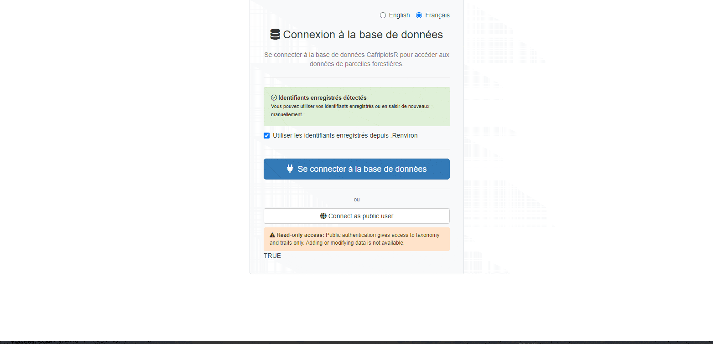
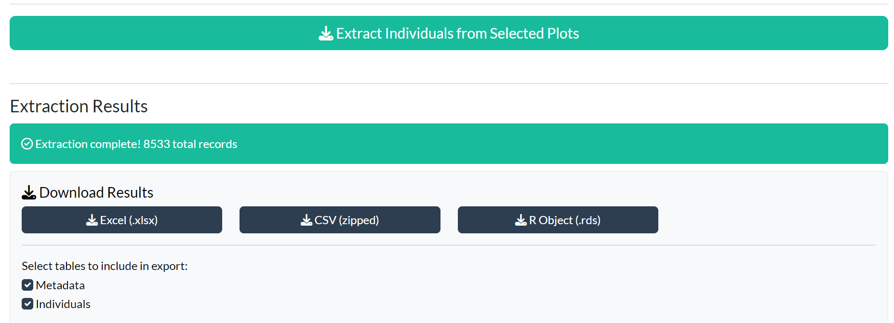
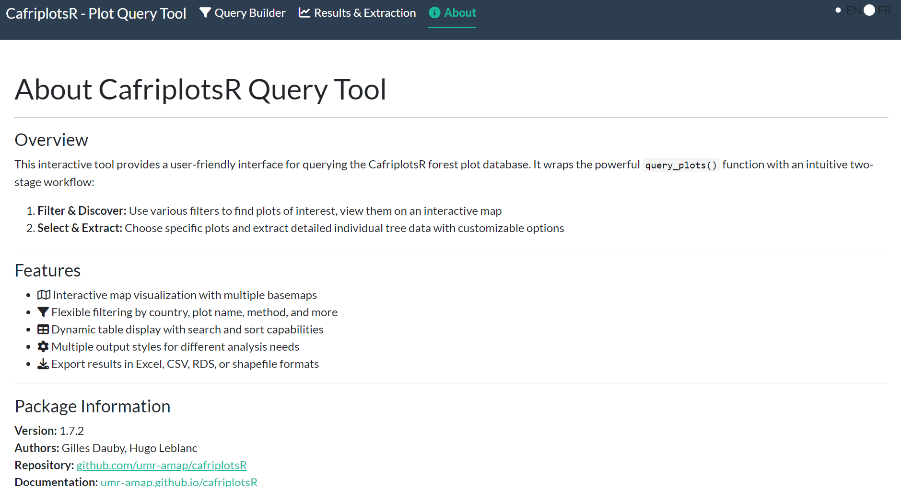

# Using the Plot Query App and query_plots()

``` r

library(CafriplotsR)
```

## Overview

CafriplotsR offers two complementary ways to access forest plot data:

1.  **Interactive Shiny app**
    ([`launch_query_plots_app()`](https://umr-amap.github.io/cafriplotsR/reference/launch_query_plots_app.md))
    — point-and-click interface with live map, plot selection, and
    download
2.  **R function**
    ([`query_plots()`](https://umr-amap.github.io/cafriplotsR/reference/query_plots.md))
    — reproducible, scriptable access for automated workflows

A key bridge between the two is the **“Equivalent R Code”** panel in the
app, which shows the exact
[`query_plots()`](https://umr-amap.github.io/cafriplotsR/reference/query_plots.md)
call that reproduces what you configured interactively.

------------------------------------------------------------------------

## Part 1 — Interactive Shiny App

### Launching the App

``` r

# Launch with default language (French)
launch_query_plots_app()

# Launch in English
launch_query_plots_app(language = "en")

# Launch in browser on a specific port
launch_query_plots_app(language = "en", launch.browser = TRUE, port = 8080)

# Reuse an existing connection pool (avoids repeated login prompts)
pool <- create_pool_main()
launch_query_plots_app(pool_main = pool)
```

The app will prompt for database credentials if no pool is provided. Use
[`setup_db_credentials()`](https://umr-amap.github.io/cafriplotsR/reference/setup_db_credentials.md)
to store credentials in `~/.Renviron` to skip the prompt on future
sessions.

### App Overview

The app has four tabs accessible from the top navigation bar:

| Tab | Purpose |
|----|----|
| Query Builder | Define filters and execute the metadata query |
| Results & Extraction | Map, table, plot selection, extraction config, download |
| Statistics | Summary statistics and charts for extracted data |
| About | App documentation and package information |

The language toggle (**EN** / **FR**) is always visible in the top-right
corner. The switch is instant and affects all UI elements.


App initial view — login screen and navigation bar

> **Screenshot to add:** full app view *after* login, showing the
> four-tab navigation bar (`app-query-nav-tabs.png`).

------------------------------------------------------------------------

### Tab 1 — Query Builder

#### Basic Filters


Query Builder — filter panel

- **Country** — multi-select dropdown of available countries
- **Method** — inventory method (e.g., “1 ha plot”, “Long Transect”)
- **Plot Name(s)** — partial or exact text search; comma-separate
  multiple names
- **Locality** — search by locality name
- **Individual Tag** — search by tree tag number

#### Advanced Filters

Click **Advanced Filters** to expand additional options:


Query Builder — advanced filters

- **Plot ID** — search by internal database plot ID
- **Individual ID** — search by specific individual ID
- **Taxon ID** — filter by taxonomic ID
- **Specimen ID** — search by herbarium specimen ID
- **Exact match** — toggle for strict text matching (default: partial)

#### Executing the Query

Click **Execute Query** to retrieve plot metadata. The app automatically
switches to the **Results & Extraction** tab and shows the number of
plots found.



Demo: full query workflow

------------------------------------------------------------------------

### Tab 2 — Results & Extraction

This tab has five stacked sections that guide you from visualising
results to downloading data.

#### Section A — Interactive Map


Interactive map with plot markers

- **Basemap layers** — OpenStreetMap, Satellite, Physical
- **Clickable markers** — show plot name, country, method, area
- Map and table are synchronised: selecting rows in the table highlights
  the corresponding markers

#### Section B — Metadata Table


Plot metadata table

A sortable, searchable table of all plot metadata returned by the query.
Click column headers to sort; use the search box to filter rows.

#### Section C — Plot Selection


Plot selection — selected rows highlighted

Click rows to select or deselect individual plots. A counter shows the
number of selected plots. All plots are pre-selected by default.

#### Section D — Extraction Configuration

After selecting plots, configure how individual tree data should be
extracted:


Extraction configuration panel

**Output Style** — controls which columns and tables are returned:

| Style                         | Best for                                    |
|-------------------------------|---------------------------------------------|
| Auto-detect                   | Let the app choose based on the plot method |
| Minimal                       | Quick exploration — essential columns only  |
| Standard                      | General ecological analysis                 |
| Permanent Plot                | Single-census permanent plot monitoring     |
| Permanent Plot (multi-census) | Time-series format with `_census_N` columns |
| Transect                      | Walk survey format                          |
| Full                          | Complete dataset, all columns               |

**Census Handling:**


Census options

- **Census Strategy** — Last (default), First, or Mean across censuses
- **Show multiple census data** — creates `dbh_census_1`,
  `dbh_census_2`, … columns; automatically selects the *Permanent Plot
  (multi-census)* style
- **Individual features format**:
  - *Wide* (default) — one row per individual, traits as columns; values
    are aggregated when multiple measurements exist for the same
    individual
  - *Long* — one row per measurement; includes `trait`, `traitvalue`,
    `census_name`, and `census_date` columns
  - *Census pairs* — one row per consecutive pair of censuses per
    individual; useful for computing growth rates

**Data Organisation:**

- **Concatenate multiple stems** — combine multi-stemmed tree
  measurements
- **Remove database IDs** — hide internal ID columns for cleaner output
- **Issues handling** — remove, include, or ignore flagged records
- **Include issue flags** — add quality flag columns to the output

> **Note:** `"long"` and `"census pairs"` formats are incompatible with
> *Concatenate multiple stems*; that option is automatically disabled
> when either long-format mode is selected.

**Additional Data:**


Additional data options

- **Extract taxonomic traits** — wood density, growth form, etc.
- **Extract individual-level features** — tree-specific measurements
- **Extract subplot-level features** — subplot characteristics
- **Fallback to genus-level traits** — use genus data when species
  traits are unavailable

Click **Extract Individuals from Selected Plots** to run the extraction.

#### Section E — Results Display and Download

Results are organised in tabs: **Individuals**, **Metadata**,
**Censuses**, **Height-Diameter** (when applicable), and **Column
Documentation**.

> **Screenshot to add:** results display showing the result tabs after
> extraction, with the Column Documentation tab visible
> (`app-query-results-display.png`).

The **Column Documentation** tab is always present after extraction. It
contains a searchable table describing every output column: its original
database name, a plain-language description, category, unit, and any
contextual notes. This is the fastest way to understand what each column
means without consulting external documentation.

The column documentation table is also **exportable**: select it via the
download checkboxes to include it as an additional sheet in Excel
exports, a separate CSV in the ZIP archive, or an element of the RDS
list.

Download your data using the download panel:



Download panel

| Format           | Notes                                                    |
|------------------|----------------------------------------------------------|
| Excel (.xlsx)    | Multi-sheet workbook, one sheet per table                |
| CSV (zipped)     | Separate CSV files in a ZIP archive                      |
| R Object (.rds)  | Native R format; preserves list structure and data types |
| Shapefile (.zip) | Spatial data (requires coordinate columns)               |

Use the checkboxes to select which tables to include before downloading.

#### Section F — Equivalent R Code

After running a query or extraction, the **Equivalent R Code** panel
shows the exact
[`query_plots()`](https://umr-amap.github.io/cafriplotsR/reference/query_plots.md)
calls that reproduce your results:


R code preview panel


Complete workflow script

Three code sections are provided:

1.  **Metadata Query** — filter and retrieve plot metadata
2.  **Individual Extraction** — extract tree data with your chosen
    options
3.  **Complete Workflow Script** — both steps in a single ready-to-run
    script

Click **Copy to clipboard** to copy any section directly into your R
editor.

------------------------------------------------------------------------

### Tab 3 — Statistics

The Statistics tab displays summary cards and charts that update
automatically once individual data has been extracted:

- Total number of **plots** extracted
- Total number of **individuals** (stems)
- Number of **species**
- Number of **families**
- **Diameter distribution** histogram (when DBH data are available)

> **Screenshot to add:** Statistics tab showing the four summary cards
> and the diameter histogram (`app-query-statistics.png`).

------------------------------------------------------------------------

### Tab 4 — About

The About tab contains a description of the app’s features and package
metadata (version, authors, links to documentation and repository).



About page

> **Screenshot to update:** the About page now shows version 1.7.2 and
> the updated authors list — retake if your existing screenshot is from
> an older version.

------------------------------------------------------------------------

### From App to Script

The typical workflow is:

1.  Use the app to explore plots and configure options interactively
2.  Copy the generated code from the **Equivalent R Code** panel
3.  Paste it into your analysis script for reproducible, automated runs

``` r

# Example code generated by the app after selecting Cameroon 1-ha plots

# Step 1: query metadata
metadata <- query_plots(
  country = "Cameroon",
  method = "1 ha plot",
  extract_individuals = FALSE
)

# Step 2: extract individuals from selected plots
result <- query_plots(
  id_plot = c(1, 5, 12),
  extract_individuals = TRUE,
  output_style = "permanent_plot",
  extract_traits = TRUE,
  census_strategy = "last"
)
```

### App vs. Function: When to Use Each

| Use case | Recommendation |
|----|----|
| First exploration, unknown plot IDs | App |
| Interactive map selection | App |
| Learning function parameters | App — copy generated code |
| Reproducible analysis scripts | [`query_plots()`](https://umr-amap.github.io/cafriplotsR/reference/query_plots.md) |
| Automated data pipelines | [`query_plots()`](https://umr-amap.github.io/cafriplotsR/reference/query_plots.md) |
| Batch processing many queries | [`query_plots()`](https://umr-amap.github.io/cafriplotsR/reference/query_plots.md) |

------------------------------------------------------------------------

## Part 2 — `query_plots()` Function

### Database Connection

[`connect_cafri()`](https://umr-amap.github.io/cafriplotsR/reference/connect_cafri.md)
is the recommended entry point: a single credential prompt opens
**both** databases at once and stashes the connections, so any package
function that needs one finds it without re-prompting.

``` r

# Recommended: one prompt, both databases
cons <- connect_cafri()

cons$main   # main database connection
cons$taxa   # taxa database connection
```

If `MYDB_USER` and `MYDB_PASS` are stored in your `~/.Renviron` (see
[`setup_db_credentials()`](https://umr-amap.github.io/cafriplotsR/reference/setup_db_credentials.md)),
they are picked up automatically — no argument needed. See the [Database
Connections
Guide](https://umr-amap.github.io/cafriplotsR/articles/database-connections.md)
for details.

The taxa database connection is created automatically inside
[`query_plots()`](https://umr-amap.github.io/cafriplotsR/reference/query_plots.md)
when needed. Supply it explicitly via `con.taxa` to reuse an existing
connection and avoid repeated prompts:

``` r

cons <- connect_cafri()
mydb      <- cons$main
mydb_taxa <- cons$taxa

result <- query_plots(
  plot_name = "mbalmayo001",
  extract_individuals = TRUE,
  con      = mydb,
  con.taxa = mydb_taxa
)
```

### Basic Usage

#### Metadata only (no tree data)

``` r

plots <- query_plots(
  plot_name = "mbalmayo001",
  extract_individuals = FALSE
)
plots$metadata
```

#### Including individual trees

``` r

result <- query_plots(
  plot_name = "mbalmayo001",
  extract_individuals = TRUE
)

names(result)       # e.g. metadata, individuals, censuses, height_diameter
result$individuals  # one row per stem
result$censuses     # census dates and team information
```

### Output Styles

[`query_plots()`](https://umr-amap.github.io/cafriplotsR/reference/query_plots.md)
always returns a **named list**. The tables included and the columns
kept depend on `output_style`. Built-in styles:

| `output_style` | Description | Additional tables |
|----|----|----|
| `"auto"` | Detected from plot `method` (default) | varies |
| `"minimal"` | Essential plot metadata only | — |
| `"standard"` | General-purpose output for analysis | — |
| `"permanent_plot"` | Permanent plot monitoring, single/most-recent census | `censuses`, `height_diameter` |
| `"permanent_plot_multi_census"` | Multi-census wide format (`_census_N` columns) | `censuses`, `height_diameter` |
| `"transect"` | Simplified output for transect / walk surveys | — |
| `"census_pairs"` | One row per consecutive census pair per individual | — |
| `"full"` | Keep every metadata and individual column | — |

``` r

# Auto-detect from method (recommended)
result_auto <- query_plots(
  plot_name = "mbalmayo001",
  extract_individuals = TRUE
)

# Force a specific style
result_perm <- query_plots(
  plot_name = "mbalmayo001",
  extract_individuals = TRUE,
  output_style = "permanent_plot"
)

# Full output keeps every column on the metadata and individuals tables
result_full <- query_plots(
  plot_name = "mbalmayo001",
  extract_individuals = TRUE,
  output_style = "full"
)
names(result_full$individuals)
```

#### Inspecting built-in styles

Two helper functions let you discover what each style does without
leaving R:

``` r

# Summary table of all built-in styles
list_output_styles()

# Full configuration of a single style, with a pretty print method
get_output_style("permanent_plot")

# Drop the class to access fields programmatically
cfg <- unclass(get_output_style("permanent_plot"))
cfg$metadata_columns
cfg$remove_patterns
```

[`list_output_styles()`](https://umr-amap.github.io/cafriplotsR/reference/list_output_styles.md)
returns a tibble with one row per style and counts of explicit columns /
regex patterns.
[`get_output_style()`](https://umr-amap.github.io/cafriplotsR/reference/get_output_style.md)
returns a `plot_output_style` object whose print method groups fields by
purpose (column selection, regex filters, renames, additional tables,
flags).

#### Custom output styles

If none of the built-in styles fits, build your own with
[`output_style()`](https://umr-amap.github.io/cafriplotsR/reference/output_style.md)
and pass the resulting object straight to
[`query_plots()`](https://umr-amap.github.io/cafriplotsR/reference/query_plots.md):

``` r

my_style <- output_style(
  description         = "Just IDs and species",
  metadata_columns    = c("plot_name", "country", "id_liste_plots"),
  individuals_columns = c("id_n", "tag", "tax_fam", "tax_gen", "tax_sp_level")
)

result <- query_plots(
  plot_name           = "mbalmayo001",
  extract_individuals = TRUE,
  output_style        = my_style
)
```

Use `based_on` to start from an existing style and override only the
fields you want to change. **Override semantics are “replace, not
append”**: any field you pass replaces the parent’s value entirely. To
clear a vector field while inheriting the rest, pass an empty vector
(`remove_patterns = character()`); to inherit unchanged, leave it
unspecified.

``` r

# Start from permanent_plot, but drop all trait_* columns from the output
perm_no_traits <- output_style(
  based_on        = "permanent_plot",
  remove_patterns = c(
    "^id_(?!n|liste_plots)", "^date_modif",
    "_census_\\d+$", "^trait_"
  )
)
perm_no_traits   # pretty-printed summary

result <- query_plots(
  plot_name           = "mbalmayo001",
  extract_individuals = TRUE,
  output_style        = perm_no_traits
)
```

Custom style objects live only in the current R session. To reuse one,
assign it to a variable, save it with
[`saveRDS()`](https://rdrr.io/r/base/readRDS.html), or put the
constructor call in your `.Rprofile` / a project script.

#### `keep_patterns` and `remove_patterns`

Beyond the explicit `metadata_columns` / `individuals_columns` lists,
every style supports two regex-based filters applied on top of the
column selection:

- **`keep_patterns`** — Perl-compatible regexes. Any column whose name
  matches **any** pattern is *added* to the keep list (useful for
  grabbing whole groups of feature columns like `^feat_` or
  `wood_density`).
- **`remove_patterns`** — applied **after** `keep_patterns` to drop
  columns. Often used to remove internal IDs
  (`"^id_(?!n|liste_plots)"`), modification timestamps
  (`"^date_modif"`), or per-census suffix columns (`"_census_\\d+$"`).

``` r

# Keep every wood density and stem diameter column, drop internal IDs
my_style <- output_style(
  based_on        = "standard",
  keep_patterns   = c("wood_density", "stem_diameter"),
  remove_patterns = c("^id_(?!n|liste_plots)", "^date_modif")
)
```

### Filtering Options

``` r

# By country
query_plots(country = "Cameroon", extract_individuals = FALSE)

# By method
query_plots(method = "1 ha plot", extract_individuals = FALSE)

# Multiple countries or methods
query_plots(country = c("Cameroon", "Gabon"), extract_individuals = FALSE)

# By locality
query_plots(locality_name = "Dja", extract_individuals = FALSE)

# By plot ID (most efficient when IDs are already known)
query_plots(id_plot = c(1, 2, 3), extract_individuals = TRUE)

# By individual tag (implies extract_individuals = TRUE)
query_plots(plot_name = "mbalmayo001", tag = "1234")

# By taxon ID
query_plots(plot_name = "mbalmayo001", id_tax = 115, extract_individuals = TRUE)

# By herbarium specimen ID
query_plots(id_specimen = 42, extract_individuals = TRUE)

# Exact plot name match (default is partial)
query_plots(plot_name = "mbalmayo001", exact_match = TRUE, extract_individuals = FALSE)
```

### Handling Multiple Censuses

``` r

# Last census only (default)
last <- query_plots(
  plot_name = "mbalmayo",
  extract_individuals = TRUE,
  census_strategy = "last"
)

# First census
first <- query_plots(
  plot_name = "mbalmayo",
  extract_individuals = TRUE,
  census_strategy = "first"
)

# Mean values across all censuses
averaged <- query_plots(
  plot_name = "mbalmayo",
  extract_individuals = TRUE,
  census_strategy = "mean"
)

# All censuses as separate columns (dbh_census_1, dbh_census_2, …)
multi <- query_plots(
  plot_name = "mbalmayo",
  extract_individuals = TRUE,
  show_multiple_census = TRUE   # automatically uses permanent_plot_multi_census style
)
multi$censuses   # census dates
head(multi$individuals)
```

### Individual Features Format

Three row structures are available:

``` r

# Wide (default): one row per individual, traits as columns
wide <- query_plots(
  plot_name = "mbalmayo001",
  extract_individuals = TRUE,
  individual_features_format = "wide"
)
```

``` r

# Long: one row per measurement
long <- query_plots(
  plot_name = "mbalmayo001",
  extract_individuals = TRUE,
  individual_features_format = "long"
)
# Extra columns: trait, traitvalue, traitvalue_char, valuetype, census_name, census_date
long$individuals |>
  dplyr::select(plot_name, tag, tax_sp_level, trait, traitvalue, census_name, census_date)
```

``` r

# Census pairs: one row per consecutive census pair per individual
# Useful for computing diameter growth between censuses
pairs <- query_plots(
  plot_name = "mbalmayo",
  extract_individuals = TRUE,
  individual_features_format = "census_pairs"
)
# Output style is automatically set to "census_pairs"
```

### Taxonomic Backbone

``` r

# Internal taxonomy (default)
result_internal <- query_plots(
  plot_name = "mbalmayo001",
  extract_individuals = TRUE,
  backbone = "internal"
)

# WCVP (World Checklist of Vascular Plants)
result_wcvp <- query_plots(
  plot_name = "mbalmayo001",
  extract_individuals = TRUE,
  backbone = "wcvp"
)
```

### Additional Data Options

``` r

result <- query_plots(
  plot_name = "mbalmayo001",
  extract_individuals = TRUE,
  extract_traits            = TRUE,   # taxonomic traits (wood density, growth form …)
  extract_individual_features = TRUE, # tree-level measurements
  extract_subplot_features  = TRUE,   # subplot characteristics
  traits_to_genera          = FALSE,  # fall back to genus-level when species traits absent
  wd_fam_level              = FALSE,  # fall back to family-level wood density
  include_liana             = FALSE   # set TRUE to keep lianas in the output
)
```

### Spatial Data

``` r

# Default: one representative coordinate per plot
plots <- query_plots(country = "Gabon", extract_individuals = FALSE)
plots$metadata[, c("plot_name", "latitude", "longitude")]

# All coordinate points (corners, subplot centres …)
all_coords <- query_plots(
  plot_name = "mbalmayo",
  extract_individuals   = FALSE,
  extract_coordinates   = TRUE   # replaces deprecated show_all_coordinates
)
all_coords$coordinates_sf        # sf object
```

> **Note:** `show_all_coordinates` was deprecated in v1.9.4. Use
> `extract_coordinates` instead.

``` r

# Display an interactive Leaflet map (opens in the RStudio Viewer)
query_plots(country = "Cameroon", extract_individuals = FALSE, map = TRUE)
```

### Keeping Database IDs

``` r

result <- query_plots(
  plot_name = "mbalmayo001",
  extract_individuals = TRUE,
  remove_ids   = FALSE,
  output_style = "full"
)
names(result$individuals)  # includes id_liste_plots, id_census, id_n …
```

### Handling Data Quality Issues

``` r

# Remove flagged records (default)
clean <- query_plots(
  plot_name = "mbalmayo001", extract_individuals = TRUE,
  issues = "remove"
)

# Include all records regardless of flags
all_records <- query_plots(
  plot_name = "mbalmayo001", extract_individuals = TRUE,
  issues = "include"
)

# Keep flagged records but add quality flag columns
with_flags <- query_plots(
  plot_name = "mbalmayo001", extract_individuals = TRUE,
  issues = "ignore"
)
```

### Complex Query Example

``` r

result <- query_plots(
  country      = "Cameroon",
  locality_name = "Dja",
  method       = "1 ha plot",
  extract_individuals         = TRUE,
  extract_traits              = TRUE,
  extract_individual_features = TRUE,
  show_multiple_census        = TRUE,
  extract_coordinates         = TRUE,
  remove_ids                  = FALSE,
  output_style                = "permanent_plot_multi_census"
)

names(result)
```

## Performance Tips

1.  Start with `extract_individuals = FALSE` to explore metadata before
    pulling tree data
2.  Filter by `id_plot` when plot IDs are already known — it is the most
    efficient route
3.  Enable `extract_traits` and `extract_individual_features` only when
    needed
4.  Choose the most specific `output_style` to avoid loading unused
    columns

## Troubleshooting

``` r

# Check connection status
print_connection_status()

# Run a full connection diagnostic
db_diagnostic()

# Close all connections and clear cached credentials
cleanup_connections()
```

Row-level security is enforced on the database: you can only access
plots and individuals that your database account has permission to view.
