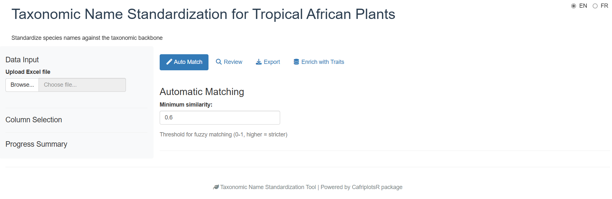
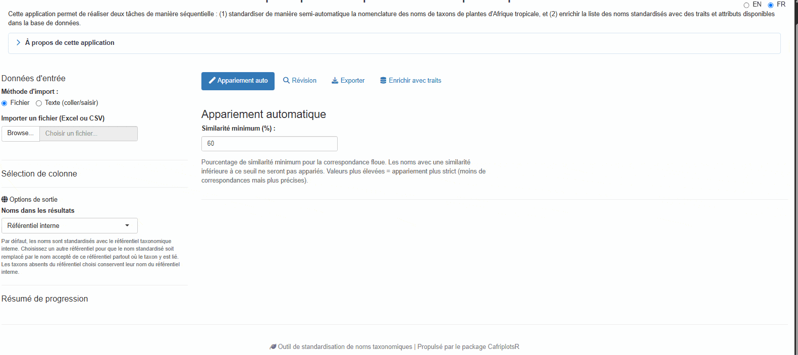
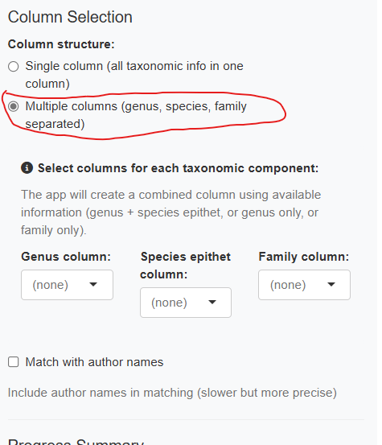
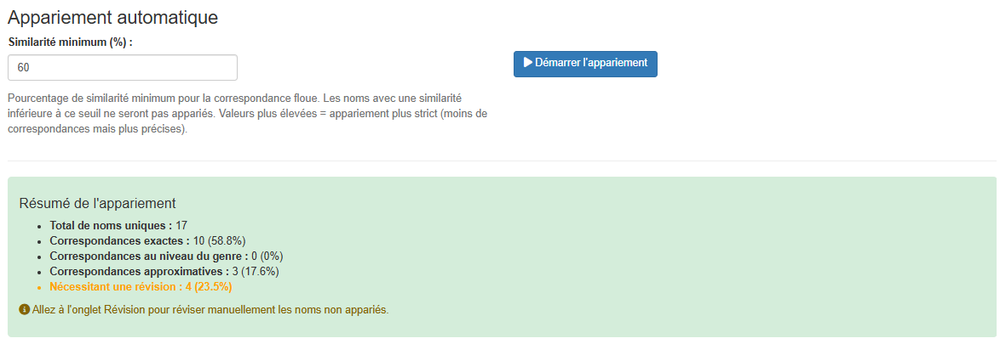
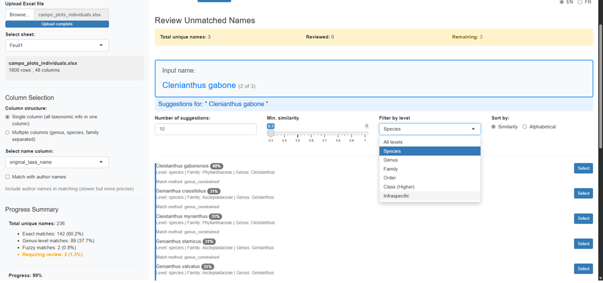

```{r, include = FALSE}
knitr::opts_chunk$set(
  collapse = TRUE,
  comment = "#>",
  eval = FALSE,
  echo = TRUE
)
```

## Introduction

The `launch_taxonomic_match_app()` function provides an interactive Shiny application for standardizing taxonomic names against the Central African plant taxonomic backbone database. This visual interface is ideal for:

- Exploring and cleaning taxonomic data interactively
- Understanding match quality through visual feedback
- Manually reviewing uncertain matches
- Enriching data with species-level traits from the database
- Checking taxonomic name provenance via WCVP integration

## Prerequisites

### With database credentials (full access)

To access all features including traits enrichment, you need database credentials configured (see `setup_db_credentials()`). Once launched, the app presents a login screen where you enter your credentials.

### Without credentials

Since March 2026, the app can be used **without any database credentials**, by either of two routes.

**Public read-only account.** Click **"Connect as public user"** on the login screen. Matching *and* traits enrichment both work; adding or modifying data does not. This is the credential-free route available everywhere, including the hosted app, and it is the one to reach for if you simply have no account.

**Offline cached backbone.** Click **"Use offline (cached backbone)"** to work from a locally cached copy of the backbone:

- Automatic matching and fuzzy suggestions work via a cached local backbone
- Manual review is fully functional
- Traits enrichment is hidden (requires a live database connection)
- A **"Read-only"** badge is displayed to indicate limited permissions

Offline mode earns its keep when the database is unreachable from where you are working. It appears only when you launch the app yourself from R *and* a cache has already been downloaded. The hosted app does not offer it, because there the cache would sit on the server rather than on your machine — so it would solve nothing, and public access already covers working without an account.

## Quick Start

Launch the app with a single command:

```{r}
library(CafriplotsR)
launch_taxonomic_match_app()
```

Alternatively, pre-load your data or set options:

```{r}
# With R data.frame
my_data <- read.csv("tree_inventory.csv")
launch_taxonomic_match_app(data = my_data, name_column = "species_name")

# Launch in English (default is French)
launch_taxonomic_match_app(language = "en")

# Adjust fuzzy matching sensitivity (default is 0.7)
launch_taxonomic_match_app(min_similarity = 0.5)  # More permissive matching
```

## Step-by-Step Walkthrough

### Phase 1: Initial View

When you first launch the app, you see a login screen. After authenticating (or choosing offline mode), the main interface appears with a sidebar for configuration and tabs for different workflow phases:



The app uses a **tabbed workflow** that guides you through each phase sequentially:

1. **Auto Match** — Automatic matching
2. **Review** — Manual review of unmatched names
3. **Export** — Download results
4. **Traits Enrichment** — Add species traits (hidden in offline mode)

### Phase 2: Upload Your Data

The first step is to provide your data. The app offers two input methods:

#### File Upload (Default)

- **Upload an Excel file** using the file browser (supports .xlsx, .xls); for multi-sheet files you can select which sheet to use
- **Upload a CSV file**
- **Use pre-loaded R data** (if you passed the `data` parameter)


The app displays a preview of your uploaded data so you can verify it was read correctly. Excel files are read with `guess_max = 30000` to improve column type detection for large files.

#### Text Input (Copy-Paste)

For quick standardization of a few names, or when you have a list copied from another source, use the **Text input** method:



1. Select **"Text input (paste/type)"** from the input method radio buttons
2. Paste or type your taxonomic names in the text area
3. Click **"Load names"** to process the input

**Accepted separators:**
- One name per line (recommended)
- Comma-separated: `Lophira alata, Terminalia superba, Aucoumea klaineana`
- Semicolon-separated: `Lophira alata; Terminalia superba; Aucoumea klaineana`
- Tab-separated (useful when pasting from Excel)

The app automatically removes empty lines, trims whitespace, and deduplicates names while preserving order. A single column named `taxon_name` is created for matching.

### Phase 3: Select Name Column(s)

Once data is loaded, you have two options for selecting taxonomic names:

#### Single Column Mode (Default)

Select one column containing the full taxonomic name:


The dropdown menu shows all available columns from your dataset. Choose the one containing species names (typically formatted as "Genus species" or "Genus species Author").

#### Multiple Column Mode

If your data has separate columns for genus, species, and family, enable **"Use multiple columns"**:



The app combines these columns hierarchically:
- Genus + species available → "Genus species"
- Genus only → "Genus"
- Family only → "Family"

You can also optionally include an author column.

### Phase 4: Automatic Matching

Click the **"Start Matching"** button to begin the automatic matching process.

**Choosing the backbone copy.** Before matching starts the app may ask whether to use the taxonomic backbone it already has cached or download a fresh copy. The cached copy is much faster and is what you want in ordinary use; download a fresh one after taxa have been added or revised in the database, or if you are unsure how old your cache is. The dialog reports the cache's age so you can decide.

The app then works through the strategy below, stopping at the first stage that matches each name. Names are handled independently, so one list can come back with results from every stage:

1. **Exact match on species**: Direct lookup of the full name (genus + species)
2. **Exact match on genus**: Match at genus level
3. **Exact match on family**: Match at family level
4. **Exact match on higher rank**: Match at order or class level (e.g. names ending in -opsida, -psida)
5. **Genus-constrained fuzzy match**: When the genus is recognised but the epithet is not, approximate matching is restricted to species *within that genus*. This is what catches most misspellings, and it is far safer than searching the whole backbone because the candidate set is already botanically plausible
6. **Full fuzzy match**: Approximate string matching (trigram-Jaccard via `stringdist`) across the whole backbone — the last resort, used when even the genus is unrecognised

Stages 1–4 all record `match_method = "exact"`; the rank that matched is recorded in `tax_level`. Stage 5 records `genus_constrained` and stage 6 records `fuzzy`, which is why the two are worth telling apart when you review the results.


The progress bar shows real-time status and correctly accounts for manually reviewed names in the completion percentage. The sidebar displays live statistics:

- Number of exact matches
- Number of genus-level matches
- Number of fuzzy matches
- Number of unmatched names

**Checkpoint / resume**: Matching progress is automatically saved to a temporary file. If you accidentally close the browser tab, re-opening the app will offer to resume from where you left off.

### Phase 5: Review Match Results

After matching completes, the Auto Match tab shows a summary table with all names and their match status:



The results table includes:

- **Original name**: Your input name
- **matched_name**: Name found in backbone
- **match_method**: How it was matched — `exact`, `genus_constrained`, `fuzzy`, `manual`, `unresolved` or `no_match`. See [Values of `match_method`](#values-of-match_method) for what each one means, and why there is no `exact_species` or `exact_genus`
- **match_score**: Similarity score (0–1, higher is better)
- **idtax_n**: Taxon ID in database
- **is_synonym**: Whether matched name is a synonym
- **accepted_name**: Current accepted name (if synonym)

**Match quality indicators.** The app colours each score so the table can be scanned rather than read: **green from 90 %** and **blue from 70 %**, with lower scores left uncoloured. As a rule of thumb:

- **Exact match (1.0)**: Perfect match, no review needed
- **High similarity (≥ 0.9, green)**: Very likely correct, quick review recommended
- **Medium similarity (0.7–0.9, blue)**: Possible match, review suggested
- **Low similarity (< 0.7)**: Uncertain, manual review required
- **No match**: Requires manual selection

A name matched by `genus_constrained` deserves more confidence than a plain `fuzzy` match at the same score, because the candidates it was compared against were restricted to species in a genus the app had already recognised.

### Phase 6: Manual Review

For unmatched or uncertain names, switch to the **"Review"** tab to manually review and select matches:


The review interface provides two ways to find matches:

#### Fuzzy Suggestions Panel

Shows automatic suggestions ranked by similarity with advanced filtering options:



**Filtering options:**

- **Number of suggestions**: Slider to show 5–30 suggestions
- **Minimum similarity**: Adjust threshold (0.3–1.0)
- **Taxonomic level filter**: Filter by All, Species, Genus, Family, Order, Class, or Infraspecific
- **Sort by**: Similarity score or alphabetical order

Each suggestion card displays:

- Name with color-coded similarity badge (green = high, blue = medium, yellow = low)
- Taxonomic level and family
- Synonym information if applicable
- **Select** button for one-click acceptance

#### Manual Search Panel

For names without good suggestions, use the manual search:


- Type any search term to query the taxonomic backbone
- Filter results by taxonomic level
- View detailed information for each match
- Select the correct match or mark as "unresolved"

**Navigation:**

- Use **Previous/Skip/Next** buttons to browse unmatched names
- Progress counter shows reviewed vs. remaining names
- The app remembers your selections and automatically updates the results

### Phase 7: Enrich Data with Traits

Switch to the **"Traits Enrichment"** tab to add species-level traits to your matched data (requires a database connection; this tab is hidden in offline mode):


A taxon usually carries several measurements of the same trait, from different individuals, sources or studies, so every trait has to be summarised to one value per taxon before it can be added as a column. How that is done depends on the trait's type:

- **Numeric traits** (wood density, seed mass, …) are reported as three columns — the **mean**, the **standard deviation** and **n**, the number of measurements behind it. Always read `n` before using a mean: a wood density averaged from one measurement and one averaged from forty are the same number with very different weight behind them, and an `sd` is only meaningful once `n` is at least a few
- **Categorical traits** (growth form, phenology, …) are summarised according to the aggregation mode you choose

**Options:**

- **Categorical aggregation mode**:
  - "mode" — Use the most frequent value per taxon. Gives one clean value per taxon, but silently hides disagreement between sources
  - "concat" — Concatenate all unique values. Keeps every recorded value, so genuine variation and contradictions both stay visible. Prefer this when you intend to inspect the traits rather than compute on them directly

- **Select columns to include**:
  - Original input names
  - Corrected names
  - Taxonomic IDs
  - Match metadata

Available traits include growth form, wood density, leaf traits, and ecological characteristics. Which traits come back depends on what the database actually holds for *your* taxa, so a list of well-studied timber species will be far better covered than a list of herbs.

The enriched data combines your matched taxa with selected traits. A **wide format** (one row per taxon, traits as columns) and a **long format** (one row per taxon × trait combination) are both available as separate sub-tabs:


**Note**: The enriched export creates one row per unique taxon, not per input row. Input names are concatenated with pipe separators.

#### Data Sources panel

A **Data Sources** sub-tab lists all trait citations used, with measurement counts per source. This helps you track data provenance for your analysis and cite sources correctly.

### Phase 8: Export Results

Switch to the **"Export"** tab to download your standardized dataset:


**Available formats:**

- **Excel (.xlsx)**: Best for sharing with collaborators
- **CSV (.csv)**: Universal tabular format
- **RDS (.rds)**: R-native format preserving data types

**Selectable columns.** Your original columns are always included; the three groups below can each be switched off:

- **Matched IDs** — `idtax_n`, `idtax_good_n`
- **Corrected names** — `corrected_name`, `matched_name`
- **Match metadata** — `match_method`, `match_score`, `is_synonym`, `accepted_name`

WCVP columns are not one of these groups: they are appended whenever the WCVP option was enabled before matching, and travel with the export either way. The internal `id_data` row identifier is always stripped.

**Column descriptions in the app.** Beside the preview, the Export tab lists every standardized column present in your results with a one-line description of what it holds — the same content as [Understanding Output Columns](#understanding-output-columns) below. Only the columns actually present are described, so the list reflects the options you chose rather than everything the app can produce. Your own input columns are preserved but not described individually, since the app knows nothing about them.

A preview table shows the data before export with pagination controls.

## Understanding Output Columns

Your original columns are always preserved. The app appends the columns below — the same descriptions are shown in the app itself, beside the preview table on the Export tab, so you do not have to come back here to read them.

| Column | Description |
|--------|-------------|
| `idtax_n` | Identifier of the matched taxon in the taxonomic backbone |
| `idtax_good_n` | Identifier of the accepted taxon. Differs from `idtax_n` when the matched name is a synonym |
| `matched_name` | Name found in the backbone corresponding to your input name — this may itself be a synonym |
| `corrected_name` | Final standardized name: the accepted name when the match is a synonym, or the WCVP name when that option is enabled |
| `accepted_name` | Accepted name when the matched name is a synonym; empty otherwise |
| `is_synonym` | `TRUE` when the matched name is a synonym of an accepted name |
| `match_method` | How the name was matched — see the table below |
| `match_score` | Similarity between your input name and the matched name, 0 to 1 (1 = exact, or a match you confirmed yourself) |

When the WCVP option is enabled (see [WCVP Integration](#wcvp-integration)), four more columns are appended and `corrected_name` is **replaced** by the WCVP name wherever one exists:

| Column | Description |
|--------|-------------|
| `wcvp_taxon_name` | Accepted name from the World Checklist of Vascular Plants |
| `wcvp_family` | Family according to WCVP |
| `wcvp_taxon_authors` | Taxonomic authorship according to WCVP |
| `wcvp_taxon_status` | Status of the name in WCVP (e.g. `Accepted`) |
| `name_source` | Which reference supplied `corrected_name`: `internal` backbone or `WCVP` |

### Values of `match_method`

| Value | Meaning |
|-------|---------|
| `exact` | The name was found verbatim in the backbone. All four exact tiers report `exact` — see the note below |
| `genus_constrained` | The genus was recognised, so fuzzy matching was restricted to species within that genus. Usually the most trustworthy fuzzy result |
| `fuzzy` | Approximate match against the whole backbone, used when the genus was not recognised |
| `manual` | You chose this match yourself on the Review tab |
| `unresolved` | You marked the name as impossible to resolve on the Review tab |
| `no_match` | Automatic matching found nothing and the name has not been reviewed yet |

**The exact tier is not recorded in `match_method`.** All four exact tiers — species, genus, family and higher rank — write `exact`. Which one applied is recorded separately in `tax_level` (`genus`, `family`, `order`, `higher`), so read that column rather than expecting `exact_species` or `exact_genus`, which the app never produces.

The app also adds an internal `id_data` row identifier when your file does not already contain one. It is used to keep rows aligned through matching and review, and is removed from every export, so you will not see it in the downloaded file.

## Advanced Options

### Language Selection

The app supports **bilingual operation** with French and English interfaces. **French is the default language**.

A language toggle is located in the top-right corner of the app:
- Click **"FR"** for French interface
- Click **"EN"** for English interface

The switch is instant and affects all UI elements. To set the initial language programmatically:

```{r, eval=FALSE}
# Launch app in English
launch_taxonomic_match_app(language = "en")

# Launch app in French (default)
launch_taxonomic_match_app(language = "fr")
```

### WCVP Integration

The app can optionally reconcile results against the **World Checklist of Vascular Plants (WCVP)**, an international reference maintained by the Royal Botanic Gardens, Kew. When the taxa database contains WCVP data, a **"Use WCVP names in output"** checkbox appears in the sidebar. It has no effect on matching itself — names are always matched against the internal backbone first — but it changes what the output reports.

Enabling it adds four columns:

- `wcvp_taxon_name` — Accepted name according to WCVP
- `wcvp_family` — Family according to WCVP
- `wcvp_taxon_authors` — Taxonomic authorship according to WCVP
- `wcvp_taxon_status` — Status of the name in WCVP (e.g. `Accepted`)

**It also rewrites `corrected_name`.** Wherever WCVP holds the taxon, `corrected_name` becomes the WCVP name rather than the internal backbone's; taxa absent from WCVP keep their internal name. The `name_source` column records which of the two supplied each value (`internal` or `WCVP`), so the substitution stays auditable — check it before treating `corrected_name` as coming from a single reference.

Enable this when your results must line up with an international checklist, and leave it off when you need names consistent with the rest of the database. The tick box must be set **before** matching, since the enrichment happens as part of that step.

### Adjusting Fuzzy Matching

Control matching sensitivity with the `min_similarity` parameter:

```{r}
# Very strict - only high-quality matches
launch_taxonomic_match_app(min_similarity = 0.8)

# Default setting
launch_taxonomic_match_app(min_similarity = 0.7)

# More permissive - allows lower-quality matches
launch_taxonomic_match_app(min_similarity = 0.5)
```

Lower values cast a wider net but may include false positives. Higher values are more conservative but may miss valid matches. The default was raised from 0.3 to **0.7** to reduce spurious suggestions.

### Increasing Suggestions

Show more fuzzy match suggestions per name:

```{r}
# Show top 20 suggestions instead of default 10
launch_taxonomic_match_app(max_suggestions = 20)
```

You can also adjust this interactively in the Review tab using the slider.

### Offline Mode

If you do not have a database connection, click **"Use offline (cached backbone)"** on the login screen. The app:

- Downloads and caches the backbone locally on first use
- Performs string matching entirely in R via `stringdist` (trigram-Jaccard)
- Supports auto-matching, fuzzy suggestions, and manual search
- Hides the Traits Enrichment tab (requires live connection)
- Displays a **"Read-only"** badge throughout the session

## Function Parameters

```{r}
launch_taxonomic_match_app(
  data           = NULL,         # Optional: pre-load a data.frame
  name_column    = NULL,         # Optional: pre-select a column name
  language       = c("fr", "en"),# Interface language (default: "fr")
  min_similarity = 0.7,          # Fuzzy match threshold (0-1)
  max_suggestions = 10,          # Max suggestions per unmatched name
  mode           = "interactive",# Review mode ("interactive" or "batch")
  launch.browser = TRUE          # Whether to open app in the browser
)
```

## Troubleshooting

### Connection Issues

**Problem**: "Failed to connect to database"

**Solutions**:
```{r}
# Check connection
db_diagnostic()

# Reset credentials if needed
remove_db_credentials()
setup_db_credentials()
```

Alternatively, use **offline mode** (click "Use offline (cached backbone)" on the login screen) to work without a live database connection.

### No Fuzzy Matches Found

**Problem**: No suggestions appear for unmatched names

**Possible causes**:
- `min_similarity` threshold too high
- Taxonomic names contain typos or non-standard formatting
- Names not present in the taxonomic backbone (e.g., non-African taxa)

**Solutions**:
- Lower `min_similarity`: `launch_taxonomic_match_app(min_similarity = 0.5)`
- Use the taxonomic level filter to search at genus or family level
- Clean input names (remove extra spaces, fix obvious typos)
- Verify names are African taxa

### Slow Matching Performance

**Problem**: Matching takes very long for large datasets

**Solutions**:
- Enable **offline mode**: matching runs locally via `stringdist` without database round-trips
- Use batch processing instead: `match_taxonomic_names()` for programmatic workflows
- Process data in chunks (split large datasets)

## When to Use the App vs. Programmatic Approach

### Use the Shiny App when:

- Exploring data interactively
- You prefer visual interfaces
- Dataset is small to medium size (<5,000 rows)
- Need to manually review uncertain matches
- Learning the matching process

### Use `match_taxonomic_names()` when:

- Processing large datasets (>5,000 rows)
- Automating workflows in scripts
- Integrating with data pipelines
- Reproducibility is critical (*NEVER REMOVE THE COLUMN THAT CONTAINS THE ORIGINAL NAME*)
- Batch processing multiple files

Example programmatic approach:

```{r}
# Load data
my_data <- read.csv("tree_inventory.csv")

# Match names
matched <- match_taxonomic_names(
  names = my_data$species_name,
  min_similarity = 0.7
)

# Merge back with original data
result <- cbind(my_data, matched)

# Export
write.csv(result, "standardized_inventory.csv", row.names = FALSE)
```

## See Also

- `match_taxonomic_names()`: Underlying matching function for programmatic use
- `query_taxa()`: Query taxonomic backbone directly
- `match_tax()`: Simple taxonomic lookup function
- `launch_taxo_backbone_app()`: Interactive tool for exploring the taxonomic backbone
- `vignette("using-query-plots")`: Guide to querying plot data

## Tips for Best Results

1. **Clean your data first**: Remove obvious typos, extra whitespace, and special characters
2. **Understand your data**: Know which taxonomic groups are in your dataset
3. **Use multi-column mode**: If you have separate genus/species/family columns, combine them for better matching
4. **Filter by taxonomic level**: Use the level filter in the Review tab to find genus or family matches
5. **Review match scores**: Don't blindly accept low-similarity matches (<0.6)
6. **Use checkpoint/resume**: The app saves your progress automatically — if you close the browser tab, you can pick up where you left off
7. **Document parameters**: Note which `min_similarity` value you used for reproducibility
8. **Cite data sources**: Check the Data Sources panel in the Traits tab for citations to include in your methods

## Example Workflow

Here's a complete workflow from start to finish:

```{r}
# 1. Load your data
trees <- read.csv("forest_inventory.csv")
# Columns: plot_id, tree_number, species_name, dbh, height

# 2. Launch app with data
launch_taxonomic_match_app(
  data = trees,
  name_column = "species_name",
  language = "en",
  min_similarity = 0.7
)

# 3. In the app:
#    - Authenticate (or choose offline mode)
#    - Review automatic matches in the Auto Match tab
#    - Use the Review tab to resolve unmatched names
#    - Optionally enable WCVP output via the sidebar checkbox
#    - Optionally enrich with traits in the Traits Enrichment tab
#      (check the Data Sources panel for citations)
#    - Export as "forest_inventory_standardized.xlsx"

# 4. Continue analysis with standardized data
standardized <- readxl::read_excel("forest_inventory_standardized.xlsx")

# Now you have clean taxonomic IDs for further analysis!
```

This workflow ensures your taxonomic data is standardized and ready for downstream analyses like diversity metrics, trait-based analyses, or database integration.
