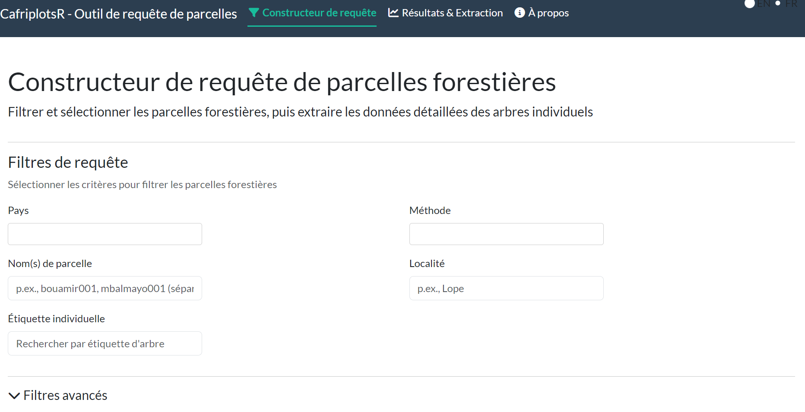
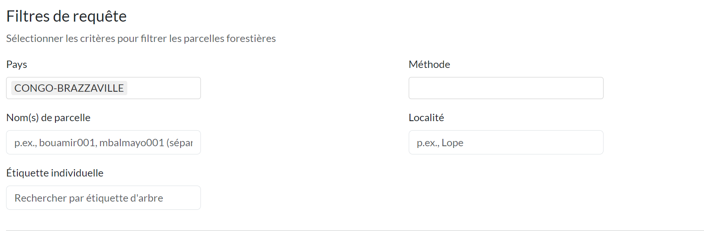
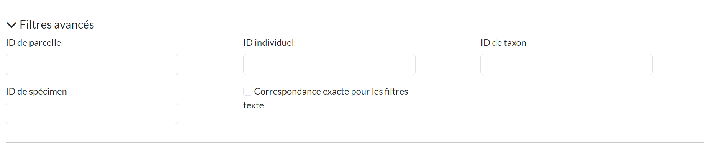
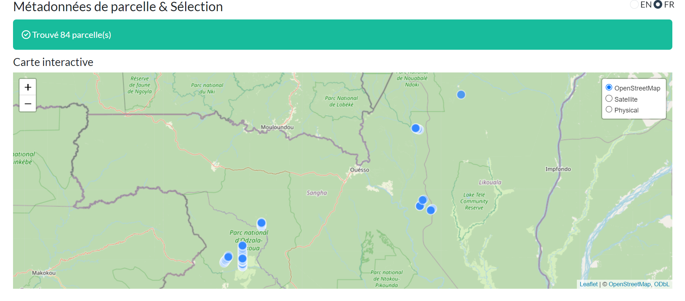
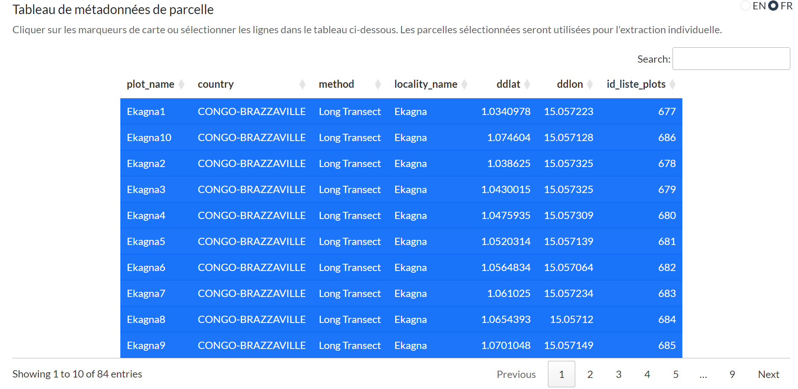
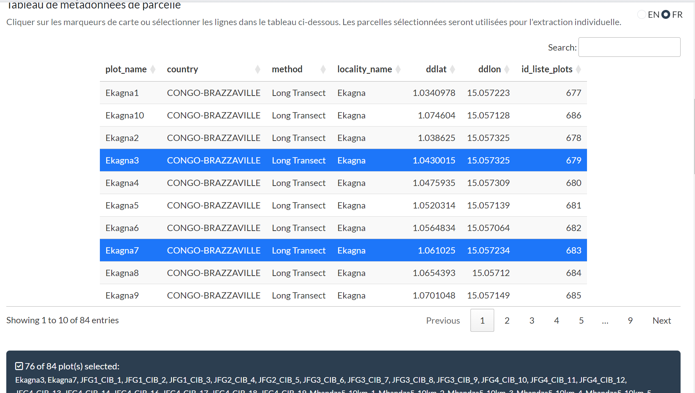
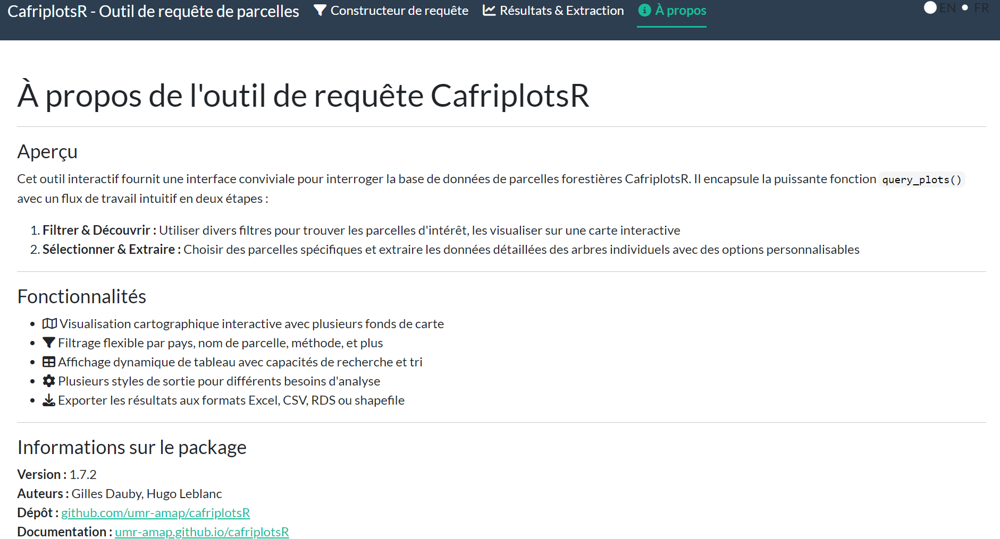

```{r, include = FALSE}
knitr::opts_chunk$set(
  collapse = TRUE,
  comment = "#>",
  eval = FALSE,
  message = FALSE,
  warning = FALSE
)
```

```{r setup}
library(tidyverse)
library(CafriplotsR)
```

## Introduction

La fonction `query_plots()` est le point d'entrée principal pour accéder aux données de parcelles forestières de la base de données des parcelles d'Afrique centrale. Cette vignette montre comment utiliser les différentes fonctionnalités de la fonction, y compris le nouveau **système de styles de sortie** introduit dans la version 1.5.

## Connexion à la Base de Données

Avant d'interroger les données, établissez les connexions aux deux bases de données :


```{r connection-t, eval=T, echo=F, warning=FALSE, message=FALSE}
library(tidyverse)
devtools::load_all()
# Se connecter à la base de données principale
mydb <- call.mydb(use_env_credentials = T)

# Se connecter à la base de données taxonomique
mydb_taxa <- call.mydb.taxa(use_env_credentials = T)

```

```{r connection}
# Se connecter à la base de données principale
mydb <- call.mydb()

# Se connecter à la base de données taxonomique
mydb_taxa <- call.mydb.taxa()
```

Le package demandera les identifiants de manière interactive, ou vous pouvez utiliser les variables d'environnement via `use_env_credentials = TRUE`.

## Utilisation de Base

### Interroger Uniquement les Métadonnées de Parcelles

Pour récupérer uniquement les informations au niveau de la parcelle sans les données d'arbres individuels :

```{r basic-metadata, eval=TRUE, results='hide'}
# Interroger par nom de parcelle
plots <- query_plots(
  plot_name = "mbalmayo001",
  extract_individuals = FALSE
)

```

```{r, eval=TRUE, message=TRUE}
# Voir la structure
plots
```


### Interroger les Parcelles avec les Arbres Individuels

Pour inclure les mesures d'arbres/tiges individuels :

```{r with-individuals, eval=TRUE, results='hide'}
plots_with_trees <- query_plots(
  plot_name = "mbalmayo001",
  extract_individuals = TRUE
)


```


```{r, eval=TRUE, message=TRUE}
# Le résultat est une liste structurée
plots_with_trees
```

## Système de Styles de Sortie (v1.5+)

À partir de la version 1.5, `query_plots()` retourne des **listes structurées** au lieu de data frames plats. La structure s'adapte automatiquement en fonction de la méthode d'inventaire.

### Styles de Sortie Disponibles

- **`minimal`** : Métadonnées essentielles de parcelle uniquement, pas de caractéristiques ni de traits
- **`standard`** : Sortie d'analyse standard avec les caractéristiques communes (par défaut pour les méthodes inconnues)
- **`permanent_plot`** : Tables organisées pour le suivi de parcelles permanentes (recensement unique)
- **`permanent_plot_multi_census`** : Données multi-recensement avec colonnes _census_N
- **`transect`** : Sortie simplifiée pour les transects/relevés pédestres
- **`full`** : Export complet avec toutes les colonnes (préserve le comportement v1.4)

### Détection Automatique Basée sur la Méthode

Le style de sortie est automatiquement détecté à partir du champ `method` de la parcelle :

```{r auto-detection}
# Pour une parcelle permanente (method = "1 ha plot")
perm_plot <- query_plots(
  plot_name = "mbalmayo",
  extract_individuals = TRUE
)

# Utilise automatiquement le style 'permanent_plot'
# Retourne : $metadata, $individuals, $censuses, $height_diameter
names(perm_plot)
```

### Sélection Manuelle du Style

Outrepassez la détection automatique en spécifiant `output_style` :

```{r manual-style}
# Forcer une sortie minimale
minimal_output <- query_plots(
  plot_name = "mbalmayo",
  extract_individuals = TRUE,
  output_style = "minimal"
)

# Forcer une sortie complète (comportement v1.4 - data frame plat)
full_output <- query_plots(
  plot_name = "mbalmayo",
  extract_individuals = TRUE,
  output_style = "full"
)
```

### Comprendre la Sortie Structurée

Pour les parcelles permanentes avec `extract_individuals = TRUE` :

```{r structured-output}
result <- query_plots(
  plot_name = "mbalmayo001",
  extract_individuals = TRUE
)

# Table des métadonnées : informations au niveau de la parcelle
result$metadata
#   plot_id | plot_name | country | latitude | longitude | elevation | ...

# Table des individus : mesures d'arbres
result$individuals
#   id_n | plot_name | tag | family | genus | species | dbh | height | ...

# Table des recensements : informations de recensement
result$censuses
#   plot_name | census_number | census_date | team_leader | ...

# Paires hauteur-diamètre : pour l'analyse allométrique
result$height_diameter
#   id_n | plot_name | tag | D | H | POM | census

# Données spatiales (si show_all_coordinates = TRUE)
result$coordinates_sf
```

## Options de Filtrage

### Par Localisation

```{r filter-location}
# Par pays
cameroon_plots <- query_plots(
  country = "Cameroon",
  extract_individuals = FALSE
)

# Par localité
dja_plots <- query_plots(
  locality_name = "Dja",
  extract_individuals = FALSE
)

```

### Par Méthode

```{r filter-method}
# Obtenir toutes les parcelles permanentes
permanent_plots <- query_plots(
  method = "1 ha plot",
  extract_individuals = FALSE
)

# Obtenir tous les transects
transects <- query_plots(
  method = "Long Transect",
  extract_individuals = FALSE
)
```

### Par ID de Parcelle

```{r filter-id}
# Interroger des IDs de parcelles spécifiques
plots_by_id <- query_plots(
  id_plot = c(1, 2, 3),
  extract_individuals = TRUE
)
```

## Travailler avec les Données d'Arbres Individuels

### Extraction Basique des Arbres

```{r individuals-basic}
trees <- query_plots(
  plot_name = "mbalmayo001",
  extract_individuals = TRUE
)

# Accéder aux données d'arbres individuels
trees$individuals
```


## Gestion des Recensements Multiples

### Afficher les Données de Recensements Multiples

Par défaut, seul le recensement le plus récent est retourné. Pour voir tous les recensements :

```{r multiple-census}
multi_census <- query_plots(
  plot_name = "mbalmayo",
  extract_individuals = TRUE,
  show_multiple_census = TRUE
)

# Utilise automatiquement le style 'permanent_plot_multi_census'
# Colonnes spécifiques au recensement : dbh_census_1, dbh_census_2, height_census_1, ...
head(multi_census$individuals)

# La table des recensements montre toutes les dates de recensement
multi_census$censuses

# La table hauteur-diamètre a une ligne par mesure
multi_census$height_diameter
```

### Format Long : Une Ligne par Mesure

La sortie par défaut (`individual_features_format = "wide"`) place chaque trait dans sa propre colonne en agrégeant les valeurs lorsque plusieurs mesures existent. Utilisez `"long"` pour conserver chaque mesure sur sa propre ligne :

```{r long-format}
arbres_long <- query_plots(
  plot_name = "mbalmayo001",
  extract_individuals = TRUE,
  individual_features_format = "long"
)

# Chaque ligne correspond à une mesure pour un individu
# Colonnes : trait, traitvalue / traitvalue_char, valuetype,
#            census_name (ex. "census_3"), census_date (NA si non lié à un recensement)
arbres_long$individuals |>
  dplyr::select(plot_name, tag, tax_sp_level, trait, traitvalue, census_name, census_date)
```

En format long, un individu ayant deux mesures de diamètre (ex. issus de deux recensements) apparaît sur deux lignes. Les mesures non liées à un recensement (ex. coordonnées de position) ont `census_name = NA` et `census_date = NA`.

Le filtrage des recensements reste actif : avec `census_strategy = "last"` (valeur par défaut), seules les mesures du recensement le plus récent sont retournées pour les traits liés à un recensement, tandis que les mesures non recensées sont toujours incluses.

```{r long-format-premier-recensement}
# Format long avec uniquement le premier recensement
arbres_long_premier <- query_plots(
  plot_name = "mbalmayo001",
  extract_individuals = TRUE,
  individual_features_format = "long",
  census_strategy = "first"
)
```

Le format long est particulièrement utile lorsque vous souhaitez travailler avec les valeurs brutes des mesures plutôt qu'avec des agrégats, ou calculer vos propres statistiques sur plusieurs mesures.

## Renommage des Colonnes

Les styles de sortie renomment automatiquement les colonnes de la base de données en noms conviviaux :

```{r column-names}
result <- query_plots(
  plot_name = "mbalmayo001",
  extract_individuals = TRUE
)

# Noms de base de données → Noms conviviaux
# ddlat → latitude
# ddlon → longitude
# tax_fam → family
# tax_gen → genus
# tax_sp_level → species
# stem_diameter → dbh
# tree_height → height

names(result$metadata)
names(result$individuals)
```

## Données Spatiales

### Coordonnées de Parcelle

Par défaut, retourne une coordonnée par parcelle :

```{r default-coords}
plots <- query_plots(
  country = "Gabon",
  extract_individuals = FALSE
)

plots$metadata[, c("plot_name", "latitude", "longitude")]
```

### Toutes les Coordonnées

Certaines parcelles ont plusieurs points de coordonnées (coins, centres de sous-parcelles) :

```{r all-coords}
plots_all_coords <- query_plots(
  plot_name = "mbalmayo",
  extract_individuals = FALSE,
  show_all_coordinates = TRUE
)

# Retourne un objet sf avec tous les points de coordonnées
plots_all_coords$coordinates_sf
```

### Carte Interactive

Visualiser les emplacements des parcelles :

```{r map}
query_plots(
  country = "Cameroon",
  extract_individuals = FALSE,
  map = TRUE
)
```

## Options Avancées

### Conserver les IDs de Base de Données

Par défaut, les IDs internes sont supprimés. Pour les conserver :

```{r keep-ids}
with_ids <- query_plots(
  plot_name = "mbalmayo001",
  extract_individuals = TRUE,
  remove_ids = FALSE, output_style = "full"
)

# Inclut maintenant id_liste_plots, id_census, etc.
names(with_ids$extract)
```

### Filtrage par ID d'Individu

Extraire des individus spécifiques :

```{r filter-individual}
specific_trees <- query_plots(
  id_individual = c(1001, 1002, 1003),
  extract_individuals = TRUE
)
```

### Filtrage par Taxon

Extraire les individus de taxons spécifiques :

```{r filter-taxon}
species_trees <- query_plots(
  plot_name = "mbalmayo001",
  id_tax = c(115),  # IDs de taxons
  extract_individuals = TRUE
)
```

## Styles de Sortie Personnalisés

Les options `keep_patterns` et `remove_patterns` dans les configurations de style permettent la personnalisation (PAS ENCORE IMPLÉMENTÉ) :

```{r custom-patterns}
# Dans votre configuration de style personnalisé :
# keep_patterns = c("^feat_wood", "^trait_leaf")
# Ceci garde les caractéristiques du bois et les traits foliaires tout en supprimant les autres
```

## Combinaison d'Options

Requêtes complexes combinant plusieurs filtres :

```{r complex-query}
complex_result <- query_plots(
  country = "Cameroon",
  locality_name = "Dja",
  method = "1 ha plot",
  extract_individuals = TRUE,
  extract_traits = TRUE,
  extract_individual_features = TRUE,
  show_multiple_census = TRUE,
  show_all_coordinates = TRUE,
  remove_ids = FALSE,
  output_style = "permanent_plot_multi_census"
)

# Retourne une sortie structurée complète
names(complex_result)
```


## Conseils de Performance

1. **Commencer par les métadonnées uniquement** : Utilisez `extract_individuals = FALSE` lors de l'exploration
2. **Utiliser des filtres spécifiques** : Réduisez le temps de requête en filtrant par plot_name ou id_plot
3. **Limiter les traits** : N'utilisez `extract_traits = TRUE` que lorsque nécessaire
4. **Choisir le style approprié** : Utilisez `minimal` ou `standard` pour des analyses rapides

## Dépannage

### Résultats Vides

Si votre requête ne retourne pas de données :

```{r troubleshoot}
# Vérifier le statut de connexion
print_connection_status()

# Exécuter le diagnostic
db_diagnostic()

# Vérifier l'accès aux parcelles (sécurité au niveau des lignes)
# Vous ne pouvez accéder qu'aux parcelles pour lesquelles vous avez la permission
```

### Revenir au Comportement v1.4

Si vous avez besoin de l'ancienne sortie en data frame plat :

```{r legacy-behavior}
flat_output <- query_plots(
  plot_name = "mbalmayo001",
  extract_individuals = TRUE,
  output_style = "full"
)

# Retourne un seul data frame au lieu d'une liste structurée
```

## Application Shiny Interactive

CafriplotsR fournit une application Shiny interactive pour les utilisateurs qui préfèrent une interface graphique à l'écriture de code R. L'application encapsule `query_plots()` avec un flux de travail intuitif en deux étapes.

### Lancement de l'Application

```{r launch-app, eval=FALSE}
# Lancer l'application de requête interactive
launch_query_plots_app()

# Ou spécifier la langue (Français ou Anglais)
launch_query_plots_app(language = "fr")  # Français (par défaut)
launch_query_plots_app(language = "en")  # Anglais
```

### Aperçu de l'Application

Lorsque vous lancez l'application, vous verrez l'interface principale avec une barre de navigation contenant trois onglets :



L'application utilise un **flux de travail par onglets** :

1. **Constructeur de requête** - Définir les filtres et critères de recherche
2. **Résultats & Extraction** - Visualiser les résultats, sélectionner des parcelles, extraire les individus
3. **À propos** - Documentation de l'application et informations sur le package

### Phase 1 : Constructeur de Requête

#### Configuration des Filtres

L'onglet Constructeur de requête propose diverses options de filtrage pour trouver les parcelles d'intérêt :



**Filtres de base :**

- **Pays** : Menu déroulant multi-sélection des pays disponibles
- **Méthode** : Filtrer par méthode d'inventaire (1 ha plot, Long Transect, etc.)
- **Nom(s) de parcelle** : Recherche textuelle (séparés par des virgules pour plusieurs parcelles)
- **Localité** : Recherche par nom de localité
- **Étiquette individuelle** : Recherche par numéro d'étiquette d'arbre

#### Filtres Avancés

Cliquez sur "Filtres avancés" pour développer les options de recherche supplémentaires :



- **ID de parcelle** : Recherche par ID de parcelle dans la base de données
- **ID individuel** : Recherche par ID d'individu spécifique
- **ID de taxon** : Filtrer par ID taxonomique
- **ID de spécimen** : Recherche par ID de spécimen d'herbier
- **Correspondance exacte** : Basculer pour une correspondance stricte du texte

#### Exécution de la Requête

Après avoir configuré vos filtres, cliquez sur **"Exécuter la requête"** pour récupérer les métadonnées des parcelles. L'application affiche un résumé des filtres actifs avant l'exécution.

### Phase 2 : Résultats & Extraction

#### Carte Interactive

Les résultats de la requête sont affichés sur une carte interactive avec plusieurs options de fond de carte :



**Fonctionnalités de la carte :**

- **Couches de fond de carte** : OpenStreetMap, Satellite, Physique
- **Marqueurs cliquables** : Cliquez pour voir les détails de la parcelle
- **Information contextuelle** : Nom de parcelle, pays, méthode, superficie

#### Tableau des Métadonnées

Sous la carte, un tableau triable et consultable affiche toutes les métadonnées des parcelles :



**Fonctionnalités du tableau :**

- **Recherche** : Filtrer le contenu du tableau
- **Tri** : Cliquez sur les en-têtes de colonnes pour trier
- **Pagination** : Naviguer dans les grands ensembles de résultats
- **Sélection de lignes** : Cliquez sur les lignes pour sélectionner/désélectionner des parcelles

#### Sélection des Parcelles

Sélectionnez des parcelles spécifiques pour l'extraction individuelle en cliquant sur les lignes du tableau :



- Les lignes sélectionnées sont mises en surbrillance
- Un compteur affiche le nombre de parcelles sélectionnées
- Par défaut, toutes les parcelles sont sélectionnées

### Phase 3 : Configuration de l'Extraction

#### Style de Sortie

Choisissez comment les données extraites doivent être formatées :


**Styles disponibles :**

| Style | Description |
|-------|-------------|
| Détection automatique | Sélectionne automatiquement selon la méthode de parcelle |
| Minimal | Colonnes essentielles uniquement (parcelle, étiquette, espèce, dhp) |
| Standard | Colonnes communes pour l'analyse écologique générale |
| Parcelle permanente | Format recensement unique pour le suivi de parcelles permanentes |
| Parcelle permanente (multi-recensements) | Préserve toutes les colonnes de recensement |
| Transect | Format simplifié pour les relevés pédestres |
| Complet | Ensemble de données complet avec toutes les colonnes |

#### Gestion des Recensements

Configurez comment les recensements multiples doivent être gérés :


- **Stratégie de recensement** : Dernier recensement, Premier recensement, ou Moyenne entre les recensements
- **Afficher les données de recensements multiples** : Crée des colonnes séparées pour chaque recensement (ex. dbh_census_1, dbh_census_2)
- **Format des données individuelles** : Contrôle la structure des lignes pour les mesures individuelles :
  - *Large* (par défaut) : une ligne par individu, avec une colonne par trait — les valeurs sont agrégées lorsque plusieurs mesures existent pour un même individu
  - *Long* : une ligne par mesure — si un individu a deux enregistrements de diamètre (ex. deux recensements), il apparaît sur deux lignes. La sortie inclut les colonnes `trait`, `traitvalue` / `traitvalue_char`, `valuetype`, `census_name` et `census_date` (`NA` si la mesure n'est pas liée à un recensement). Le filtrage des recensements (`census_strategy`) reste appliqué en format long.

#### Organisation des Données

Contrôlez la structure de sortie :

- **Concaténer les tiges multiples** : Combiner les données des arbres à tiges multiples
- **Supprimer les IDs de base de données** : Masquer les colonnes d'ID internes pour une sortie plus claire
- **Supprimer les observations avec problèmes** : Exclure les enregistrements problématiques signalés
- **Inclure les drapeaux de problèmes** : Ajouter des colonnes de drapeaux de qualité à la sortie

#### Données Additionnelles

Sélectionnez quelles informations supplémentaires inclure :


- **Extraire les traits taxonomiques** : Densité du bois, forme de croissance, etc.
- **Extraire les caractéristiques au niveau individuel** : Mesures spécifiques aux arbres
- **Extraire les caractéristiques au niveau sous-parcelle** : Caractéristiques des sous-parcelles
- **Utiliser les traits au niveau du genre** : Utiliser les données du genre quand l'espèce n'est pas disponible

### Phase 4 : Extraction et Téléchargement

#### Résultats d'Extraction

Cliquez sur **"Extraire les individus des parcelles sélectionnées"** pour récupérer les données détaillées des arbres :

Les résultats sont organisés en onglets :

- **Individus** : Mesures au niveau de l'arbre
- **Métadonnées** : Informations de parcelle
- **Recensements** : Dates et détails des recensements (si applicable)
- **Hauteur-Diamètre** : Paires H-D pour l'allométrie (si applicable)

#### Options de Téléchargement

Exportez vos données dans plusieurs formats :


**Formats disponibles :**

- **Excel (.xlsx)** : Classeur multi-feuilles
- **CSV (compressé)** : Fichiers CSV séparés dans une archive ZIP
- **Objet R (.rds)** : Format natif R préservant les types de données
- **Shapefile (.zip)** : Données spatiales (si coordonnées disponibles)

Sélectionnez les tableaux à inclure dans votre export en utilisant les cases à cocher.

### Visualisation du Code R Équivalent

Une fonctionnalité clé de l'application est le panneau **"Code R équivalent"**, affiché après l'exécution des requêtes :


Ceci montre le code R exact que vous utiliseriez avec `query_plots()` pour reproduire les mêmes résultats de manière programmatique.

**Sections de code :**

1. **Requête de métadonnées** : Code pour récupérer les métadonnées de parcelles avec vos filtres
2. **Extraction individuelle** : Code pour extraire les données d'arbres avec vos options
3. **Script de flux de travail complet** : Script complet combinant les deux étapes


**Pourquoi c'est important :**

- **Apprentissage** : Comprendre comment les options de l'application correspondent aux paramètres de fonction
- **Reproductibilité** : Sauvegarder le code exact pour la documentation de votre analyse
- **Scripting** : Copier le code pour des flux de travail automatisés
- **Collaboration** : Partager les paramètres de requête avec vos collègues

Cliquez sur **"Copier dans le presse-papiers"** pour copier n'importe quelle section de code.

### Page À Propos

L'onglet À propos fournit la documentation de l'application et les informations sur le package :



### Application vs Fonction : Quand Utiliser Chacune

| Cas d'utilisation | Recommandation |
|-------------------|----------------|
| Exploration rapide des données | Utiliser l'application |
| Sélection interactive de parcelles sur une carte | Utiliser l'application |
| Apprentissage des paramètres de fonction | Commencer avec l'application, copier le code généré |
| Scripts d'analyse reproductibles | Utiliser `query_plots()` |
| Pipelines de données automatisés | Utiliser `query_plots()` |
| Traitement de nombreuses requêtes | Utiliser `query_plots()` |

### Sélection de la Langue

L'application supporte le **fonctionnement bilingue** (Français et Anglais). Le français est la langue par défaut.

Un sélecteur de langue est situé dans le coin supérieur droit :

- Cliquez sur **"FR"** pour l'interface française
- Cliquez sur **"EN"** pour l'interface anglaise

Le changement est instantané et affecte tous les éléments de l'interface.

### Exemple : De l'Application au Script

Voici comment l'application vous aide à construire des requêtes reproductibles :

1. **Dans l'application** : Sélectionnez Cameroun, filtrez par méthode "1 ha plot", extrayez avec les traits

2. **Copiez le code généré** :

```{r app-to-script, eval=FALSE}
# Requête de métadonnées de parcelles
metadata <- query_plots(
  country = c("Cameroon"),
  method = c("1 ha plot"),
  extract_individuals = FALSE
)

# Extraction des données d'arbres individuels des parcelles sélectionnées
individuals <- query_plots(
  id_plot = c(1, 5, 12),
  extract_individuals = TRUE,
  output_style = "permanent_plot",
  extract_traits = TRUE,
  extract_individual_features = TRUE
)
```

3. **Utilisez dans votre script d'analyse** pour une recherche reproductible

