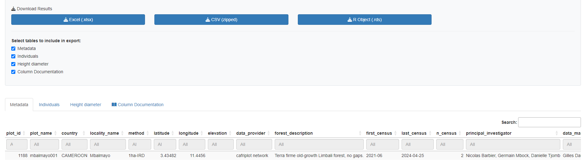

```{r, include = FALSE}
knitr::opts_chunk$set(
  collapse = TRUE,
  comment = "#>",
  eval = FALSE,  # Set to FALSE to prevent execution during pkgdown build
  message = FALSE,
  warning = FALSE
)
```

```{r setup}
library(tidyverse)
library(CafriplotsR)
```

## Introduction

The `query_plots()` function is the primary entry point for accessing forest plot data from the Central African plot database. This vignette demonstrates how to use the function's various features, including the new **output styles system** introduced in version 1.5.

## Database Connection

Before querying data, establish connections to both databases:


```{r connection-t, eval=T, echo=F, warning=FALSE, message=FALSE}
library(tidyverse)
devtools::load_all()
# Connect to the main database
mydb <- call.mydb(use_env_credentials = T)

# Connect to the taxa database
mydb_taxa <- call.mydb.taxa(use_env_credentials = T)

```

```{r connection}
# Connect to the main database
mydb <- call.mydb()

# Connect to the taxa database
mydb_taxa <- call.mydb.taxa()
```

The package will prompt for credentials interactively, or you can use environment variables via `use_env_credentials = TRUE`.

## Interactive Shiny Application

CafriplotsR provides an interactive Shiny application for users who prefer a graphical interface over writing R code. The app wraps `query_plots()` with an intuitive two-stage workflow.

### Launching the App

```{r launch-app, eval=FALSE}
# Launch the interactive query app
launch_query_plots_app()

# Or specify language (French or English)
launch_query_plots_app(language = "fr")  # French (default)
launch_query_plots_app(language = "en")  # English
```

### App Overview

When you first launch the app, you'll see the main interface with a navigation bar containing three tabs:


The app uses a **tabbed workflow**:

1. **Query Builder** - Define filters and search criteria
2. **Results & Extraction** - View results, select plots, extract individuals
3. **About** - App documentation and package information

### Phase 1: Query Builder

#### Setting Up Filters

The Query Builder tab provides various filtering options to find plots of interest:


**Basic Filters:**

- **Country**: Multi-select dropdown of available countries
- **Method**: Filter by inventory method (1 ha plot, Long Transect, etc.)
- **Plot Name(s)**: Text search (comma-separated for multiple plots)
- **Locality**: Search by locality name
- **Individual Tag**: Search by tree tag number

#### Advanced Filters

Click on "Advanced Filters" to expand additional search options:


- **Plot ID**: Search by database plot ID
- **Individual ID**: Search by specific individual ID
- **Taxon ID**: Filter by taxonomic ID
- **Specimen ID**: Search by herbarium specimen ID
- **Exact match**: Toggle for strict text matching

#### Executing the Query

After setting your filters, click **"Execute Query"** to retrieve plot metadata. The app shows a summary of active filters before execution.

### Phase 2: Results & Extraction

#### Interactive Map

Query results are displayed on an interactive map with multiple basemap options:


**Map features:**

- **Basemap layers**: OpenStreetMap, Satellite, Physical
- **Clickable markers**: Click to see plot details
- **Popup information**: Plot name, country, method, area

#### Metadata Table

Below the map, a sortable and searchable table displays all plot metadata:


**Table features:**

- **Search**: Filter table contents
- **Sort**: Click column headers to sort
- **Pagination**: Navigate through large result sets
- **Row selection**: Click rows to select/deselect plots

#### Selecting Plots

Select specific plots for individual extraction by clicking rows in the table:


- Selected rows are highlighted
- A counter shows the number of selected plots
- By default, all plots are selected

### Phase 3: Configure Extraction

#### Output Style

Choose how the extracted data should be formatted:


**Available styles:**

| Style | Description |
|-------|-------------|
| Auto-detect | Automatically selects based on plot method |
| Minimal | Essential columns only (plot, tag, species, dbh) |
| Standard | Common columns for general ecological analysis |
| Permanent Plot | Single census format for permanent plot monitoring |
| Permanent Plot (multi-census) | Preserves all census columns |
| Transect | Simplified format for walk surveys |
| Full | Complete dataset with all columns |

#### Census Handling

Configure how multiple censuses should be handled:


- **Census Strategy**: Last census, First census, or Mean across censuses
- **Show multiple census data**: Creates separate columns for each census (e.g., dbh_census_1, dbh_census_2)
- **Individual features format**: Controls the row structure of individual-level measurements:
  - *Wide* (default): one row per individual, with one column per trait — values are aggregated when multiple measurements exist for the same individual
  - *Long*: one row per measurement — if an individual has two diameter records (e.g. two censuses), it appears in two rows. The output includes `trait`, `traitvalue` / `traitvalue_char`, `valuetype`, `census_name`, and `census_date` columns (`NA` when the measurement is not linked to a census). Census filtering (`census_strategy`) is still applied in long format.

#### Data Organization

Control output structure:

- **Concatenate multiple stems**: Combine data from multi-stemmed trees
- **Remove database IDs**: Hide internal ID columns for cleaner output
- **Remove observations with issues**: Exclude flagged problematic records
- **Include issue flags**: Add quality flag columns to output

#### Additional Data

Select what extra information to include:


- **Extract taxonomic traits**: Wood density, growth form, etc.
- **Extract individual-level features**: Tree-specific measurements
- **Extract subplot-level features**: Subplot characteristics
- **Fallback to genus-level traits**: Use genus data when species unavailable

### Phase 4: Extract and Download

#### Extraction Results

Click **"Extract Individuals from Selected Plots"** to retrieve detailed tree data:



Results are organized in tabs:

- **Individuals**: Tree-level measurements
- **Metadata**: Plot information
- **Censuses**: Census dates and details (if applicable)
- **Height-Diameter**: H-D pairs for allometry (if applicable)

#### Download Options

Export your data in multiple formats:


**Available formats:**

- **Excel (.xlsx)**: Multi-sheet workbook
- **CSV (zipped)**: Separate CSV files in a ZIP archive
- **R Object (.rds)**: Native R format preserving data types
- **Shapefile (.zip)**: Spatial data (if coordinates available)

Select which tables to include in your export using the checkboxes.

### Viewing the Equivalent R Code

A key feature of the app is the **"Equivalent R Code"** panel, displayed after running queries:


This shows the exact R code you would use with `query_plots()` to reproduce the same results programmatically.

**Code sections:**

1. **Metadata Query**: Code to retrieve plot metadata with your filters
2. **Individual Extraction**: Code to extract tree data with your options
3. **Complete Workflow Script**: Full script combining both steps


**Why this matters:**

- **Learning**: Understand how app options map to function parameters
- **Reproducibility**: Save the exact code for your analysis documentation
- **Scripting**: Copy code for automated workflows
- **Collaboration**: Share query parameters with colleagues

Click **"Copy to clipboard"** to copy any code section.

### About Page

The About tab provides app documentation and package information:


### App vs. Function: When to Use Each

| Use Case | Recommendation |
|----------|----------------|
| Quick data exploration | Use the app |
| Interactive plot selection on a map | Use the app |
| Learning function parameters | Start with the app, copy generated code |
| Reproducible analysis scripts | Use `query_plots()` |
| Automated data pipelines | Use `query_plots()` |
| Processing many queries | Use `query_plots()` |

### Language Selection

The app supports **bilingual operation** (French and English). French is the default language.

A language toggle is located in the top-right corner:

- Click **"FR"** for French interface
- Click **"EN"** for English interface

The switch is instant and affects all UI elements.

### Example: From App to Script

Here's how the app helps you build reproducible queries:

1. **In the app**: Select Cameroon, filter by "1 ha plot" method, extract with traits

2. **Copy the generated code**:

```{r app-to-script, eval=FALSE}
# Query plot metadata
metadata <- query_plots(
  country = c("Cameroon"),
  method = c("1 ha plot"),
  extract_individuals = FALSE
)

# Extract individual tree data from selected plots
individuals <- query_plots(
  id_plot = c(1, 5, 12),
  extract_individuals = TRUE,
  output_style = "permanent_plot",
  extract_traits = TRUE,
  extract_individual_features = TRUE
)
```
3. **Use in your analysis script** for reproducible research

## Basic Usage

### Query Plot Metadata Only

To retrieve only plot-level information without individual tree data:

```{r basic-metadata, eval=TRUE, results='hide'}
# Query by plot name
plots <- query_plots(
  plot_name = "mbalmayo001",
  extract_individuals = FALSE
)

```

```{r, eval=TRUE, message=TRUE}
# View the structure
plots
```


### Query Plots with Individual Trees

To include individual tree/stem measurements:

```{r with-individuals, eval=TRUE, results='hide'}
plots_with_trees <- query_plots(
  plot_name = "mbalmayo001",
  extract_individuals = TRUE
)


```


```{r, eval=TRUE, message=TRUE}
# The result is a structured list
plots_with_trees
```

## Output Styles System (v1.5+)

Starting in version 1.5, `query_plots()` returns **structured lists** instead of flat data frames. The structure adapts automatically based on the inventory method.

### Available Output Styles

- **`minimal`**: Essential plot metadata only, no features or traits
- **`standard`**: Standard analysis output with common features (default for unknown methods)
- **`permanent_plot`**: Organized tables for permanent plot monitoring (single census)
- **`permanent_plot_multi_census`**: Multi-census data with _census_N columns
- **`transect`**: Simplified output for transect/walk surveys
- **`full`**: Complete export with all columns (preserves v1.4 behavior)

### Auto-Detection Based on Method

The output style is automatically detected from the plot's `method` field:

```{r auto-detection}
# For a permanent plot (method = "1 ha plot")
perm_plot <- query_plots(
  plot_name = "mbalmayo",
  extract_individuals = TRUE
)

# Automatically uses 'permanent_plot' style
# Returns: $metadata, $individuals, $censuses, $height_diameter
names(perm_plot)
```

### Manual Style Selection

Override automatic detection by specifying `output_style`:

```{r manual-style}
# Force minimal output
minimal_output <- query_plots(
  plot_name = "mbalmayo",
  extract_individuals = TRUE,
  output_style = "minimal"
)

# Force full output (v1.4 behavior - flat data frame)
full_output <- query_plots(
  plot_name = "mbalmayo",
  extract_individuals = TRUE,
  output_style = "full"
)
```

### Understanding the Structured Output

For permanent plots with `extract_individuals = TRUE`:

```{r structured-output}
result <- query_plots(
  plot_name = "mbalmayo001",
  extract_individuals = TRUE
)

# Metadata table: plot-level information
result$metadata
#   plot_id | plot_name | country | latitude | longitude | elevation | ...

# Individuals table: tree measurements
result$individuals
#   id_n | plot_name | tag | family | genus | species | dbh | height | ...

# Censuses table: census information
result$censuses
#   plot_name | census_number | census_date | team_leader | ...

# Height-diameter pairs: for allometric analysis
result$height_diameter
#   id_n | plot_name | tag | D | H | POM | census

# Spatial data (if show_all_coordinates = TRUE)
result$coordinates_sf
```

## Filtering Options

### By Location

```{r filter-location}
# By country
cameroon_plots <- query_plots(
  country = "Cameroon",
  extract_individuals = FALSE
)

# By locality
dja_plots <- query_plots(
  locality_name = "Dja",
  extract_individuals = FALSE
)

```

### By Method

```{r filter-method}
# Get all permanent plots
permanent_plots <- query_plots(
  method = "1 ha plot",
  extract_individuals = FALSE
)

# Get all transects
transects <- query_plots(
  method = "Long Transect",
  extract_individuals = FALSE
)
```

### By Plot ID

```{r filter-id}
# Query specific plot IDs
plots_by_id <- query_plots(
  id_plot = c(1, 2, 3),
  extract_individuals = TRUE
)
```

## Working with Individual Tree Data

### Basic Tree Extraction

```{r individuals-basic}
trees <- query_plots(
  plot_name = "mbalmayo001",
  extract_individuals = TRUE
)

# Access individual tree data
trees$individuals
```


## Handling Multiple Censuses

### Show Multiple Census Data

By default, only the most recent census is returned. To see all censuses:

```{r multiple-census}
multi_census <- query_plots(
  plot_name = "mbalmayo",
  extract_individuals = TRUE,
  show_multiple_census = TRUE
)

# Automatically uses 'permanent_plot_multi_census' style
# Census-specific columns: dbh_census_1, dbh_census_2, height_census_1, ...
head(multi_census$individuals)

# Censuses table shows all census dates
multi_census$censuses

# Height-diameter table has one row per measurement
multi_census$height_diameter
```

### Long Format: One Row per Measurement

The default output (`individual_features_format = "wide"`) places each trait in its own column, aggregating when multiple measurements exist. Use `"long"` to keep every measurement on its own row instead:

```{r long-format}
trees_long <- query_plots(
  plot_name = "mbalmayo001",
  extract_individuals = TRUE,
  individual_features_format = "long"
)

# Each row is one measurement for one individual
# Columns: trait, traitvalue / traitvalue_char, valuetype,
#          census_name (e.g. "census_3"), census_date (NA if not census-linked)
trees_long$individuals |>
  dplyr::select(plot_name, tag, tax_sp_level, trait, traitvalue, census_name, census_date)
```

In long format, an individual with two diameter measurements (e.g. from two censuses) appears in two rows. Measurements not linked to any census (e.g. position coordinates) have `census_name = NA` and `census_date = NA`.

Census filtering still applies: with `census_strategy = "last"` (the default), only measurements from the most recent census are returned for census-linked traits, while non-census measurements are always included.

```{r long-format-first-census}
# Long format keeping only the first census
trees_long_first <- query_plots(
  plot_name = "mbalmayo001",
  extract_individuals = TRUE,
  individual_features_format = "long",
  census_strategy = "first"
)
```

Long format is particularly useful when you need to work with raw measurement values rather than aggregated summaries, or when you want to compute your own statistics across multiple measurements.

## Column Renaming

The output styles automatically rename database columns to user-friendly names:

```{r column-names}
result <- query_plots(
  plot_name = "mbalmayo001",
  extract_individuals = TRUE
)

# Database names → User-friendly names
# ddlat → latitude
# ddlon → longitude
# tax_fam → family
# tax_gen → genus
# tax_sp_level → species
# stem_diameter → dbh
# tree_height → height

names(result$metadata)
names(result$individuals)
```

## Spatial Data

### Plot Coordinates

By default, returns one coordinate per plot:

```{r default-coords}
plots <- query_plots(
  country = "Gabon",
  extract_individuals = FALSE
)

plots$metadata[, c("plot_name", "latitude", "longitude")]
```

### All Coordinates

Some plots have multiple coordinate points (corners, subplot centers):

```{r all-coords}
plots_all_coords <- query_plots(
  plot_name = "mbalmayo",
  extract_individuals = FALSE,
  show_all_coordinates = TRUE
)

# Returns sf object with all coordinate points
plots_all_coords$coordinates_sf
```

### Interactive Map

Visualize plot locations:

```{r map}
query_plots(
  country = "Cameroon",
  extract_individuals = FALSE,
  map = TRUE
)
```

## Advanced Options

### Keeping Database IDs

By default, internal IDs are removed. To keep them:

```{r keep-ids}
with_ids <- query_plots(
  plot_name = "mbalmayo001",
  extract_individuals = TRUE,
  remove_ids = FALSE, output_style = "full"
)

# Now includes id_liste_plots, id_census, etc.
names(with_ids$extract)
```

### Filtering by Individual ID

Extract specific individuals:

```{r filter-individual}
specific_trees <- query_plots(
  id_individual = c(1001, 1002, 1003),
  extract_individuals = TRUE
)
```

### Filtering by Taxon

Extract individuals of specific taxa:

```{r filter-taxon}
species_trees <- query_plots(
  plot_name = "mbalmayo001",
  id_tax = c(115),  # Taxon IDs
  extract_individuals = TRUE
)
```

## Custom Output Styles

The `keep_patterns` and `remove_patterns` options in style configurations allow customization (NOY YET IMPLEMENTED):

```{r custom-patterns}
# In your custom style configuration:
# keep_patterns = c("^feat_wood", "^trait_leaf")
# This keeps wood features and leaf traits while removing others
```

## Combining Options

Complex queries combining multiple filters:

```{r complex-query}
complex_result <- query_plots(
  country = "Cameroon",
  locality_name = "Dja",
  method = "1 ha plot",
  extract_individuals = TRUE,
  extract_traits = TRUE,
  extract_individual_features = TRUE,
  show_multiple_census = TRUE,
  show_all_coordinates = TRUE,
  remove_ids = FALSE,
  output_style = "permanent_plot_multi_census"
)

# Returns comprehensive structured output
names(complex_result)
```


## Performance Tips

1. **Start with metadata only**: Use `extract_individuals = FALSE` when exploring
2. **Use specific filters**: Reduce query time by filtering by plot_name or id_plot
3. **Limit traits**: Only use `extract_traits = TRUE` when needed
4. **Choose appropriate style**: Use `minimal` or `standard` for quick analyses

## Troubleshooting

### Empty Results

If your query returns no data:

```{r troubleshoot}
# Check connection status
print_connection_status()

# Run diagnostic
db_diagnostic()

# Verify plot access (row-level security)
# You can only access plots you have permission for
```

### Switching Back to v1.4 Behavior

If you need the old flat data frame output:

```{r legacy-behavior}
flat_output <- query_plots(
  plot_name = "mbalmayo001",
  extract_individuals = TRUE,
  output_style = "full"
)

# Returns a single data frame instead of structured list
```

