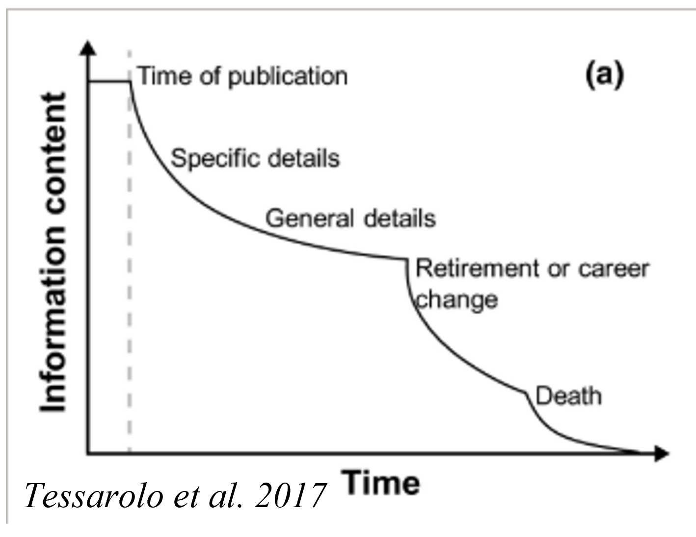

# Plan d'Atelier CafriplotsR - Brouillon

Ce document propose une structure pour organiser un atelier d'introduction au package CafriplotsR destiné à des utilisateurs francophones avec des compétences R limitées.

---

## Pourquoi Cafriplots ? - Contexte et Justification

### Le problème global

La collecte et la compilation des données de biodiversité ont été transformées par le développement d'outils et de plateformes globales. **Pourtant**, l'accès à des données standardisées et à jour reste **inégal et insuffisant** dans les régions à forte biodiversité. Cela complique n'importe quelle initiative visant à évaluer les multiples dimensions de la biodiversité végétale.

### Le cas de l'Afrique centrale

Des dépôts de données globaux et de meilleures pratiques d'archivage font que les données de biodiversité (occurrences) sont aujourd'hui beaucoup plus accessibles. **C'est moins le cas pour d'autres types de données de biodiversité "primaires"** :

- Données d'inventaires forestiers
- Traits fonctionnels au sens large du terme
- Données de recensement de parcelles permanentes

**Question clé** : Où et quand les forêts d'Afrique centrale ont-elles fait l'objet d'inventaires ?

### Problèmes d'accessibilité aux données

**Un facteur important est le temps écoulé depuis la collecte des données.**



*L'accessibilité aux données décroît avec le temps : plus les données sont anciennes, plus le risque de les perdre est élevé.*

| Problème | Conséquence |
|----------|-------------|
| Mauvaises pratiques d'archivage | Formats incompatibles, métadonnées manquantes |
| Pas de ressources au-delà des projets | Accessibilité non maintenue |
| Pas de volonté de partage | Risque de perdre à jamais des données durement acquises |

### Le défi de la compilation

Combiner traits, inventaires, occurrences, statuts de conservation - en réalité n'importe quel attribut associé à une espèce - pose des problèmes :

- **Manque de reproductibilité** : Chaque chercheur refait le travail depuis zéro
- **Manque de visibilité** : Les compilations restent dans des projets/articles isolés
- **Résultats dépendant de l'accès aux données** (inégal) et difficilement réutilisables
- **Évolution continue de la classification taxonomique** : Un nom d'espèce aujourd'hui peut être un synonyme demain

### Pourquoi pas simplement GBIF, TRY, forestplot.net ?

Ces outils globaux ont des **processus de partage plutôt unilatéraux** :
- Apports fantastiques pour des études à larges échelles
- Mais peu d'intérêt pour des approches à plus petites échelles
- **Interactions faibles (voire nulles)** entre collecteurs, curateurs et utilisateurs
- Pas de co-construction ni de co-gestion

**L'échelle régionale (biome) fait sens** des points de vue biogéographique et de gestion et rend plus réaliste ces intéractions entre collecteurs, curateurs et utilisateurs.

### Cafriplots : Un réseau de réseaux

> **Ce n'est pas une plateforme de données (centralisation), mais un réseau de réseaux.**

**Rejoindre Cafriplots, c'est :**

1. **Partager une gestion commune** - Référentiel(s) taxonomique et structures communs
2. **Faciliter le partage et l'intégration** de données entre réseaux
3. **Accéder à une plateforme** pour partager des scripts/applications reproductibles à des fins didactiques et de recherche
4. **Rester souverain** de ses données et de leur utilisation
5. **Accroître la visibilité** de ses réseaux et de ses données

### CafriplotsR : La boîte à outils du réseau

**Arguments pour rejoindre Cafriplots :**

| Bénéfice | Description |
|----------|-------------|
| **Standardisation** | Garantit une standardisation des données entre réseaux |
| **Reproductibilité** | Facilite la reproduction d'analyses et l'intégration de données |
| **Données complémentaires** | Donne accès à des traits, occurrences, statuts de conservation |
| **Suivi taxonomique** | Suit les avancées taxonomiques automatiquement |
| **Contextualisation** | Contextualise ses données dans un environnement biogéographique et fonctionnel plus large |
| **Cercle vertueux** | En participant, on améliore la connaissance collective tout en bénéficiant des apports des autres |
| **Visibilité** | On améliore la visibilité de ses données |

### Co-construction avec les jeunes chercheurs

> L'implication des jeunes chercheurs qui manipulent régulièrement des données est essentielle pour :
> - Identifier les besoins réels du terrain
> - Développer des outils adaptés aux usages concrets
> - Assurer la pérennité et l'évolution du réseau
> - Former la prochaine génération aux bonnes pratiques

---

## Configuration de l'Atelier

### Comptes virtuels créés

Mot de passe identique pour tous :
_Lbv112025_

| Compte | Mot de passe | Groupe |
|--------|--------------|--------|
| user_test | [commun] | Binôme 1 |
| user_test2 | [commun] | Binôme 2 |
| user_test3 | [commun] | Binôme 3 |
| user_test4 | [commun] | Binôme 4 |
| user_test5 | [commun] | Binôme 5 |
| user_test6 | [commun] | Binôme 6 |
| user_test7 | [commun] | Binôme 7 |
| user_test8 | [commun] | Binôme 8 |
| user_test9 | [commun] | Réserve |
| user_test10 | [commun] | Réserve |

### Organisation en binômes

**Principe** : Associer un.e participant.e plus à l'aise avec R avec un.e participant.e moins à l'aise.

**Avantages** :
- Entraide naturelle
- Le "tuteur" consolide ses connaissances en expliquant
- Dynamique de groupe positive

**Critères de formation des binômes** :
- Niveau en R (auto-évalué)
- Expérience avec les bases de données
- Manipulation avec des données d'inventaires

---

## Structure Proposée de l'Atelier

#### 1. Introduction et contexte (45 min)

**Contenu** :
- Présentation du contexte
- Présentation de Cafriplots et de la boîte à outils

#### 2. Cours accéléré R Essentiels (1h00) (si nécessaire)

**Contenu minimal** :
- Installation de packages : `install.packages("CafriplotsR")`
- Syntaxe de base : `<-` (assignation), `$` (accès colonne), `%>%` (pipe)
- Lire/écrire des fichiers Excel : `readxl::read_excel()`, `writexl::write_xlsx()`
- Comprendre les data.frames : lignes, colonnes, filtrage simple
- Utiliser RStudio : panneau console, scripts, environnement

- Exercices pratiques courts (5-10 min) après chaque concept

---

#### 3. Première connexion et exploration

**Objectif** : Se connecter.

```r
# Charger le package
library(CafriplotsR)

# Se connecter à la base
con <- call.mydb()
# Utiliser : user_testX / [mot de passe commun]

# Vérifier que tout fonctionne
db_diagnostic()

# Voir les pays disponibles
country_list()

# Voir les méthodes d'inventaire
method_list()
```

#### 4. Exercices de requêtes avec données d'entraînement

**Exercices progressifs** :

```r
# Exercice 1 : Lister les parcelles disponibles
parcelles <- query_plots()

# Exercice 2 : Filtrer par pays
parcelles_gabon <- query_plots(country = "Gabon")

# Exercice 3 : Extraire les individus d'une parcelle
individus <- query_plots(
  id_plot = 123,
  extract_individuals = TRUE
)

# Exercice 4 : Utiliser l'application interactive
launch_query_plots_app()
```

---

### Application sur Données Réelles

#### 5. Atelier standardisation taxonomique

**Objectif** : Utiliser `launch_taxonomic_match_app()` sur ses propres données.

**Workflow** :
1. Chaque binôme apporte un fichier Excel avec des noms d'espèces
2. Lancer l'application : `launch_taxonomic_match_app()`
3. Uploader ses fichier
4. Observer le matching automatique
5. Réviser manuellement les noms non matchés
6. Exporter le résultat standardisé

**Bénéfice immédiat** : Données deviennent 'propres' et standardisées.

#### 6. Accéder aux traits pour leurs espèces

```r
# Après standardisation, on a des idtax_n
mes_taxons <- c(12345, 67890, ...)

# Récupérer les traits
traits <- query_taxa_traits(
  idtax = mes_taxons,
  format = "wide",
  add_taxa_info = TRUE
)

# Voir les traits disponibles
traits_taxa_list()

# Exporter vers Excel
writexl::write_xlsx(traits$traits_numeric, "mes_traits.xlsx")
```

#### 7. Feuille de route pour l'import de données

**Objectif** : Vision claire des prochaines étapes.

**Contenu** :
- Vue d'ensemble du workflow d'import
- Ce qu'ils doivent préparer (format, métadonnées)
- Sessions de suivi individuelles
- Comment contribuer au réseau

**Message final** : "En important vos données, vous enrichissez le réseau et vous bénéficiez de tout ce que les autres ont apporté. C'est le cercle vertueux de Cafriplots."

---

### Applications Shiny comme porte d'entrée

Les applications interactives offrent une interface graphique sans code :
- `launch_taxonomic_match_app()` - Standardisation taxonomique
- `launch_query_plots_app()` - Exploration des parcelles

**Stratégie** : Shiny app d'abord, code ensuite.

### Fiche récapitulative

Distribuer la **cheatsheet**

---

## Matériel à Préparer

### Documents
- [ ] Cheatsheet CafriplotsR en français
- [ ] Scripts d'exercices commentés
- [ ] Liste des parcelles d'entraînement

### Logistique
- [ ] Vérifier installations R/RStudio
- [ ] Former les binômes à l'avance si possible
- [ ] Prévoir un canal de communication post-atelier
