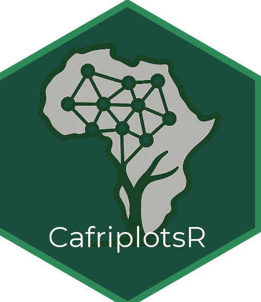

---
output:
  pdf_document: default
  html_document: default
---
# Atelier CafriplotsR

## Introduction à la base de données et aux outils du réseau Cafriplots

<center>

{width=25%}

</center>

---

**Date** : Jeudi 27 novembre 2025

**Lieu** : Salle de réunion du CENAREST, Libreville

---

<center>

{height=60px}
&nbsp;&nbsp;&nbsp;
{height=60px}
&nbsp;&nbsp;&nbsp;
{height=60px}
&nbsp;&nbsp;&nbsp;
{height=60px}

</center>

---

## Informations Pratiques

### Connexion à la base de données

Lors de l'atelier, vous utiliserez un compte d'entraînement pour vous connecter à la base de données.

**Identifiants** :
- Utilisateur : `user_testX` (X = numéro de votre binôme)
- Mot de passe : `Lbv112025`

### Organisation

On propose de créer des **binômes** combinant une personne expérimentée (en R et/ou dans la manipulation de données) 
avec une personne moins expérimentée.
Cette organisation pourrait favoriser l'entraide et permet à chacun d'apprendre à son rythme.

---

## Pré-requis

### Logiciels à installer avant l'atelier

1. **R** (version 4.0 ou supérieure)
   - Télécharger : https://cran.r-project.org/

2. **RStudio** (version récente recommandée)
   - Télécharger : https://posit.co/download/rstudio-desktop/

3. **Package CafriplotsR**

   Ouvrir RStudio et exécuter :
   ```r
    install.packages(c("tidyverse", "dbplyr", "devtools"))
    devtools::install_github("umr-amap/cafriplotsR", upgrade = "never")
   ```

4. **Packages complémentaires**
   ```r
   install.packages(c("readxl", "writexl", "dplyr"))
   ```

### À apporter

- Un fichier Excel contenant une **liste de noms d'espèces** (pour l'exercice de standardisation taxonomique)
- Vos questions et cas d'usage concrets !

---

## Programme de l'Atelier

### 1. Introduction et contexte (45 min)

- Présentation du réseau Cafriplots
- Présentation de CafriplotsR : la boîte à outils

### 2. Bases de R (si nécessaire) (1h)

- Syntaxe de base R
- Utilisation de RStudio
- Lecture et écriture de fichiers Excel

### 3. Première connexion et exploration

**Objectif** : Se connecter à la base de données et découvrir les fonctions de base.

```r
# Charger le package
library(CafriplotsR)

# Se connecter à la base
con <- call.mydb()

# Vérifier la connexion
db_diagnostic()

# Explorer les données disponibles
country_list()
method_list()
```

### 4. Requêtes sur les parcelles

**Objectif** : Apprendre à interroger la base de données.

```r
# Lister les parcelles accessibles
parcelles <- query_plots()

# Filtrer par pays
parcelles_gabon <- query_plots(country = "Gabon")

# Extraire les individus d'une parcelle
individus <- query_plots(
  id_plot = 123,
  extract_individuals = TRUE
)

# Utiliser l'application interactive
launch_query_plots_app()
```

### 5. Standardisation taxonomique

**Objectif** : Standardiser les noms d'espèces de vos propres données.

**Workflow** :
1. Lancer l'application : `launch_taxonomic_match_app()`
2. Charger votre fichier Excel
3. Sélectionner la colonne contenant les noms d'espèces
4. Laisser l'application faire le matching automatique
5. Réviser manuellement les noms non reconnus
6. Exporter le résultat standardisé

**Résultat** : Vos noms d'espèces sont maintenant liés à des identifiants taxonomiques uniques (`idtax_n`).

### 6. Enrichissement avec les traits

**Objectif** : Récupérer des traits pour vos espèces.

```r
# Après standardisation, utiliser les idtax_n obtenus
mes_taxons <- c(12345, 67890, ...)

# Récupérer les traits
traits <- query_taxa_traits(
  idtax = mes_taxons,
  format = "wide",
  add_taxa_info = TRUE
)

# Voir les traits disponibles
traits_taxa_list()

# Exporter vers Excel
writexl::write_xlsx(traits$traits_numeric, "mes_traits.xlsx")
```

### 7. Discussion : Import de vos données

- Vue d'ensemble du processus d'import
- Format des données attendu
- Prochaines étapes et accompagnement

---

## Applications Interactives

CafriplotsR propose des applications avec interface graphique, sans avoir besoin d'écrire du code :

| Application | Commande | Description |
|-------------|----------|-------------|
| Exploration des parcelles | `launch_query_plots_app()` | Carte interactive, filtres, export |
| Standardisation taxonomique | `launch_taxonomic_match_app()` | Matching automatique des noms d'espèces |

---

## Aide-Mémoire

### Fonctions principales

| Fonction | Description |
|----------|-------------|
| `call.mydb()` | Se connecter à la base |
| `db_diagnostic()` | Vérifier la connexion |
| `query_plots()` | Requêter les parcelles |
| `query_taxa()` | Rechercher des taxons |
| `query_taxa_traits()` | Récupérer les traits |
| `traits_taxa_list()` | Liste des traits disponibles |
| `cleanup_connections()` | Fermer les connexions |

### Syntaxe R de base

| Syntaxe | Signification | Exemple |
|---------|---------------|---------|
| `<-` | Assigner une valeur | `x <- 5` |
| `$` | Accéder à une colonne | `donnees$colonne` |
| `c()` | Créer un vecteur | `c(1, 2, 3)` |
| `head()` | Premières lignes | `head(donnees, 10)` |
| `View()` | Voir en tableau | `View(donnees)` |

### En cas de problème

| Problème | Solution |
|----------|----------|
| `could not find function` | `library(CafriplotsR)` |
| Connexion refusée | Vérifier internet, réessayer |
| `SSL SYSCALL error` | `cleanup_connections()` puis reconnecter |

---

## Contact et Ressources

- **Documentation** : `?CafriplotsR` dans R
- **Aide sur une fonction** : `?nom_fonction` (ex: `?query_plots`)

---

*Atelier CafriplotsR - Réseau Cafriplots*
